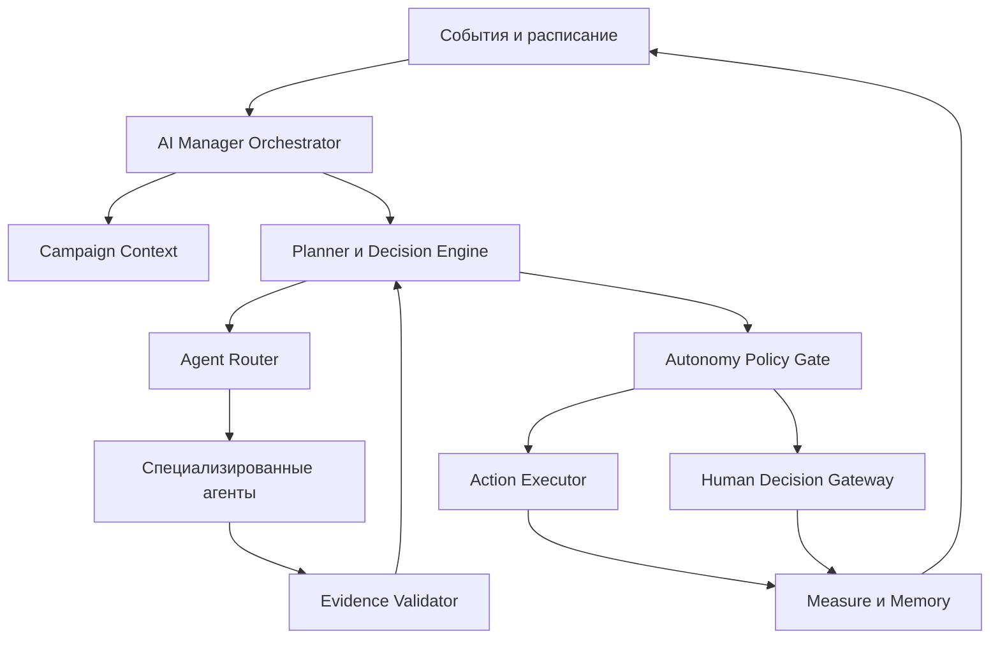

# LeaseMind AI Manager Architecture

**Версия:** 1.0  
**Статус:** Approved  
**Дата утверждения:** 2026-07-12  
**Владелец:** Chief AI Architect  
**Область:** внутренняя AI-архитектура LeaseMind

---

## 1. Назначение

AI Manager — управляющая система каждой Campaign. Это не один чат-бот и не одна языковая модель. Это оркестратор, который:

- поддерживает актуальное состояние Campaign;
- запускает параллельную работу специализированных AI-агентов;
- объединяет их результаты;
- формирует и пересматривает стратегию;
- принимает разрешенные автономные решения;
- передает человеку только решения, требующие его участия;
- измеряет результат действий и запускает следующий цикл работы;
- сохраняет полную историю причин, решений и действий.

Главная цель AI Manager — сокращать время от запуска Campaign до подтвержденной сделки, увеличивая вероятность успешного результата и уменьшая неопределенность.

---

## 2. Архитектурные границы

AI Manager обязан соблюдать следующие ограничения:

1. Campaign — главный объект управления.
2. AI Manager не меняет утвержденные пользователем коммерческие ограничения самостоятельно.
3. Юридически и финансово значимые действия выполняются только после подтверждения человека.
4. Точный адрес и другие защищенные данные раскрываются только после прохождения соответствующего коммерческого и политического контроля.
5. AI-агенты не общаются с пользователем напрямую от собственного имени.
6. AI-агенты не изменяют состояние Campaign напрямую.
7. Ни один результат AI не становится подтвержденным фактом без проверки источника, качества и актуальности.
8. Необязательные данные не блокируют запуск Campaign.
9. Все независимые работы выполняются параллельно.
10. Каждое решение должно быть объяснимым, проверяемым и воспроизводимым по журналу событий.

---

## 3. Архитектура верхнего уровня



AI Manager состоит из управляющего ядра, специализированных агентов и детерминированных сервисов. Языковые модели используются для анализа, извлечения смысла, построения гипотез и объяснений. Финансовые расчеты, правила доступа, статусы, ограничения и необратимые действия контролируются программными правилами.

---

## 4. Компоненты управляющего ядра

| Компонент | Ответственность |
| --- | --- |
| Campaign Orchestrator | Запускает циклы работы, управляет задачами, зависимостями, повторами и параллельным выполнением |
| Campaign Context Builder | Собирает минимально необходимый контекст для конкретной задачи из состояния, памяти и доказательств |
| Goal and Constraint Manager | Хранит цель Campaign, подтвержденные ограничения и допустимые диапазоны изменений |
| Strategy Manager | Создает, сравнивает, активирует и пересматривает поисковые гипотезы и стратегию |
| Task Planner | Преобразует стратегию в граф задач с зависимостями, приоритетами и сроками |
| Agent Router | Выбирает специализированного агента и подходящий режим выполнения задачи |
| Evidence Validator | Проверяет источник, свежесть, полноту, непротиворечивость и допустимость результата |
| Decision Engine | Формирует варианты действий, оценивает ожидаемый эффект и выбирает следующий шаг |
| Confidence Engine | Рассчитывает уровень уверенности вывода или рекомендации |
| Autonomy Policy Gate | Определяет: выполнить самостоятельно, рекомендовать или запросить обязательное решение человека |
| Action Executor | Выполняет только разрешенные действия с идемпотентностью и контролем повторов |
| Human Decision Gateway | Создает структурированный запрос решения и принимает подтвержденный ответ человека |
| Memory Service | Записывает и извлекает факты, решения, гипотезы, результаты и полезные шаблоны |
| Measurement Engine | Сравнивает ожидаемый и фактический эффект действий, обновляет прогноз и стратегию |
| Audit Log | Неизменно фиксирует входные данные, версии правил, решения, действия и результаты |
| Notification Manager | Инициирует уведомления только при новой ценности, риске, значимом изменении или необходимости решения |

---

## 5. Модель управления Campaign

### 5.1 Состояние Campaign

Состояние Campaign формируется из двух источников:

- **Immutable Event Log** — неизменяемая последовательность событий;
- **Current State Projection** — актуальное расчетное состояние для быстрой работы.

Такой подход позволяет восстановить ход Campaign, понять причину любого решения и пересчитать состояние после исправления ошибки.

### 5.2 Основные внутренние сущности

| Сущность | Назначение |
| --- | --- |
| CampaignGoal | Подтвержденный результат, к которому ведется Campaign |
| Constraint | Жесткое ограничение или допустимый диапазон |
| Assumption | Неподтвержденное допущение с уровнем уверенности |
| Evidence | Источник, факт, дата получения и оценка качества |
| Hypothesis | Проверяемая поисковая или переговорная гипотеза |
| StrategyVersion | Версия стратегии и основания ее выбора |
| Task | Единица работы агента или сервиса |
| Candidate | Потенциальная сторона сделки с квалификационным состоянием |
| Match | Оцененная совместимость помещения и спроса |
| Recommendation | Предложение с причиной, эффектом, риском и уверенностью |
| DecisionRequest | Решение, которое должен принять человек |
| DecisionRecord | Зафиксированное решение AI или человека |
| ActionRecord | Попытка действия и ее результат |
| Risk | Выявленная угроза, вероятность, влияние и способ контроля |
| MetricSnapshot | Состояние ключевых метрик в определенный момент |

### 5.3 Статусы Campaign

Поддерживаются утвержденные статусы:

Created, Analyzing, Strategy Building, Searching, Qualifying, Negotiating, Viewing, Deal Support, Completed, Paused, Failed.

Статус не управляет процессом как жесткий линейный сценарий. Он является агрегированным представлением текущей ведущей стадии. Одновременно могут работать несколько потоков, например Searching, Qualifying и Strategy Building.

Возврат к предыдущей стадии выполняется через новую версию стратегии и фиксируется в журнале событий.

---

## 6. Рабочий цикл AI Manager

AI Manager работает одновременно в двух режимах:

- **event-driven** — немедленная реакция на значимое событие;
- **scheduled review** — полный пересмотр Campaign не реже одного раза в сутки.

### 6.1 Цикл

1. **Observe** — получить новые события, данные, ответы и изменения.
2. **Normalize** — привести данные к общей структуре и удалить дубликаты.
3. **Validate** — проверить источники, свежесть и противоречия.
4. **Think** — определить, что изменилось и какие гипотезы затронуты.
5. **Plan** — создать или обновить граф задач.
6. **Decide** — сравнить допустимые варианты действий.
7. **Policy Check** — определить разрешенный уровень автономии.
8. **Act or Ask** — выполнить действие либо запросить решение человека.
9. **Measure** — оценить фактический эффект.
10. **Learn** — обновить память, прогноз и стратегию.
11. **Repeat** — назначить следующий триггер или контрольную точку.

### 6.2 Основные триггеры

- запуск Campaign;
- поступление новых рыночных данных;
- появление или изменение кандидата;
- ответ кандидата или пользователя;
- завершение задачи агента;
- выявление риска или противоречия;
- снижение вероятности успеха;
- отсутствие прогресса в установленном контрольном периоде;
- приближение срока решения или действия;
- подтверждение или отклонение рекомендации человеком;
- ежедневный плановый пересмотр.

---

## 7. Планирование параллельной работы

Task Planner создает ориентированный граф задач.

Каждая задача содержит:

- цель;
- тип агента или сервиса;
- входные данные и ссылки на доказательства;
- зависимости;
- приоритет;
- срок актуальности;
- критерий завершения;
- допустимое число повторов;
- идентификатор идемпотентности;
- уровень чувствительности данных.

Независимые задачи запускаются параллельно. Зависимые задачи ожидают только обязательные входы. Отсутствие необязательных данных не останавливает остальные ветви.

Для предотвращения конфликтов используются:

- блокировка изменения одной версии стратегии;
- версионирование Campaign Context;
- проверка устаревших результатов перед записью;
- идемпотентность внешних действий;
- дедупликация одинаковых задач и событий.

---

## 8. Контракт специализированного AI-агента

Специализированный агент является ограниченным исполнителем. Он не владеет Campaign и не принимает окончательных решений за AI Manager.

### 8.1 Входной контракт

```yaml
task_id: string
campaign_id: string
agent_type: string
objective: string
context_version: integer
inputs: object
constraints: array
evidence_refs: array
data_access_scope: array
deadline: datetime
output_schema_version: string
```

### 8.2 Выходной контракт

```yaml
task_id: string
status: completed | partial | blocked | failed
findings: array
evidence: array
assumptions: array
risks: array
recommended_actions: array
confidence: 0..1
fresh_until: datetime
missing_data: array
model_and_policy_versions: object
```

### 8.3 Обязательные правила агента

1. Не выходить за переданный scope.
2. Не изменять Campaign напрямую.
3. Отделять факты от предположений.
4. Прикладывать доказательство к каждому значимому выводу.
5. Указывать срок актуальности результата.
6. Возвращать `partial`, если полезный результат получен не полностью.
7. Не скрывать противоречия и отсутствующие данные.
8. Не инициировать юридические, финансовые или связанные с раскрытием защищенных данных действия.

---

## 9. Реестр специализированных агентов

| Агент | Основная функция |
| --- | --- |
| Property Analyzer | Структурирует параметры помещения, сильные стороны, ограничения и риски |
| Demand Analyzer | Анализирует структуру и активность спроса |
| Market Analyzer | Оценивает рынок, динамику и доступность вариантов |
| Pricing Analyzer | Сравнивает цену или бюджет с рынком и строит сценарии |
| Location Analyzer | Оценивает территорию, доступность и соответствие бизнесу |
| Competition Analyzer | Определяет конкурентную среду и насыщенность сегмента |
| Search Agent | Ищет потенциальные объекты или стороны по активным гипотезам |
| Matching Engine | Рассчитывает совместимость и ранжирует пары |
| Candidate Qualifier | Проверяет соответствие, готовность, надежность и полноту данных кандидата |
| Negotiation Assistant | Готовит переговорную позицию, аргументы и допустимые сценарии |
| Risk Analyzer | Выявляет коммерческие, информационные, операционные и поведенческие риски |
| Notification Manager | Определяет наличие основания для уведомления и его срочность |

Подробная логика Matching Engine и каждого агента оформляется отдельными спецификациями. Этот документ определяет их место и контракт в общей системе.

---

## 10. Decision Engine

### 10.1 Входы решения

- цель Campaign;
- подтвержденные ограничения;
- актуальная версия стратегии;
- новые наблюдения;
- качество и свежесть доказательств;
- активные риски;
- результаты предыдущих действий;
- доступные действия;
- правила автономии.

### 10.2 Оценка варианта действия

Каждый вариант оценивается по следующим измерениям:

- ожидаемое влияние на вероятность сделки;
- ожидаемое сокращение времени до сделки;
- стоимость и требуемые ресурсы;
- коммерческий и юридический риск;
- обратимость действия;
- уверенность в исходных данных;
- срочность;
- соответствие подтвержденным ограничениям.

Внутренняя функция оценки:

```text
Decision Score = Expected Impact × Confidence
                 − Cost
                 − Risk
                 − Irreversibility Penalty
                 − Delay Penalty
```

Вес каждого фактора хранится в конфигурации и версионируется. Изменение весов не должно менять утвержденные продуктовые или коммерческие правила.

### 10.3 Decision Record

Каждое принятое решение сохраняет:

- рассматриваемые варианты;
- выбранный вариант;
- причину выбора;
- ожидаемый эффект;
- доказательства;
- уровень уверенности;
- известные риски;
- примененное правило автономии;
- версию стратегии, модели и политики;
- ожидаемую дату измерения результата.

---

## 11. Confidence Engine

Уверенность не должна быть субъективной оценкой одной модели. Она рассчитывается из нескольких факторов:

- полнота данных;
- качество источников;
- свежесть данных;
- согласованность независимых источников;
- устойчивость результата к изменению допущений;
- историческая точность примененного метода;
- наличие нерешенных противоречий.

Уровень уверенности всегда относится к конкретному выводу, рекомендации или прогнозу, а не ко всей Campaign.

Если уверенность недостаточна, AI Manager выбирает одно из действий:

- получить дополнительные данные;
- запустить независимую проверку другим методом;
- сузить формулировку вывода;
- понизить приоритет действия;
- передать человеку рекомендацию с явным описанием неопределенности.

---

## 12. Autonomy Policy Gate

Каждое действие обязательно проходит Policy Gate.

| Уровень | Результат проверки | Примеры |
| --- | --- | --- |
| Самостоятельно | AI Manager выполняет и фиксирует действие | анализ, сравнение, поиск, ранжирование, обновление прогноза, изменение поисковой гипотезы в утвержденных границах |
| Только рекомендация | AI Manager формирует обоснованное предложение и ожидает решения | изменение цены, бюджета, аудитории, локации, срока или ключевых условий |
| Только человек | выполнение заблокировано до явного подтверждения уполномоченного человека | документы, окончательный выбор стороны, согласие на условия, деньги, защищенные данные, юридические заявления |

### 12.1 Порядок проверки

1. Определить тип действия.
2. Проверить ограничения Campaign.
3. Проверить чувствительность данных.
4. Проверить юридическую и финансовую значимость.
5. Проверить обратимость.
6. Определить требуемый уровень полномочий.
7. Выполнить, сформировать рекомендацию или заблокировать до решения.

LLM не может самостоятельно изменить результат Policy Gate. Политика реализуется детерминированными правилами и версионируемой конфигурацией.

---

## 13. Human Decision Gateway

AI Manager обращается к человеку только тогда, когда:

- действие требует подтверждения по правилам автономии;
- существует несколько стратегически разных вариантов с близкой оценкой;
- требуется изменить подтвержденное ограничение;
- выявлен критический риск;
- недостаток данных нельзя устранить безопасно и автономно.

Запрос решения содержит только необходимое:

- что произошло;
- какое решение требуется;
- рекомендуемый вариант;
- причина;
- ожидаемый эффект;
- основные риски;
- уровень уверенности;
- срок, до которого решение имеет ценность.

После ответа AI Manager сохраняет решение, обновляет стратегию и возобновляет зависимые задачи.

---

## 14. Память AI Manager

### 14.1 Уровни памяти

| Уровень | Содержание |
| --- | --- |
| Working Memory | Минимальный контекст текущего цикла и активных задач |
| Campaign Memory | Факты, ограничения, кандидаты, решения, действия и результаты одной Campaign |
| User Decision Memory | Только подтвержденные предпочтения и решения конкретного пользователя |
| Strategic Memory | Гипотезы, версии стратегии, причины изменений и результаты тестов |
| Platform Pattern Memory | Обезличенные закономерности, пригодные для улучшения будущих Campaign |
| Procedural Memory | Утвержденные правила, политики, схемы и рабочие процедуры |

### 14.2 Типы записей

- подтвержденный факт;
- пользовательское решение;
- допущение;
- гипотеза;
- рекомендация;
- действие;
- результат;
- ошибка;
- выявленная закономерность.

### 14.3 Memory Write Gate

Запись в долговременную память разрешается только после проверки:

1. Тип записи определен.
2. Источник и время известны.
3. Факт отделен от предположения.
4. Указан срок актуальности.
5. Определен уровень конфиденциальности.
6. Нет запрещенного переноса данных между пользователями и Campaign.
7. Для пользовательского предпочтения существует явное подтверждение.

Необработанный ответ агента не является памятью. Он сначала проходит Evidence Validator и Memory Write Gate.

### 14.4 Извлечение памяти

Context Builder извлекает только данные, необходимые для текущей задачи, с учетом:

- Campaign и пользователя;
- типа агента;
- разрешенного доступа;
- свежести;
- релевантности;
- уровня доверия;
- запрета на раскрытие защищенных данных.

Platform Pattern Memory не должна содержать персональные данные, точные защищенные адреса, коммерческие секреты или данные, позволяющие восстановить конкретную Campaign.

---

## 15. Проверка и объединение результатов агентов

AI Manager не выбирает результат только потому, что он получен первым или сформулирован убедительно.

Порядок объединения:

1. Проверить формат ответа.
2. Проверить разрешенный scope.
3. Проверить источники и свежесть.
4. Найти дубликаты и противоречия.
5. Отделить факты от выводов.
6. Рассчитать уверенность каждого вывода.
7. Запросить независимую проверку при значимом противоречии.
8. Сформировать единый набор наблюдений.
9. Передать его в Decision Engine.

При неразрешенном противоречии AI Manager сохраняет обе версии и не представляет спорный вывод как факт.

---

## 16. Изменение стратегии

Стратегия пересматривается, если:

- новые данные опровергают ключевую гипотезу;
- отсутствует ожидаемый прогресс;
- меняются подтвержденные условия;
- появляется более сильный сегмент или канал;
- риск превышает допустимый уровень;
- фактический эффект действий систематически ниже ожидаемого.

AI Manager может самостоятельно менять поисковые гипотезы только внутри утвержденных границ. Изменение цены, бюджета, целевой аудитории, локации, срока или ключевых условий оформляется как рекомендация человеку.

Каждая новая StrategyVersion содержит:

- причину изменения;
- сохраненные ограничения;
- закрытые и активные гипотезы;
- новые приоритеты;
- ожидаемый эффект;
- критерии проверки;
- дату следующего пересмотра.

---

## 17. Ошибки, повторы и деградация

Для каждой задачи устанавливаются timeout, retry policy и fallback.

При ошибке AI Manager последовательно:

1. Определяет тип ошибки: временная, данных, политики, модели или интеграции.
2. Проверяет, было ли действие фактически выполнено.
3. Безопасно повторяет только идемпотентные операции.
4. При необходимости переключает источник или метод.
5. Понижает уверенность, если результат неполный.
6. Продолжает независимые ветви Campaign.
7. Эскалирует человеку только блокирующую проблему или существенный риск.

Одна неуспешная задача не переводит Campaign в Failed. Статус Failed допустим только тогда, когда достижение цели невозможно или продолжение запрещено правилами.

---

## 18. Безопасность и изоляция данных

- жесткая изоляция данных разных пользователей и организаций;
- минимально необходимый доступ каждого агента;
- отдельное защищенное хранение персональных и контактных данных;
- маскирование защищенных данных в контексте агента;
- Address Disclosure Gate для точного адреса;
- неизменяемый аудит доступа к защищенным данным;
- запрет передачи секретов и платежных реквизитов в LLM-контекст;
- проверка исходящих действий на утечку данных;
- версионирование политик доступа и автономии.

---

## 19. Наблюдаемость и метрики

### 19.1 Метрики результата

- время от запуска Campaign до подтвержденной сделки;
- изменение прогнозной вероятности сделки;
- время от нового события до решения;
- доля кандидатов, прошедших квалификацию;
- эффективность поисковых гипотез;
- фактический эффект рекомендаций.

### 19.2 Метрики качества AI

- доля выводов с подтвержденными источниками;
- точность прогнозов уверенности;
- число противоречивых результатов;
- частота повторной работы из-за ошибки;
- доля автономных действий, отмененных человеком;
- количество ненужных запросов решения;
- число нарушений политик — целевое значение всегда 0;
- время и стоимость одного полного цикла Campaign.

---

## 20. MVP AI Manager

В первую реализацию входят:

1. Campaign Orchestrator.
2. Event Log и Current State Projection.
3. Goal and Constraint Manager.
4. Task Planner с параллельным выполнением.
5. Agent Router и единый контракт агентов.
6. Market, Property/Demand, Pricing, Matching, Qualification и Risk контуры.
7. Evidence Validator.
8. Decision Engine.
9. Autonomy Policy Gate.
10. Human Decision Gateway.
11. Campaign Memory и Memory Write Gate.
12. Ежедневный пересмотр и событийные триггеры.
13. Audit Log и базовые метрики.
14. Notification Manager по принципу «только новая ценность, риск или решение».

В MVP не допускаются автономные:

- денежные операции;
- юридически значимые заявления;
- подписание или принятие договорных условий;
- окончательный выбор стороны сделки;
- раскрытие защищенных данных без разрешения.

---

## 21. Критерии готовности архитектуры к реализации

Архитектура считается готовой к передаче Lead Software Architect, если:

- каждая Campaign имеет изолированное и восстанавливаемое состояние;
- полный цикл Observe → Think → Decide → Act → Measure → Repeat формализован;
- независимые задачи исполняются параллельно;
- каждый агент работает только через утвержденный контракт;
- ни один агент не изменяет Campaign напрямую;
- все значимые выводы связаны с доказательствами;
- каждое решение имеет причину, эффект и уверенность;
- каждое действие проходит Autonomy Policy Gate;
- юридические, финансовые и защищенные действия невозможно выполнить без человека;
- память отличает факты, допущения, решения и гипотезы;
- точный адрес защищен отдельным правилом доступа;
- ошибки одного модуля не останавливают независимую работу Campaign;
- любое решение и действие можно восстановить по Audit Log;
- AI Manager выполняет полный пересмотр Campaign не реже одного раза в сутки.

---

## 22. Следующие AI-спецификации

После утверждения этого документа проектируются:

1. `MATCHING_ENGINE_ARCHITECTURE.md`
2. `AI_MEMORY_ARCHITECTURE.md`
3. `DECISION_ENGINE_SPEC.md`
4. `SPECIALIZED_AGENTS_REGISTRY.md`
5. `CAMPAIGN_EVENT_MODEL.md`
6. `AI_EVALUATION_AND_GUARDRAILS.md`

Эти документы детализируют компоненты, не меняя утвержденные продуктовые решения LeaseMind.
