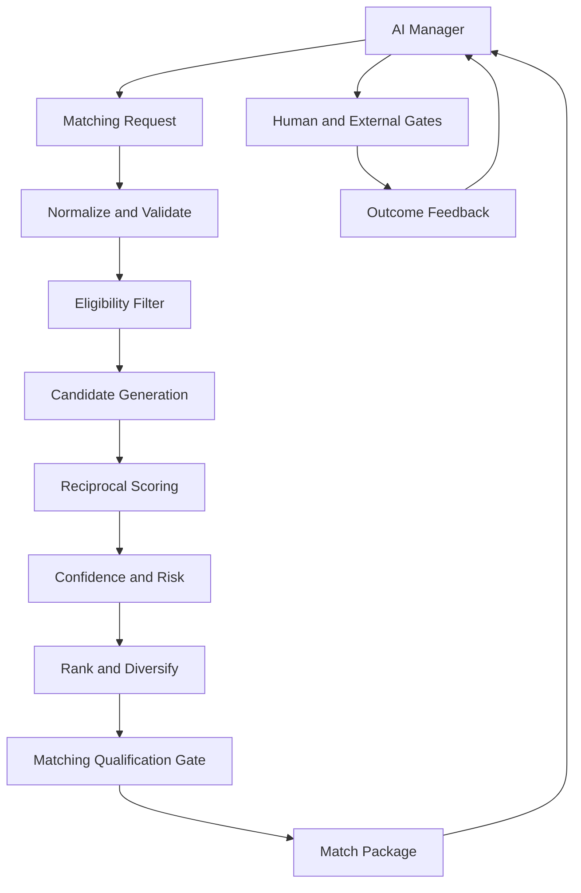

# LeaseMind Matching Engine Architecture

**Версия:** 1.1  
**Дата:** 2026-07-26  
**Статус:** Proposal for cross-functional review and approval  
**Предыдущая версия:** v1.0 — Superseded  
**Владелец:** Chief AI Architect  
**Первый рынок:** Россия  
**Область:** внутренняя AI-архитектура LeaseMind

---

## 1. Назначение документа

Настоящий документ определяет полную архитектуру Matching Engine LeaseMind после аудита версии 1.0 на соответствие более поздним решениям PRODUCT, AI, BUSINESS и LEGAL.

Matching Engine — специализированная внутренняя система, которая:

- сопоставляет профиль помещения и профиль спроса арендатора;
- формирует взаимные, объяснимые и проверяемые гипотезы совпадения;
- отделяет совместимость от уверенности, риска и юридической готовности;
- ранжирует перспективные пары;
- передает результат AI Manager;
- принимает обратную связь о просмотре, переговорах и сделке для оценки качества модели.

Matching Engine не является владельцем Кампании. Единственным владельцем состояния Кампании, стратегии, задач, решений и переходов остается AI Manager.

Главный результат Matching Engine:

> Не список объявлений и не автоматическое решение о сделке, а проверяемая гипотеза взаимного совпадения, пригодная для дальнейшей квалификации и решения AI Manager.

---

## 2. Статус и порядок утверждения

Версия 1.1 не утверждается Chief AI Architect единолично.

Порядок согласования:

1. PRODUCT проверяет соответствие продуктовой механике и терминам.
2. BUSINESS проверяет единственного плательщика, платежные события и отсутствие влияния Matching Engine на возвраты, кредиты и вознаграждение за результат.
3. LEGAL проверяет Условия участия, прежний контакт, Запись о защищенном знакомстве, 12-месячную защиту, персональные данные и человеческие решения.
4. DEVELOPMENT проверяет реализуемость контрактов данных, событий, воспроизводимости и разделения хранилищ.
5. Замечания возвращаются Chief AI Architect.
6. Chief AI Architect выпускает исправленную версию либо переводит v1.1 в Approved только после закрытия всех блокирующих замечаний.

До завершения этого процесса статус документа остается `Proposal for cross-functional review and approval`.

Редакция последовательно учитывает обязательные замечания BUSINESS и LEGAL. После закрытия юридических блокеров документ был передан в DEVELOPMENT. Первая–шестая технические проверки дали `CHANGES REQUIRED`. Пять blocking-замечаний шестой проверки закрыты редакцией от 2026-07-26: DB validation приведена ко всем применимым schema constraints, DLP распознаёт нормализованные российские идентификаторы, Reveal использует строгий внешний input allowlist, token redemption атомарно создаёт immutable Attempt и server-owned result hash, а CT evidence проверяется по точным смысловым counters. Версия, архитектурная основа, продукт, UX, экономика и юридические правила не изменены.

Настоящая полная редакция v1.1 повторно направляется в DEVELOPMENT на `ARCHITECTURE_APPROVAL_GATE`. Самостоятельное утверждение Chief AI Architect не выполняется. Прохождение Architecture Approval разрешает только подготовку артефактов и синтетическую реализацию; оно не подменяет `IMPLEMENTATION_READINESS_GATE`, `SYNTHETIC_ACCEPTANCE_GATE` или `PRODUCTION_LAUNCH_GATE`. До последнего запрещены production-платежи, обработка реальных персональных данных и раскрытие защищенных данных.

---

## 3. Источники и приоритет требований

При подготовке v1.1 использованы:

1. `PLAYBOOK.md`.
2. `PRODUCT.md`.
3. `SCREEN_FLOW.md`.
4. `UX_GUIDE.md`.
5. `AI_PRINCIPLES.md`.
6. `LeaseMind_AI_MANAGER_ARCHITECTURE_v1.0.md` — Approved.
7. `AI_CAMPAIGN_ENGINE.md`.
8. `AUTONOMY_RULES.md`.
9. `LeaseMind_MATCHING_ENGINE_ARCHITECTURE_v1.0.md` — Superseded.
10. `LeaseMind_BUSINESS_PAYMENTS_v1.3.md`.
11. `LeaseMind_LEGAL_CONTRACT_PACKAGE_v1.1.md`.
12. `LeaseMind_INTERFACE_LEGAL_PAYMENT_SPEC_v1.0.md`.
13. `PROJECT_STATE.md`.
14. `NEXT_STEPS.md`.

При расхождении применяется следующий приоритет:

1. императивные требования законодательства и утвержденные LEGAL-ограничения;
2. утвержденная продуктовая механика;
3. утвержденная бизнес- и платежная модель;
4. утвержденная архитектура AI Manager и правила автономии;
5. настоящая архитектура Matching Engine;
6. устаревшая версия Matching Engine v1.0.

`PROJECT_STATE.md` и `NEXT_STEPS.md` датированы 2026-07-10 и не отражают все поздние платежные и юридические решения. Для Match, оплаты, раскрытия и защиты данных более поздние документы BUSINESS, LEGAL и интерфейсная спецификация имеют приоритет. Обновление базовых PRODUCT-документов остается отдельной задачей PRODUCT и не выполняется настоящим документом.

---

## 4. Полный Change Log v1.1

| Область | v1.0 | v1.1 |
| --- | --- | --- |
| Статус | Draft for Approval | Proposal for cross-functional review and approval |
| Роль Matching Engine | Формирует и ранжирует совпадения | Формирует гипотезы; явно не владеет состоянием Кампании и не меняет его |
| Владелец Кампании | Указан AI Manager | Закреплен как единственный владелец состояния, стратегии и переходов |
| Термин результата | Match | Внутренний Match; продуктовый и юридический результат — «Квалифицированный вариант» |
| Плательщик | Не моделировался | Один заранее определенный плательщик; назначение поступает от AI Manager по утвержденному правилу |
| Две активные Кампании | Не было закрытого правила разрешения конфликта | Введено атомарное назначение единственного плательщика; до разрешения конфликта блокируются оплата и раскрытие, авторизация второй стороны освобождается |
| Платеж 10 000 ₽ | Упоминался только общий Address Disclosure Gate | Зафиксирован как внешний gate до раскрытия; Matching Engine не создает платеж, не списывает средства и не определяет возврат |
| Условия участия второй стороны | Отсутствовали | Обязательное состояние до активации и раскрытия защищенных данных |
| Отказ от Условий участия и новая Кампания | Не моделировался | Предыдущий Match закрывается без раскрытия и защиты; новая Кампания запускает новый Match с новым ID, актуальными версиями и повторным прохождением всех gates |
| Прежний контакт | Отсутствовал | Обязательная двусторонняя декларация и проверяемый статус до возникновения защиты |
| Запись о защищенном знакомстве | Отсутствовала | Matching Engine формирует необходимые идентификаторы и доказательственные ссылки; Запись создает отдельный юридический сервис |
| Итоговый состав Записи | Был разделен между Seed и внешними дополнениями без единого обязательного перечня | Закреплен полный обязательный состав Записи по BUSINESS v1.3 с владельцами каждого блока данных |
| 12-месячная защита | Отсутствовала | Поддерживаются ссылки на начало, окончание и статус защиты, но Matching Engine не создает юридическое обязательство |
| Защита локации | Допускались район, зона, расстояние и время в пути | До раскрытия запрещены любые прямые и косвенные данные, способные идентифицировать объект |
| Раскрытие вариантов | Не ограничивалось одним активным вариантом | Учитывается правило одного раскрытого варианта и обязательного решения по текущему до следующего |
| Персональные данные | Общая изоляция | ПД и контакты отделены от неизменяемых ID, статусов, временных меток и хешей событий |
| Связанные лица | Не моделировались | Только сигнал риска на проверяемых данных; окончательный вывод делает человек |
| Обход платформы | Не моделировался | Только риск-сигнал; решение о защищенной сделке и взыскании принимает уполномоченный сотрудник |
| Спорная неявка | Не моделировалась | AI-вывод и одностороннее заявление не являются доказательством; Matching Engine не принимает решение |
| Risk Score | Входил в корректировку итогового балла | Отделен от Match Score и Confidence Score; юридические выводы не скрываются внутри формулы |
| Qualification Gate | Общая готовность | Разделен на Matching Qualification, Presentation Readiness и внешние Legal/Payment/Reveal gates |
| Причины отказа | Частично описаны | Введена полная таксономия алгоритмических и процессных причин |
| Повторный запуск | Общий пересчет | Определены триггеры, версия входов, защита от устаревшего результата и сохранение истории |
| Обратная связь | Просмотр, переговоры, сделка | Для обучения используются только проверенные или явно маркированные результаты; спорные события не становятся истинной меткой автоматически |
| Агенты поиска | Не детализировались | Введен контракт передачи кандидатов от будущих агентов поиска собственников и арендаторов |
| Пилотные показатели | Общие AI-метрики | Добавлены показатели российского пилота и обязательные нулевые нарушения |
| Граница KPI | Содержались показатели сделки, оплаты и операционного процесса | Раздел 34 ограничен KPI Matching Engine; полный перечень бизнес-показателей остается в BUSINESS v1.3 |
| Готовность DEVELOPMENT | Общие критерии | Добавлен межфункциональный Launch Gate и список обязательных спецификаций |

### 4.1. Закрытие обязательных замечаний LEGAL от 2026-07-22

| Закрытый LEGAL-блокер | Раздел документа | Внесенное изменение |
| --- | --- | --- |
| Авторизация ошибочно считалась достаточной для раскрытия | 18.5, 18.7, 21.4, 22.3, 25.2, 29, 31, 32 | До раскрытия требуется `ADVANCE_SETTLED_AND_FISCALIZED` и `advance_receipt_id`; hold и авторизация остаются блокирующими; финальный чек создается после доказанной доставки |
| Не было формальной модели состояний Записи | 21.4 | Введена машина состояний `DRAFT → PRE_REVEAL_LOCKED → REVEAL_COMMITTED → REVEALED_ACTIVE → EXPIRED / VOID_PRE_REVEAL / DISPUTED` с допустимыми переходами и запретами |
| Не была полностью исключена выдача данных до атомарной фиксации Записи | 18.6, 18.7, 21.5, 22.3, 32 | Введен fail-closed протокол: commit Записи предшествует выдаче байтов, ссылки или токена; частичное незафиксированное раскрытие запрещено |
| Participation Gate не содержал полного доказательственного состава и повторного акцепта | 18.3, 21.2, 23.5, 29 | Зафиксированы личность, полномочия, версия и хеш условий, ПЭП, дата и время; изменение плательщика или версии условий аннулирует readiness и требует нового подтверждения |
| Не все состояния прежнего контакта блокировали раскрытие; поздний спор мог трактоваться как автоматическое аннулирование | 18.4, 20, 21.4, 32 | Все неразрешенные состояния блокируют Reveal; поздний спор переводит действующую Запись в `DISPUTED`, но не аннулирует ее автоматически |
| Полномочия reviewer при конфликте плательщика были сформулированы слишком широко | 19, 31 | Роль `PAYER_CONFLICT_REVIEWER` устанавливает факты и применяет утвержденное правило, но не выбирает плательщика по усмотрению; неопределенность блокирует процесс |
| Не был точно определен момент и неизменность 12-месячной защиты | 21.6, 22.3, 26, 29 | Начало связано с первым `REVEAL_DELIVERY_CONFIRMED`, окончание вычисляется один раз; commit без доставки срока не создает; повторное раскрытие, закрытие Кампании и возврат срок не изменяют |
| Не были закрыты правила ПД, обезличивания, автоматического `INELIGIBLE` и хранения | 8.2–8.5, 14.3, 30, 33, 37 | Закреплены раздельное хранение, локализация, различие токенизации и обезличивания, границы автоматического исключения, матрица сроков и подтверждаемое уничтожение |

### 4.2. Закрытие оставшихся замечаний повторной проверки LEGAL

| Закрытый LEGAL-блокер | Измененные разделы | Новые состояния и события | Внесенное изменение | Влияние на Production Launch Gate |
| --- | --- | --- | --- | --- |
| Защита начиналась до доказанной технической передачи | 18.7, 21.4–21.6, 22.3, 26, 29, 32 | `REVEAL_DELIVERY_CONFIRMED`, `DISCLOSURE_DISPUTED` | `REVEAL_COMMITTED` фиксирует только готовность; срок и оказание этапа начинаются лишь при первой доказанной доставке; неопределенная/частичная передача требует human review | Production Reveal заблокирован без доказательства доставки и проверенного перехода в `REVEALED_ACTIVE` |
| Авансовая и финальная фискализация не были разделены | 18.5, 21.2–21.5, 23.5, 25.2, 29, 31, 32 | `ADVANCE_SETTLED_AND_FISCALIZED`, `advance_receipt_id`, `FINAL_SETTLEMENT_FISCALIZED`, `final_settlement_receipt_id` | До раскрытия фиксируется аванс; чек полного расчета создается только после подтвержденной доставки; до этого этап не признается оказанным автоматически | Нужны отдельно протестированные ККТ/ОФД сценарии аванса и зачета; без них production-платежи и Reveal запрещены |
| Машина состояний не фиксировала мотивированный исход спора | 21.4, 21.7, 29, 31, 32, 33 | `DISPUTE_REJECTED`, `DISPUTE_UPHELD`, `INVALIDATED_BY_DECISION` | Добавлены append-only результаты, состав мотивированного решения и финансовые последствия без удаления исходной Записи | Production dispute workflow заблокирован без RBAC, журнала решения и теста обоих исходов |
| Не был формализован стандарт доказательств прежнего контакта | 18.4, 20, 23.5, 29, 33, 37 | `PREVIOUS_CONTACT_EVIDENCE_POLICY` | Введена обязательная версионируемая политика датированных доказательств; заявление и AI-совпадение недостаточны; вопрос №5 закрыт | Reveal запрещен без утвержденной версии политики и итогового `NO_PREVIOUS_CONTACT_CONFIRMED` |
| Не были полностью закреплены назначения, доступ и ограничения reviewer | 19, 21.7, 31.1, 33, 36, 37 | reviewer appointment ID, RBAC role, conflict-of-interest check, second-level approval | Reviewer назначается приказом ИП, действует в пределах роли, не выражает волю за пользователя; для исправления плательщика после финансового/юридического события требуется второй уровень | Production human-decision gateway заблокирован до приказа, RBAC и проверки четырех глаз; вопрос №12 закрыт в юридически значимой части |
| Данные не были связаны с машиночитаемым правовым основанием | 8.2, 11, 13, 23.5, 29, 32, 33 | `lawful_basis_id`, `LAWFUL_BASIS_INVALIDATED`, `LAWFUL_BASIS_REVOKED` | Каждое персональное/защищенное значение связано с целью, источником, версией основания, сроком и статусом; недействительное основание блокирует поступление и повторное использование; иностранные AI/LLM/API по умолчанию `BLOCKED` | Реальные ПД запрещены до проверки оснований, поставщиков, договора обработки и трансграничной передачи LEGAL |
| Проверялась только авторизация второй стороны, а не полная финансовая экспозиция | 18.5, 18.7, 19, 21.2–21.5, 23.5, 29, 31, 32, 35, 36 | `SECOND_PARTY_FINANCIAL_EXPOSURE_CLEARED`, `SECOND_PARTY_REFUND_AND_FISCAL_CORRECTION_CONFIRMED` | Перед Reveal исключаются списание, кредит, обязательство и кассовое событие второй стороны; ошибочное списание блокирует Reveal до возврата и коррекции | Production Reveal заблокирован без агрегированной проверки финансовой экспозиции и теста ошибочного списания |

### 4.3. Закрытие blocking-замечаний DEVELOPMENT

| Закрытый DEVELOPMENT-блокер | Измененные разделы | Новые нормативные сущности, состояния и события | Влияние на Production Launch Gate |
| --- | --- | --- | --- |
| Неоднозначные источники истины и несколько writers | 6–8, 21, 23, 29, 40 | `SYSTEM_OF_RECORD_MATRIX`, single-writer, проекции с `source_version` | Запуск блокируется без технического enforcement владения |
| Разные Match ID одной пары в двух Кампаниях | 8, 18–19, 21, 23, 41 | `match_pair_id`, `encounter_id`, `PayerResolutionAggregate`, уникальная активная пара | Запуск блокируется без конкурентного теста двух Кампаний |
| Отсутствие исполнимых контрактов | 29, 36, 42, 52 | `MATCHING_DATA_CONTRACTS`, OpenAPI 3.1, AsyncAPI, JSON Schema, DDL, error catalog, event envelope | Контракты должны быть утверждены, версионированы и опубликованы до production-кода |
| Неопределенный consistent gate snapshot | 18.7, 21.5, 32, 43 | `reveal_gate_snapshot_id`, `snapshot_hash`, `valid_until`, fencing token, outbox | Reveal запрещен без валидного атомарно зафиксированного snapshot |
| Нет формальных saga/recovery/idempotency | 21.5, 29, 32, 44 | `REVEAL_SAGA`, `PAYMENT_TO_REVEAL_SAGA`, inbox/outbox, DLQ, recovery matrix | Обязательны crash-recovery и duplicate/out-of-order tests |
| Неполная state machine и смешение namespaces | 21.4–21.7, 45 | `record_state`, `gate_state`, `operation_state`, `field_status`; timeout в `DISCLOSURE_DISPUTED` | Запуск блокируется без transition tests и точного календарного алгоритма |
| Неопределенные доказательства доставки | 21.5–21.6, 29, 46 | `REVEAL_DELIVERY_EVIDENCE_POLICY`, evidence manifest, policy hash | До утверждения политики автоматическое `REVEAL_DELIVERY_CONFIRMED` запрещено |
| Нет платежной state machine и immutable ledger | 18.5, 19, 29, 32, 47 | уникальные financial IDs, append-only ledger, webhook dedup, reconciliation | Запуск блокируется без сверки провайдер/ККТ/ОФД и payer fencing |
| Недостаточная security/data-localization спецификация | 8, 33, 48 | `SECURITY_AND_DATA_LOCALIZATION_SPEC`, KMS/HSM РФ, WORM, PITR, crypto-erasure | Требуется отдельное утверждение SECURITY/LEGAL и подтвержденное размещение в РФ |
| Невоспроизводимые scoring и replay | 14–17, 30, 33, 49 | `MATCHING_REPRODUCIBILITY_SPEC`, canonical encoding, digests, deterministic replay | Недетерминированная модель не допускается к Qualification Gate |
| Нет технического synthetic-only профиля | 2, 36, 50 | `NON_PRODUCTION_SAFETY_PROFILE`, null-sink Reveal, fake payment/fiscal, DLP, kill switches | Production adapters разблокируются только подписанным Launch Gate |
| Нет cost model Matching Engine | 34, 51 | `MATCHING_COST_MODEL`, p50/p95, Campaign/month budget and stop forecast | Бюджетные лимиты и telemetry обязательны до пилота |
| Открытые Launch-блокеры не привязаны к артефактам | 36–38, 52 | `CONTROLLED_ARTIFACT_MANIFEST`, owner/version/hash/approval/link | Вопросы 2, 3, 6, 8, 10, 11, 15 блокируют запуск до утверждения артефактов |
| Нет полного acceptance suite | 36, 53 | 12 обязательных end-to-end acceptance scenarios | Повторная проверка DEVELOPMENT и Production Launch Gate блокируются до успешного прогона |

### 4.4. Закрытие восьми blocking-замечаний повторной проверки DEVELOPMENT

| № | Закрытый блокер | Измененные разделы и артефакты | Нормативное решение | Gate |
| ---: | --- | --- | --- | --- |
| 1 | Не определены writers Identity/Authority и lawful basis | 21.3, 40, 43 | Добавлены `Identity/Authority Registry` и `Lawful Basis/Consent Registry`, версии, invalidation events и запреты cross-domain write | Architecture Approval |
| 2 | Контрактный пакет описан, но отсутствует | 36, 42, 52; `LeaseMind_MATCHING_DATA_CONTRACTS_v1.0.md` | Создан исполнимый пакет OpenAPI 3.1, AsyncAPI/JSON Schema, DDL, error catalog и compatibility tests; версия и hash внесены в manifest | Implementation Readiness |
| 3 | Delayed invalidation допускала раскрытие после изменения источника | 21.5, 43, 44, 53 | Выбраны source-owned Reveal leases с strongly-consistent `reveal_guard_epoch`: обычная мутация сериализуется с lease, а safety-critical invalidation немедленно отзывает lease и повышает epoch; redemption проверяет epoch/leases атомарно server-side | Architecture Approval + Synthetic Acceptance |
| 4 | Две несовместимые модели dispute states | 21, 26, 29, 32, 33, 35, 45 | `DISPUTE_REJECTED`/`DISPUTE_UPHELD` оставлены только events/decision outcomes; четыре перехода разделены; таблица 45 имеет нормативный приоритет | Architecture Approval |
| 5 | Не покрыт путь кредита и смешанной оплаты | 18.5, 21.2, 44, 47, 53; Data Contracts | Добавлены `CREDIT_APPLIED`, `CREDIT_REVERSED`, `PAYMENT_AUTHORIZATION_RELEASED`, пути `DEBIT/CREDIT/MIXED`, авансовая фискализация и recovery | Implementation Readiness + Synthetic Acceptance |
| 6 | Pseudonymous IDs ошибочно названы PII-free | 8.4–8.5, 29, 41–42, 48, 54; Data Contracts | Классификация изменена на «без открытых идентификаторов; pseudonymized personal data»; распространены локализация, lawful basis, RBAC, retention и crypto-unlinking | Architecture Approval + Production Launch |
| 7 | Смешаны architecture, implementation, acceptance и production gates | 2, 36, 52–54 | Введены четыре независимых gate с отдельными условиями и разрешенными действиями | Architecture Approval |
| 8 | 1 640 ₽ ошибочно представлен утвержденным лимитом | 34, 51, 52 | 20%/1 640 ₽ переведены в proposed guardrail; базовый контроль разделен по утвержденным BUSINESS-категориям 1 200 ₽ и 2 000 ₽; добавлен заполненный synthetic cost baseline | Implementation Readiness + BUSINESS confirmation |

### 4.5. Закрытие `DEV-B01–DEV-B06` последующей проверки DEVELOPMENT

| Блокер | Измененные разделы и артефакты | Исправление | Влияние на gate |
| --- | --- | --- | --- |
| `DEV-B01` — contract suite был только перечнем | 36, 42, 52–53; `LeaseMind_MATCHING_DATA_CONTRACTS_v1.0.md`; каталог `LeaseMind_MATCHING_DATA_CONTRACTS_v1.0/` | Добавлены machine-readable OpenAPI/AsyncAPI, migrations up/down, fixtures, executable verification suite, hash manifest и synthetic report | Contract approval требует успешного CI; production не разрешается |
| `DEV-B02` — AsyncAPI и invalidation namespace расходились | 40.1–40.2, 42, 53; Data Contracts 4, 8–9 | Введён единый canonical event namespace: изменение причины передаётся typed `reason_code`; объявлены channel parameters и previous-contact channel | Projections/replay допускаются только по canonical schemas |
| `DEV-B03` — token secret не участвовал в redemption | 42–44, 48, 53; Data Contracts 3, 5–8 | Redemption требует opaque raw credential, server-side hash check и authenticated recipient; UUID token ID не является credential | Reveal blocked без negative security tests |
| `DEV-B04` — contract state machine расходилась с таблицей 45.1 | 42, 45–46, 53; Data Contracts 3–6, 8 | Human delivery decision разрешён только из `DISCLOSURE_DISPUTED`; automatic delivery содержит обязательный доказанный timestamp; states типизированы | Protection/final fiscalization blocked без transition tests |
| `DEV-B05` — Snapshot/Record/Token/Attempt не имели полной DDL-целостности | 21, 29, 42–44, 53; Data Contracts 5, 8 | Полный Snapshot состав, normalized party bindings, composite FK, immutable Snapshot/Attempt/Evidence/Decision и owner grants | Atomic Reveal и audit trail blocked без migration/grants tests |
| `DEV-B06` — небезопасный `SECURITY DEFINER` namespace | 43, 48, 53; Data Contracts 5, 8 | Guard перенесён в закрытую schema, обращения schema-qualified, `search_path = pg_catalog`, non-login owner и минимальные EXECUTE grants | `reveal_guard_epoch` не является security boundary до успешного shadow/grants test |

### 4.6. Закрытие третьей проверки DEVELOPMENT

| Замечание | Изменённые разделы и артефакты | Нормативное исправление | Влияние на gate |
| --- | --- | --- | --- |
| `THIRD-B01` — executable suite не выполнял обязательные tests | 42, 52–53; Data Contracts 3–5, 8, 10; executable package | Зафиксированы настоящие validators; исполняются `CT-001–CT-033`, 9 OpenAPI operations, каждый объявленный 4xx и 30 canonical event types; отчет перечисляет каждый ID | Техническая проверяемость `IMPLEMENTATION_READINESS_GATE` подтверждена offline; approval всё ещё требуется |
| `THIRD-B02` — down migration падал на циклическом FK | 42, 44, 52–53; migrations/tests | FK удаляется до teardown; post-down assertions доказывают пустой catalog contract objects | Migration lifecycle `up/assert/down/empty` обязателен и выполнен |
| `THIRD-B03` — отсутствовали initializer и атомарный guard lifecycle | 40, 43–44, 53; DDL/behavior tests | Encounter trigger идемпотентно создаёт guard; одна owner-controlled операция атомарно меняет source version, отзывает lease, повышает epoch и пишет outbox | Delayed invalidation допускается только после concurrency/idempotency tests; production не разрешён |
| `THIRD-B04` — Acceptance → Record → Snapshot не имели составной целостности | 21, 29, 42–43, 53; OpenAPI/DDL | Массивы заменены normalized party bindings; composite FK фиксируют encounter, party, acceptance version и terms hash; deferred checks требуют ровно OWNER + TENANT | Смешанные участники/версии не могут пройти Reveal gate |
| `THIRD-B05` — cross-domain outbox/idempotency write | 40, 42, 44, 53; DDL/grants tests | FORCE RLS и constraint triggers связывают role с producer/event types/service ID; сохранённый response immutable | Single-writer и replay защищены на уровне БД |
| `THIRD-NB01` — OpenAPI lint noise | 42; OpenAPI | Добавлены summaries/license, удалён unused component, исправлены conditional schemas | Комментарий закрыт без изменения wire semantics |
| `THIRD-NB02` — cleanup не гарантировался | 44, 53; PostgreSQL runners | Trap/finally всегда выполняет cleanup и post-down assertions, сохраняя исходный failure | Disposable test environment не остаётся загрязнённым |

### 4.7. Закрытие четвёртой проверки DEVELOPMENT

| Замечание | Изменённые разделы и артефакты | Нормативное исправление | Влияние на gate |
| --- | --- | --- | --- |
| `FOURTH-B01` — string/property-presence assertions создавали ложный PASS | 42, 53; Data Contracts 8, 10; contract/service/PostgreSQL runners и report | Каждый `CT-001–CT-033` исполняет validator fixture, synthetic service behavior или database behavior; отчёт указывает уровень доказательства. Непроведённый уровень обязан быть `NOT_RUN`/`BLOCKED`, а regex/property presence не может единолично дать `PASS` | `IMPLEMENTATION_READINESS_GATE` больше не принимает ложноположительный отчёт; фактический suite выполнен на synthetic data |
| `FOURTH-B02` — Architecture/AsyncAPI/fixtures/outbox расходились; malformed payload проходил | 40.2, 42, 45.1, 53; AsyncAPI, fixtures, DDL | `RECORD_PRE_REVEAL_LOCKED`, `PRE_REVEAL_VOIDED`, `PROTECTION_END_REACHED` включены в единый набор 33 event types. До commit outbox выполняется exact `(event_type, schema major)` payload validation; для каждого типа выполнены positive и malformed probes | Невалидное/нетипизированное событие не может попасть в outbox; gate требует set equality и 66 payload probes |
| `FOURTH-B03` — source writer читал lease другого source owner | 40, 43.1, 48, 53; RLS/grants/tests | Source writer видит только строки своего `source_system`; полный server-side read оставлен Introduction Record, Reveal и contract reader. Выполнены отрицательные SELECT/UPDATE probes для всех 30 ordered cross-owner pairs | Least-privilege isolation подтверждена; Reveal projections не меняются |
| `FOURTH-NB01` — неявное расположение Markdown | 42, 52–53; executable README/layout | Immutable copies обоих нормативных Markdown включены в `docs/` ZIP и входят в source manifest | Clean run не зависит от внешней directory layout |
| `FOURTH-NB02` — внешний `DATABASE_URL` не запускал behavior/security probes | 42, 53; PostgreSQL runners | Один runner выполняет одинаковый `up → catalog/behavior/security → down → empty` для embedded PostgreSQL и внешнего `DATABASE_URL`; внешний сервер обязан быть PostgreSQL 15+ | CI matrix 15+ проверяет тот же набор, не только catalog |
| `FOURTH-NB03` — риск передачи устаревших копий | 52; submission package | Добавлен top-level submission manifest с exact canonical filenames и SHA-256 трёх передаваемых артефактов; suffix-copy или hash mismatch отклоняется до review | DEVELOPMENT проверяет только согласованный controlled set |

### 4.8. Закрытие пятой проверки DEVELOPMENT

| Закрытый блокер | Изменённые разделы и артефакты | Нормативное исправление | Влияние на gate |
| --- | --- | --- | --- |
| `FIFTH-B01` — CT не были достоверно связаны с выполненными evidence | 42, 53; Data Contracts 8, 10; `evidence_matrix.mjs`, full runner, self-tests | Для каждого `CT-001–CT-033` задан exact dependency set. Отсутствующий/переименованный dependency даёт `NOT_RUN`, failed dependency — `BLOCKED`; только полный набор `PASS` создаёт итоговый `PASS` | Ложноположительный `IMPLEMENTATION_READINESS_GATE` исключён |
| `FIFTH-B02` — DB принимала неверные типы, UUID, форматы и enum payload | 42, 53; Data Contracts 2, 4–5, 8; DDL и PostgreSQL suite | До outbox commit валидируются object shape, required/nullability, типы, UUID/RFC3339/SHA-256, enum, unknown fields и event-specific conditions. Выполнены 33 positive и 231 negative mutation probes; rejected rows отсутствуют | Невалидный event не может быть опубликован |
| `FIFTH-B03` — отсутствовал реальный DLP для events/traces | 42, 48, 53; DDL, service model, PostgreSQL suite | Runtime guard сканирует payload, trace и metadata на запрещённые ключи и прямые идентификаторы; rejection атомарно откатывает outbox и возвращает только safe code `LM-DATA-CLASSIFICATION-VIOLATION` | DLP становится обязательным техническим условием; production gate не изменён |
| `FIFTH-B04` — недоверенный Reveal-контекст замещался | 42–43, 53; Reveal service model/tests | Любое caller-supplied значение recipient/snapshot/manifest/lease/epoch/record/encounter отклоняется как `LM-REVEAL-CONTEXT-UNTRUSTED`; authoritative context разрешается только из auth/token/Snapshot | Подмена контекста не может привести к Reveal |
| `FIFTH-B05` — token replay не различал idempotency key | 43–44, 53; token model/tests | Атомарный redemption связан с token hash, idempotency key, request hash и immutable stored result: same key+payload возвращает тот же result; new key — `LM-REVEAL-TOKEN-USED`; same key+different payload — conflict; crash до/после commit проверен | Повторная выдача и неразличимый replay исключены |
| `FIFTH-B06` — обязательные `CT-024–CT-033` подменялись несвязанными checks | 43, 48, 53; Data Contracts 8; service/DB suites | Исполнены crypto-unlink несвязываемости, token-ID-only rejection, reason/owner/consumer matrix, forbidden human transition, composite Token→Attempt FK, 12 immutable mutations, ordered RLS pairs и hostile shadow-object attack | Acceptance suite соответствует заявленным test IDs |

### 4.9. Закрытие шестой проверки DEVELOPMENT

| Закрытый блокер | Изменённые разделы и артефакты | Нормативное исправление | Влияние на gate |
| --- | --- | --- | --- |
| `SIXTH-B01` — DB принимала невалидные RFC 3339, minimum и length values | 42, 53; Data Contracts 2.1, 4–5, 8, 10; DDL и PostgreSQL suite | DB validator проверяет calendar-valid RFC 3339 через строгую форму, `make_date` и `timestamptz`; применяет все payload `minimum`, `maximum`, `minLength`, `maxLength`, type, format, enum, const и pattern constraints. Mutation matrix строится для каждого constrained field; в clean run выполнено 1020 negative mutations с проверкой отсутствия каждой строки | Неполное validation evidence больше не может открыть `IMPLEMENTATION_READINESS_GATE` |
| `SIXTH-B02` — DLP пропускала телефон и паспорт без разделителей | 42, 48, 53; Data Contracts 5, 8, 10; service/DB classifier | Версионированный `DLP_EVENT_CONTENT_V1` нормализует и отклоняет варианты `+7`, `8`, непрерывные цифры, пробелы, дефисы и скобки; единый guard применяется к payload, trace и metadata до commit и не отражает найденное значение | Runtime DLP является fail-closed prerequisite; Production Launch Gate остаётся закрыт |
| `SIXTH-B03` — `encounter_id` и `introduction_record_id` не считались недоверенным Reveal context | 42–43, 53; Reveal model/tests | Внешний allowlist ограничен `opaque_credential`, `idempotency_key`, `authenticated_session_context`. Любое другое поле, включая `encounter_id` и `introduction_record_id`, отклоняется точным `LM-REVEAL-CONTEXT-UNTRUSTED` до token lookup, Attempt и выдачи байтов | Caller не может влиять ни на один authoritative Reveal binding |
| `SIXTH-B04` — redemption погашал token без атомарного Attempt и принимал caller result hash | 43–44, 53; Data Contracts 5–8; DDL/service/PostgreSQL suite | Одна server-owned транзакция блокирует token/guard, проверяет Snapshot/leases/epoch, создаёт ровно один immutable Attempt, строит canonical result, вычисляет SHA-256, помечает token redeemed и сохраняет idempotent result. Same-key replay связан с тем же Attempt; caller result/result hash удалены из сигнатуры. Выполнены two-connection race и failure injection до Attempt/после token update | Ни token без Attempt, ни непроверенный result hash не могут пройти synthetic gate; первый байт разрешён только после commit |
| `SIXTH-B05` — CT dependencies подтверждали более широкий смысл, чем фактический probe | 42, 48, 53; Data Contracts 4, 8, 10; AsyncAPI/runners/evidence matrix | Добавлены machine-checkable evidence schemas/counters и self-tests. `PG-014` делает реальный duplicate `event_inbox`; AsyncAPI содержит explicit 33-row producer-owner-consumer routing; `PG-027` выполняет пять отдельных composite mismatches; `CT-024` оставляет только operation ID, category, policy version, timestamp и deletion-act hash без исходных IDs/payload/event hash | CT получает `PASS` только при выполнении exact semantic evidence; missing counter/schema даёт `BLOCKED` |

Версия v1.0 сохраняется только как историческая архитектурная основа и не используется как актуальная спецификация реализации.

---

## 5. Неизменяемые архитектурные принципы

1. Кампания — главный объект управления LeaseMind.
2. AI Manager — единственный владелец состояния Кампании.
3. Matching Engine работает только по заданию AI Manager или по разрешенному системному событию.
4. Matching Engine не меняет стратегию, параметры, статус или плательщика Кампании.
5. Сопоставление всегда взаимно: со стороны арендатора и собственника.
6. Жесткое подтвержденное ограничение нельзя компенсировать высоким баллом по другим параметрам.
7. Неизвестное значение не считается отрицательным.
8. Факт, предположение, вывод и риск хранятся раздельно.
9. Match Score, Confidence Score и Risk Score являются разными показателями.
10. Каждый значимый вывод связан с источником, временем и версией правил.
11. Matching Engine не использует защищенные персональные признаки или их скрытые заменители.
12. Matching Engine не принимает юридически или финансово значимые решения.
13. Matching Engine не раскрывает точный адрес, контакты или косвенные идентификаторы объекта.
14. Matching Engine не принимает решение о возврате, кредите, спорной неявке, санкции или взыскании.
15. Обучение на результатах сделок не меняет продуктивные правила автоматически.
16. Любой расчет воспроизводим по зафиксированной версии данных, признаков, весов и правил.
17. Пользователю передаются выводы, причины и уверенность, но не внутренние технические идентификаторы.
18. LeaseMind не превращается в каталог объектов или арендаторов.

---

## 6. Границы ответственности

### 6.1. Matching Engine отвечает за

- нормализацию разрешенных признаков профиля помещения и спроса;
- проверку полноты и внутренней согласованности входных данных;
- применение подтвержденных обязательных критериев;
- создание кандидатов на взаимное сопоставление;
- расчет Owner Fit и Tenant Fit;
- расчет Deal Feasibility, Confidence Score и Risk Score;
- формирование объяснений и списка неизвестных данных;
- ранжирование и диверсификацию гипотез;
- формирование результата для AI Manager;
- пересчет после разрешенных событий;
- прием проверенной обратной связи для оценки качества.

### 6.2. Matching Engine не отвечает за

- управление Кампанией;
- изменение стратегии или пользовательских ограничений;
- назначение окончательного статуса Кампании;
- окончательный выбор варианта;
- назначение или изменение плательщика;
- принятие Условий участия;
- идентификацию через юридически значимую электронную подпись;
- создание, авторизацию, списание или возврат платежа;
- управление кредитом Кампании;
- создание юридически действующей Записи о защищенном знакомстве;
- раскрытие адреса или прямых контактов;
- определение факта обхода LeaseMind;
- решение по спорной неявке;
- санкции, ограничение доступа или взыскание;
- подтверждение договора аренды и первого платежа;
- расчет или начисление вознаграждения за результат.

### 6.3. Ответственность AI Manager

AI Manager:

- хранит текущее состояние Кампании;
- выбирает, когда запустить Matching Engine;
- передает актуальную версию цели, ограничений и стратегии;
- определяет приоритет задач;
- принимает и проверяет Match Package;
- запрашивает действия человека;
- координирует Candidate Qualifier, Risk Analyzer и будущих агентов поиска;
- передает разрешенные действия внешним юридическим, платежным и reveal-сервисам;
- записывает подтвержденные результаты в память Кампании.

---

## 7. Архитектура верхнего уровня

Matching Engine не вызывает платежный сервис, сервис раскрытия, юридический сервис или пользователя напрямую. AI Manager координирует процесс Кампании; доменные владельцы обмениваются только утвержденными командами и фактами по матрице раздела 40, не передавая AI Manager права записи в их агрегаты.

---

## 8. Идентификаторы и разделение данных

### 8.1. Неизменяемые внутренние идентификаторы

Для каждого результата поддерживаются:

- `campaign_id`;
- `match_id`;
- `match_pair_id` — стабильная каноническая пара сторон и объекта;
- `encounter_id` — единый процесс знакомства, общий для двух Кампаний;
- `payer_resolution_aggregate_id` и `payer_assignment_version`;
- `property_id` / `object_id`;
- `demand_profile_id`;
- `owner_party_id`;
- `tenant_party_id`;
- `payer_party_id`;
- `payer_campaign_id`;
- идентификаторы представителей и полномочий;
- `strategy_version_id`;
- `scoring_policy_version_id`;
- `autonomy_policy_version_id`;
- `evidence_bundle_id`;
- при создании внешним сервисом — `introduction_record_id`;
- при раскрытии внешним сервисом — ссылка на событие первого раскрытия и срок защиты.

Инварианты и unique constraints этих идентификаторов определены разделом 41. `match_id` не используется как ключ предотвращения двойного плательщика или двойного раскрытия.

### 8.2. Персональные и защищенные данные

Отдельно, в защищенном хранилище, содержатся:

- ФИО и наименования сторон;
- телефоны, email и мессенджеры;
- точный адрес и точная геопозиция;
- документы, доверенности и сведения о полномочиях;
- содержание сообщений;
- правомерно полученные аудиозаписи;
- платежные и фискальные документы;
- иные данные, позволяющие определить сторону или объект.

Matching Engine получает минимальный разрешенный набор признаков либо токенизированные ссылки. Он не включает открытые персональные данные в журнал расчетов, объяснения, аналитические события или обучающие выборки.

Для российского пилота первичная запись, систематизация, накопление, хранение, уточнение и извлечение персональных данных граждан РФ выполняются в базе данных на территории Российской Федерации. Доступ предоставляется по принципу минимально необходимого, разделяется по ролям и журналируется. До положительного заключения LEGAL реальные персональные данные в Matching Engine и связанных тестовых контурах не допускаются.

Передача реальных персональных или защищенных данных иностранному AI, LLM, API, облачному inference-провайдеру либо связанному иностранному обработчику по умолчанию имеет статус `BLOCKED`. Разблокирование возможно только после отдельного письменного решения LEGAL по конкретному поставщику, модели обработки, договору/поручению, месту инфраструктуры, составу данных, локализации и допустимости трансграничной передачи. До такого решения допускаются только синтетические данные, не позволяющие определить реальных субъектов или объекты.

### 8.3. Неизменяемый журнал

Журнал содержит:

- ID;
- тип события;
- временную метку;
- статус;
- версию правил;
- ссылки на доказательства;
- криптографические хеши;
- результат проверки;
- автора или системный источник действия.

Журнал не содержит открытых контактов, адресов, сообщений, аудио или документов. Внутренние ID и проверяемые хеши являются pseudonymized personal data, пока LeaseMind способен восстановить связь, и потому остаются внутри режима локализации РФ, lawful basis, RBAC, retention и журналирования доступа.

### 8.4. Токенизация, псевдонимизация и обезличивание

Токенизированные ID, хешированные значения и псевдонимы остаются персональными данными, если LeaseMind или иной участник обработки способен восстановить связь с субъектом. Они не считаются обезличенными и обрабатываются с теми же правовыми и защитными требованиями, что исходные данные.

Данные считаются пригодными для сегментной аналитики или обучения только после отдельной процедуры необратимого обезличивания, которая:

- удаляет прямые идентификаторы и таблицы обратного соответствия;
- обобщает или исключает редкие комбинации признаков, точную географию и точные временные метки;
- исключает малые группы и выборки с риском повторной идентификации;
- проверяет отсутствие защищенных персональных признаков и их скрытых заменителей;
- документирует набор полей, метод, версию, дату и результат проверки риска повторной идентификации;
- получает разрешение Data Governance до использования в обучении.

Если обратное восстановление или разумное связывание с субъектом остается возможным, набор маркируется `PSEUDONYMIZED_PERSONAL_DATA`, не переносится в обучающий контур и хранится только в защищенной зоне.

### 8.5. Сроки хранения и уничтожение

Срок отсчитывается от более позднего применимого события. При претензии, проверке или судебном споре удаление только относящихся к нему доказательств приостанавливается до окончательного разрешения и истечения применимого срока защиты права.

| Категория данных Matching-контура | Срок |
| --- | --- |
| Бесплатное незавершенное обращение без запуска | До 90 дней после последней активности, если больший срок не требуется для запроса субъекта или доказанного спора |
| Договор, Заказ Кампании, версии и электронный акцепт | Срок договора + 3 года после окончания последнего связанного обязательства или спора |
| Запись о защищенном знакомстве и доказательства раскрытия | 12-месячный срок защиты + 3 года после его окончания; при сделке или споре — 3 года после окончательного расчета или разрешения спора, если это позже |
| Содержание сообщений и документы по Match | Только необходимый объем; срок Кампании или защиты + до 3 лет для защиты права; срок сокращается при отсутствии спора |
| Метаданные уведомлений и звонков | Срок Кампании или защиты + 3 года, если они необходимы как доказательство |
| Аудиозаписи | Не более 90 дней без спора; при споре — до его разрешения и окончания применимого срока защиты права |
| Геолокация или отметка присутствия | До решения по событию; при споре — до его разрешения; затем уничтожение или необратимое обезличивание |
| Платежные, кассовые, бухгалтерские и налоговые документы | Не менее установленного законом срока; рабочий минимум — 5 лет после соответствующего отчетного периода, если больший срок не требуется |
| Согласия и отзывы | Весь срок обработки + 3 года для доказательства законности, если иной срок не установлен законом |

По достижении срока Data Retention Service выполняет уничтожение либо допустимое необратимое обезличивание во всех primary/replica/cache/search/vector/backup контурах, создает акт/событие подтверждения и оставляет только минимальный технический tombstone. Для ID-bearing данных обязательно уничтожаются или криптографически разрываются таблицы соответствия, purpose-bound token mappings и соответствующие link/encryption keys. Tombstone содержит только несвязываемый случайный ID операции удаления, категорию, policy version, время и hash акта; он не содержит `party_id`, `match_pair_id`, `encounter_id`, исходный payload hash или иной стабильный ключ, позволяющий восстановить субъекта. Matching Engine не продлевает сроки самостоятельно и не сохраняет данные «для возможной будущей пользы».

---

## 9. Профиль помещения

Property Profile является версионируемым представлением объекта для сопоставления.

### 9.1. Идентификация и происхождение

- внутренний ID объекта;
- ID стороны, имеющей отношение к объекту;
- роль: собственник, представитель, управляющая компания, брокер;
- статус проверки полномочий;
- источники связи стороны с объектом;
- дата создания и версия профиля;
- дата последней проверки.

### 9.2. Объектные признаки

- тип и допустимое назначение;
- площадь и конфигурация;
- этаж, вход, витрины, доступ, парковка;
- инженерные параметры;
- состояние и готовность;
- разрешенные виды использования;
- доступность и предполагаемая дата передачи;
- ограничения эксплуатации;
- фотографии и документы как защищенные ссылки.

### 9.3. Коммерческие признаки

- базовая месячная аренда;
- дополнительные платежи;
- обеспечительный платеж;
- арендные каникулы;
- срок аренды;
- условия ремонта;
- допустимые переговорные диапазоны, если подтверждены стороной.

### 9.4. Географические признаки

- точный адрес и координаты — только в защищенном контуре;
- разрешенные внутренние геопризнаки для расчета;
- расстояния, зоны доступности и бизнес-факторы как вычисленные признаки;
- риск повторной идентификации по сочетанию признаков.

### 9.5. Ограничения собственника

- подтвержденные обязательные критерии арендатора;
- желательные критерии;
- допустимые компромиссы;
- исключенные виды деятельности;
- требования к срокам, готовности и полномочиям;
- источник и дата подтверждения каждого критерия.

### 9.6. Качество данных

- статус верификации каждого значимого поля;
- источник;
- уверенность;
- срок актуальности;
- противоречия;
- неизвестные значения;
- открытые задачи проверки.

---

## 10. Профиль спроса арендатора

Demand Profile является версионируемым представлением запроса и готовности арендатора.

### 10.1. Идентификация и полномочия

- внутренний ID стороны;
- роль и организационный статус;
- представитель и основание полномочий;
- статус проверки идентификации;
- дата создания и версия профиля.

### 10.2. Бизнес и сценарий использования

- вид бизнеса;
- предполагаемое использование помещения;
- стадия бизнеса и планируемая дата открытия;
- существенные операционные требования;
- разрешительные и технические зависимости, если они относятся к объекту.

### 10.3. Требования к помещению

- желаемый регион или район как внутренний критерий поиска;
- площадь и конфигурация;
- тип помещения;
- инженерные параметры;
- этаж, вход, видимость, парковка и доступ;
- состояние и готовность к ремонту;
- сроки доступности.

### 10.4. Коммерческие требования

- бюджет базовой аренды;
- допустимые дополнительные платежи;
- обеспечительный платеж;
- требуемые или желательные каникулы;
- срок договора;
- допустимые переговорные диапазоны, если подтверждены.

### 10.5. Приоритеты и компромиссы

- обязательные критерии;
- желательные критерии;
- переговорные критерии;
- относительная важность;
- источник приоритета;
- дата подтверждения;
- запрет превращать AI-вывод в обязательный критерий без подтверждения стороны.

### 10.6. Качество данных

- статус верификации;
- источники;
- уверенность;
- свежесть;
- противоречия;
- неизвестные значения;
- открытые задачи проверки.

---

## 11. Общая модель значения и доказательства

Каждый значимый параметр профиля содержит:

| Поле | Назначение |
| --- | --- |
| Значение | Текущее нормализованное значение |
| Тип | Точное, диапазон, множество, логическое, географическое, текстовое |
| Класс критерия | Обязательный, желательный, переговорный, информационный |
| Источник | Пользователь, документ, открытый источник, представитель, вычисленный вывод |
| Статус | Заявлено, подтверждено, опровергнуто, конфликт, устарело, неизвестно |
| Уверенность | Надежность конкретного значения |
| Проверено | Дата и способ проверки |
| Актуально до | Срок пригодности значения |
| Видимость | Внутреннее, защищенное, разрешенное к раскрытию |
| Evidence ID | Ссылка на доказательственный материал |
| `lawful_basis_id` | Неизменяемая ссылка на действующее правовое основание обработки |
| Цель обработки | Конкретная совместимая цель, для которой значение получено и используется |
| Источник данных | Субъект, представитель, договор, согласие, законный реестр, обработчик или иной разрешенный источник |
| Версия основания | Версия и хеш согласия, договора, Условий участия или другого документа/правила |
| Срок действия основания | Дата начала, дата окончания либо событие прекращения основания |
| Статус основания | `ACTIVE`, `EXPIRED`, `REVOKED`, `TERMINATED`, `SUSPENDED`, `UNDER_REVIEW` |
| Прекращение/отзыв | Дата, источник и ID события прекращения или отзыва основания |
| Версия | Версия записи и причина изменения |

AI-вывод всегда помечается как `inferred` и не заменяет подтвержденный факт. Для обязательного критерия и юридически значимого поля требуется подтвержденный источник или установленная задача проверки.

Персональное или защищенное значение допускается во вход Matching Engine и к повторному использованию только при `lawful_basis_status = ACTIVE`, совместимой цели обработки и неистекшем сроке. Отсутствующий, отозванный, прекращенный, приостановленный или несовместимый `lawful_basis_id` дает `DATA_PROCESSING_BLOCKED`; значение не загружается в расчет, не передается агенту/модели и не используется повторно. События `LAWFUL_BASIS_INVALIDATED` и `LAWFUL_BASIS_REVOKED` немедленно инвалидируют производные cache/features и запускают разрешенную процедуру блокирования, удаления либо сохранения только по другому документированному основанию.

---

## 12. Классы критериев

### 12.1. Обязательные критерии

Нарушение подтвержденного обязательного критерия исключает пару из обычного ранжирования.

Примеры:

- недопустимый вид использования;
- площадь вне жесткого диапазона;
- базовая аренда выше подтвержденного жесткого максимума;
- отсутствие обязательной инженерной возможности;
- объект вне допустимой географии;
- несовместимый срок доступности;
- отсутствие необходимых полномочий или связи с объектом после завершенной проверки.

Только явное решение стороны, применимое правило или проверенный обязательный факт может создать Hard Constraint. Предположение AI не может стать обязательным критерием.

### 12.2. Желательные критерии

Влияют на Match Score, но допускают компромисс. Их отсутствие не означает автоматический отказ.

### 12.3. Переговорные критерии

Используются для сценарного анализа. Matching Engine может показать, какое изменение повысило бы совместимость, но не может считать цену, бюджет, срок, локацию или иное условие измененным без подтверждения человека.

### 12.4. Неизвестные критерии

Неизвестное значение:

- не получает нулевой балл;
- не трактуется как нарушение;
- уменьшает Confidence Score в зависимости от важности;
- может заблокировать Qualification Gate, если способно изменить допустимость пары;
- порождает запрос проверки только при высокой ценности информации.

---

## 13. Проверка достоверности данных

Evidence Validator совместно с Candidate Qualifier оценивает:

- происхождение данных;
- право на использование источника;
- целостность;
- актуальность;
- соответствие лица и объекта;
- полномочия представителя;
- непротиворечивость;
- возможность независимой проверки;
- необходимость человеческой проверки.

Статусы доказательства:

- `UNVERIFIED` — заявлено, но не проверено;
- `SOURCE_CONFIRMED` — источник установлен;
- `CONTENT_VERIFIED` — содержание подтверждено;
- `CONFLICTING` — присутствуют противоречия;
- `STALE` — срок актуальности истек;
- `REJECTED` — материал недостоверен или непригоден;
- `HUMAN_REVIEW_REQUIRED` — автоматической проверки недостаточно.

Негативный вывод о стороне не создается только из свободного текста, поведенческого предположения или одного непроверенного источника.

---

## 14. Конвейер Matching Engine

### Этап 1. Request Validation

Проверяется:

- запрос исходит от AI Manager;
- Кампания и стратегия имеют актуальные версии;
- переданы разрешенные профили и ограничения;
- каждое персональное или защищенное входное значение имеет действующий `lawful_basis_id`, совместимую цель и разрешенный контур обработки;
- указан режим: первичное сопоставление, пересчет, проверка конкретного кандидата или оценка чувствительности;
- присутствуют версии правил и политик.

### Этап 2. Normalization

Единицы, диапазоны, классификации и географические признаки приводятся к канонической форме. Дубли, конфликты и устаревшие значения маркируются, но не скрываются.

### Этап 3. Eligibility Filter

Применяются только подтвержденные Hard Constraints и обязательные правила. Результат:

- `ELIGIBLE`;
- `INELIGIBLE` с кодированной причиной;
- `NEEDS_VERIFICATION`, если неизвестный параметр способен изменить допустимость.

Автоматический `INELIGIBLE` допустим только при одновременном выполнении всех условий:

1. критерий заранее утвержден как Hard Constraint в версионированной политике;
2. критерий явно задан соответствующей стороной либо прямо установлен обязательным правилом, а не выведен моделью;
3. значение, вызывающее несовместимость, подтверждено актуальным разрешенным источником;
4. критерий не является защищенным персональным признаком, его скрытым заменителем или дискриминационным ограничением;
5. отсутствуют неизвестность, конфликт источников и необходимость юридического толкования;
6. результат содержит код причины, версию правила, ссылку на доказательство и доступен для человеческого пересмотра.

Если хотя бы одно условие не выполнено, Matching Engine не выставляет `INELIGIBLE`, а возвращает `NEEDS_VERIFICATION` или `HUMAN_REVIEW_REQUIRED`. Модельный вывод, Risk Score, статистическая корреляция и отсутствие данных не могут самостоятельно привести к автоматическому исключению. Решения, создающие юридические последствия или существенно затрагивающие права субъекта, не принимаются исключительно Matching Engine.

### Этап 4. Candidate Generation

Используются независимые методы:

- структурные фильтры;
- географическая совместимость во внутреннем контуре;
- диапазоны;
- семантическое сходство;
- сегментные правила;
- активные гипотезы AI Manager;
- кандидаты будущих агентов поиска;
- обезличенные проверенные паттерны успешных сделок.

Этап оптимизируется на полноту и не должен преждевременно отбрасывать перспективную пару.

### Этап 5. Reciprocal Scoring

Отдельно рассчитываются:

- Tenant Fit Score;
- Owner Fit Score;
- Deal Feasibility Score.

### Этап 6. Confidence and Risk

Отдельно рассчитываются:

- Confidence Score;
- Risk Score и категории риска;
- чувствительность результата к неизвестным данным.

### Этап 7. Rank and Diversify

Кандидаты ранжируются по разрешенной политике. Избыточно похожие гипотезы диверсифицируются без повышения слабых вариантов выше минимального качества.

### Этап 8. Matching Qualification Gate

Проверяется достаточность взаимного соответствия и доказательств. Gate не выполняет юридические, платежные или reveal-проверки.

### Этап 9. Match Package

Результат передается AI Manager с полным набором причин, источников, неизвестных данных, рисков и версий.

---

## 15. Reciprocal Scoring

### 15.1. Tenant Fit Score

Оценивает, насколько помещение соответствует подтвержденным требованиям арендатора:

- пригодность использования;
- физические и инженерные параметры;
- коммерческие условия;
- локационная пригодность;
- сроки;
- операционная готовность;
- переговорные разрывы.

### 15.2. Owner Fit Score

Оценивает, насколько арендатор соответствует подтвержденным требованиям собственника:

- допустимый вид деятельности;
- сроки и готовность;
- соответствие коммерческим рамкам;
- подтвержденность личности, организации и полномочий;
- операционная совместимость;
- проверяемые риски, относящиеся к сделке.

### 15.3. Deal Feasibility Score

Оценивает возможность перейти к просмотру и сделке без утверждения самой сделки:

- размер и количество переговорных разрывов;
- готовность обеих сторон;
- совместимость сроков;
- полнота критических данных;
- статус квалификации;
- наличие блокирующих проверок.

### 15.4. Расчет измерения

Для каждого измерения используется нормализованная модель:

`Dimension Score = сумма(Feature Fit × Feature Weight × Evidence Confidence) / сумма активных весов`

Отсутствующее значение исключается из числителя и знаменателя и отдельно учитывается в Confidence Score. Подтвержденное нарушение Hard Constraint обрабатывается до скоринга.

### 15.5. Взаимный балл

`Reciprocal Fit = Mutual Aggregate(Tenant Fit, Owner Fit)`

Mutual Aggregate должен штрафовать односторонние совпадения. Очень высокий Tenant Fit не может скрыть критически низкий Owner Fit, и наоборот. Конкретная функция — гармоническая или геометрическая — фиксируется в версионируемой Scoring Policy после оценки на пилотных данных.

### 15.6. Итоговый Match Score

Match Score объединяет Reciprocal Fit и Deal Feasibility по утвержденной версии весов.

Match Score не включает скрытое юридическое решение, платежный статус, вывод об обходе, санкцию или возврат.

Для ранжирования может использоваться отдельный Priority Score, учитывающий Match Score, Confidence Score и Risk Score. Все исходные показатели сохраняются и показываются раздельно для аудита.

---

## 16. Confidence Score

Confidence Score показывает надежность оценки, а не привлекательность пары.

Факторы:

- полнота критических полей;
- качество и независимость источников;
- свежесть;
- статус верификации;
- отсутствие конфликтов;
- устойчивость ранга при изменении неизвестных параметров;
- согласованность независимых методов;
- историческая калибровка метода.

Высокий Match Score при низком Confidence Score означает необходимость проверки. Он не может быть представлен как готовый Квалифицированный вариант.

Confidence Score рассчитывается отдельно для:

- профиля помещения;
- профиля спроса;
- взаимного соответствия;
- конкретного вывода;
- общего Match Package.

---

## 17. Risk Score

Risk Score показывает наличие проверяемых факторов, способных снизить реализуемость или потребовать человеческой проверки.

Категории:

- качество и конфликт данных;
- полномочия представителя;
- связь стороны с объектом;
- дублирование сущностей;
- операционная несовместимость;
- риск устаревания;
- риск повторной идентификации объекта до раскрытия;
- возможный прежний контакт;
- возможная связь лиц или обход — только как сигнал;
- аномальное поведение, относящееся к конкретным проверяемым событиям.

Risk Score:

- не является доказательством нарушения;
- не является кредитным рейтингом;
- не заменяет юридическую проверку;
- не создает санкцию;
- не меняет плательщика;
- не определяет возврат или кредит;
- не должен использовать защищенные признаки или прокси.

Высокий риск переводит результат в `HUMAN_REVIEW_REQUIRED` либо `NEEDS_VERIFICATION` по утвержденной политике.

---

## 18. Qualification Gates

### 18.1. Matching Qualification Gate — ответственность Matching Engine

Проверяет:

- отсутствие подтвержденного несовместимого Hard Constraint;
- наличие обеих сторон и объекта с неизменяемыми ID;
- достаточность взаимного соответствия;
- минимальную полноту критических данных;
- подтвержденные источники обязательных полей;
- допустимый Confidence Score;
- отсутствие неразрешенного критического риска;
- актуальность версии профилей и правил;
- наличие объяснимых причин совпадения.

Результат:

- `QUALIFIED_HYPOTHESIS`;
- `NEEDS_VERIFICATION`;
- `HUMAN_REVIEW_REQUIRED`;
- `REJECTED_BY_MATCHING`.

### 18.2. Presentation Readiness Gate — координирует AI Manager

До передачи Квалифицированного варианта пользователю проверяется:

- определен единственный плательщик;
- при наличии активных Кампаний обеих сторон существует единственное атомарно зафиксированное назначение `payer_party_id` и `payer_campaign_id`;
- отсутствует флаг `PAYER_RESOLUTION_REQUIRED`;
- безопасное представление не содержит прямых или косвенных идентификаторов;
- нет другого конфликтующего активного варианта;
- версии условий и правил доступны;
- результат Matching Engine не устарел.

Matching Engine передает данные для проверки, но не открывает вариант пользователю самостоятельно.

### 18.3. Participation Gate — внешний

Participation Gate получает `PASSED` только при наличии единого проверяемого Acceptance Record, связанного с конкретными `match_id`, `party_id`, `payer_party_id` и `payer_campaign_id`. Acceptance Record обязательно содержит:

- подтвержденную личность участника и способ идентификации;
- роль участника и проверенный статус полномочий представителя с доказательственной ссылкой;
- версию и криптографический хеш Условий участия;
- версию и хеш необходимого согласия на обработку и передачу контактов;
- подтверждение уведомления о том, кто является единственным плательщиком;
- идентификатор подтвержденной учетной записи;
- доказательство простой электронной подписи: ID одноразового кода/операции, конкретное подписываемое действие и результат проверки;
- серверные дату и время принятия;
- ID неизменяемого события принятия.

Отсутствие любого поля дает `PARTICIPATION_INCOMPLETE` и блокирует раскрытие. При изменении `payer_party_id`, `payer_campaign_id`, версии или хеша Условий участия, роли/полномочий либо состава согласия прежний Acceptance Record получает `SUPERSEDED`, Gate переходит в `RECONFIRMATION_REQUIRED`, а подтверждение с ПЭП выполняется повторно до оплаты/раскрытия.

Matching Engine только получает итоговый статус и ссылки на версии. Он не идентифицирует лицо, не проверяет ПЭП и не оформляет принятие.

### 18.4. Previous Contact Gate — внешний с AI-поддержкой

До возникновения защиты:

- обе стороны заявляют об отсутствии прежнего прямого контакта либо раскрывают его;
- представленные сведения проверяются;
- неподтвержденное одностороннее заявление не является достаточным;
- возможное совпадение, найденное AI, является только сигналом;
- спор решает уполномоченный сотрудник.

Статусы `NOT_DECLARED`, `DECLARED_BY_ONE_SIDE`, `EVIDENCE_SUBMITTED`, `UNDER_REVIEW` и `INCONCLUSIVE` всегда дают `BLOCKED`. Декларация `DECLARED_NONE_BY_BOTH` сама по себе не открывает Gate: требуется итоговый проверенный статус `NO_PREVIOUS_CONTACT_CONFIRMED`. Статус `PREVIOUS_CONTACT_CONFIRMED` прекращает pre-reveal pipeline по правилам раздела 20.

Любое итоговое решение содержит версию `PREVIOUS_CONTACT_EVIDENCE_POLICY`, ссылки на рассмотренные доказательства и мотивировку. Отсутствие утвержденной версии политики либо доказательственной ссылки дает `BLOCKED`.

### 18.5. Payment Gate — внешний

До раскрытия защищенных данных:

- пользователь принял вариант;
- единственный плательщик определен;
- конфликт двух активных Кампаний разрешен и зафиксирован в неизменяемом журнале;
- агрегированный финансовый контроль подтвердил `SECOND_PARTY_FINANCIAL_EXPOSURE_CLEARED`;
- Payment Service и Fiscalization Service подтвердили состояние `ADVANCE_SETTLED_AND_FISCALIZED` для единственного плательщика, сумму 10 000 ₽ либо допустимое применение кредита и заполненный `advance_receipt_id`.

`PAYMENT_AUTHORIZED`, `PAYMENT_HOLD_ACTIVE`, `PAYMENT_PROCESSING`, `ADVANCE_SETTLED_NOT_FISCALIZED`, отсутствие `advance_receipt_id`, отсутствие подтверждения ОФД/ККТ или любой неоднозначный статус дают `BLOCKED`. Одна авторизация, временная блокировка суммы или успешный ответ эквайринга без чека аванса/предоплаты недостаточны для раскрытия.

`ADVANCE_SETTLED_AND_FISCALIZED` имеет ровно три проверяемых пути:

1. `DEBIT` — подтвержденный debit 10 000 ₽ и проверенный `advance_receipt_id`;
2. `CREDIT` — разрешенный внешним BUSINESS/LEGAL правилом `CREDIT_APPLIED` на 10 000 ₽, `credit_application_id` и необходимый `advance_receipt_id`;
3. `MIXED` — `CREDIT_APPLIED` плюс подтвержденный debit, сумма частей ровно 10 000 ₽, и необходимый `advance_receipt_id`.

Нулевые и отрицательные части запрещены; для `MIXED` обе части положительны. `CREDIT_REVERSED`, `REFUND_CONFIRMED`, `FISCAL_CORRECTION_CONFIRMED` и иные коррекции добавляются новыми ledger events, не переписывают исходную запись и повторно вычисляют readiness. Matching Engine не определяет допустимость кредита, состав кассового документа, возврат или коррекцию.

`SECOND_PARTY_FINANCIAL_EXPOSURE_CLEARED` означает подтвержденное отсутствие у второй стороны по данному Match одновременно всех видов экспозиции:

- активной авторизации или hold;
- списанного платежа;
- примененного кредита;
- выставленного финансового обязательства;
- кассового, фискального или бухгалтерского события.

Если у второй стороны ошибочно списаны средства либо создано фискальное событие, Reveal Gate остается `BLOCKED` до фактического возврата, необходимой кассовой/фискальной коррекции и события `SECOND_PARTY_REFUND_AND_FISCAL_CORRECTION_CONFIRMED`, после которого агрегированный статус может быть пересчитан в `SECOND_PARTY_FINANCIAL_EXPOSURE_CLEARED`.

При `PAYER_RESOLUTION_REQUIRED` Payment Gate обязан возвращать `BLOCKED`: новую авторизацию, списание, применение кредита и раскрытие выполнять нельзя. Если авторизация второй стороны была создана до выявления конфликта, AI Manager дает платежному сервису идемпотентную команду на ее освобождение; успешный итог фиксируется отдельным неизменяемым событием `PAYMENT_AUTHORIZATION_RELEASED` с provider operation ID. До этого `SECOND_PARTY_FINANCIAL_EXPOSURE_CLEARED` отсутствует. Matching Engine только получает итоговый процессный статус и не инициирует платеж.

### 18.6. Introduction Record Gate — внешний

Запись о защищенном знакомстве создается отдельным сервисом до раскрытия. Introduction Record Gate получает `PASSED` только при состоянии Записи `PRE_REVEAL_LOCKED`, полном обязательном составе предраскрываемых полей, зафиксированном хеше manifest и неизменяемой связи со всеми пройденными gates. `DRAFT`, `DISPUTED`, `VOID_PRE_REVEAL`, неполная Запись или несоответствие хеша блокируют раскрытие. Matching Engine предоставляет только подтвержденные ID, версии профилей, причины квалификации и ссылки на доказательства.

### 18.7. Reveal Gate — внешний

Раскрытие выполняется только после всех обязательных gates, включая `ADVANCE_SETTLED_AND_FISCALIZED`, `SECOND_PARTY_FINANCIAL_EXPOSURE_CLEARED`, `NO_PREVIOUS_CONTACT_CONFIRMED`, актуальный Participation Acceptance Record и `PRE_REVEAL_LOCKED`. Matching Engine не может выдать разрешение на раскрытие.

Introduction Record Service атомарно переводит Запись в `REVEAL_COMMITTED` и фиксирует готовность к выдаче, состав, хеш, получателя и outbox-команду доставки. `REVEAL_COMMITTED` не является доказательством передачи, не запускает защиту и не признает этап оказанным. Только после commit Reveal Service выполняет техническую попытку и возвращает evidence event. Introduction Record Service по утвержденной evidence policy фиксирует первое доказанное `REVEAL_DELIVERY_CONFIRMED`, атомарно переводит Запись в `REVEALED_ACTIVE`, устанавливает сроки защиты и разрешает последующее событие `FINAL_SETTLEMENT_FISCALIZED`. Неопределенная или частичная передача получает `DISCLOSURE_DISPUTED` и обязательный human review.

---

## 19. Единственный плательщик

Для каждого Квалифицированного варианта до представления и раскрытия должен существовать один заранее определенный плательщик.

Правило российского пилота:

1. При одной активной Кампании платит ее инициатор.
2. При активных Кампаниях обеих сторон плательщиком становится инициатор Кампании, в рамках которой Match был сформирован и первым принят к работе.
3. «Первым принят к работе» определяется первым успешно записанным атомарным событием `MATCH_WORK_ACCEPTED` с серверной временной меткой и монотонным порядковым номером в неизменяемом журнале. Локальное время устройства, время доставки уведомления и AI-вывод не используются как решающий признак.
4. Payer Resolution component выполняет единственную атомарную операцию назначения `payer_party_id` и `payer_campaign_id` внутри общего `PayerResolutionAggregate` для `encounter_id`. AI Manager инициирует/координирует команду и хранит versioned проекцию. Повторная операция идемпотентна; конкурирующая операция разрешается CAS, а не независимым `match_id`.
5. Если однозначность нельзя установить из неизменяемого журнала, устанавливается `PAYER_RESOLUTION_REQUIRED`. Кейс передается сотруднику с ролью `PAYER_CONFLICT_REVIEWER`; до подтвержденного результата плательщик не считается определенным.
6. Вторая сторона не платит 10 000 ₽ и вознаграждение за результат по этому варианту. Для нее не создаются авторизация, списание, применение кредита, финансовое обязательство или фискальное событие; любая ранее возникшая экспозиция устраняется до продолжения процесса.
7. Двойное вознаграждение и договорное исключение из этого правила в российском пилоте запрещены даже при согласии сторон.

До фиксации единственного плательщика запрещены:

- переход Payment Gate в `PASSED`;
- создание или сохранение финансовой экспозиции обеих сторон для одного Match;
- списание 10 000 ₽ у любой стороны;
- применение кредита Кампании;
- создание юридически действующей Записи о защищенном знакомстве;
- раскрытие точного адреса или прямых контактов.

Matching Engine:

- принимает `payer_party_id` и `payer_campaign_id` из состояния AI Manager;
- проверяет наличие назначения перед Presentation Readiness;
- обнаруживает конфликтующие Кампании и возвращает `PAYER_RESOLUTION_REQUIRED`;
- не выбирает плательщика при неоднозначности;
- возвращает `payer_conflict_evidence_refs` и идентификаторы конфликтующих Кампаний AI Manager;
- не изменяет назначение после раскрытия;
- не рассчитывает платеж, возврат, кредит или вознаграждение.

Payer Resolution component владеет `PayerResolutionAggregate`; AI Manager хранит его versioned проекцию, состояние процессной задачи и координирует Payment/Fiscal Ledger, Introduction Record Service и Reveal Service. Payment/Fiscal Ledger устраняет авторизацию, списание, кредит, обязательство и фискальное событие второй стороны и формирует `SECOND_PARTY_FINANCIAL_EXPOSURE_CLEARED`. Reveal Service принимает только подтвержденное единственное назначение плательщика и этот агрегированный статус внутри валидного snapshot.

`PAYER_CONFLICT_REVIEWER` не выбирает плательщика по усмотрению, коммерческой целесообразности, размеру платежа, удобству сторон или AI-рекомендации. Reviewer может только:

1. проверить подлинность и порядок серверных событий;
2. установить факты формирования Match и первого `MATCH_WORK_ACCEPTED`;
3. применить утвержденное правило пунктов 1–4 настоящего раздела;
4. зафиксировать использованные доказательства, установленный факт и примененную версию правила.

Если после проверки факты остаются противоречивыми или очередность недоказуема, результатом является `PAYER_UNRESOLVED`, а не ручной выбор. Payment, Introduction Record и Reveal gates остаются `BLOCKED`; кейс может быть закрыт без раскрытия либо повторно сформирован по новому однозначному событию в пределах утвержденного процесса.

Исправление ошибочного назначения до раскрытия допускается только как применение того же утвержденного правила к новым проверенным фактам, с мотивированной записью reviewer. Оно аннулирует прежний Participation Acceptance Record, сбрасывает Payment Gate в `REVALIDATION_REQUIRED` и требует повторного прохождения Participation Gate, подтверждения платежно-фискального статуса нового плательщика и `SECOND_PARTY_FINANCIAL_EXPOSURE_CLEARED`.

Если исправление выполняется после акцепта варианта, авторизации, списания или применения кредита, оно требует второго независимого подтверждения сотрудником с отдельной RBAC-ролью `PAYER_CORRECTION_APPROVER`. Reviewer и approver не могут быть одним лицом и оба проходят проверку конфликта интересов. После `REVEAL_DELIVERY_CONFIRMED` изменение плательщика запрещено; состояние `REVEAL_COMMITTED` без доказанной доставки может быть отменено/пересобрано только через fail-closed процедуру и те же два уровня контроля.

---

## 20. Прежний контакт и возникновение защиты

Matching Engine поддерживает следующие состояния:

- `NOT_DECLARED`;
- `DECLARED_NONE_BY_BOTH`;
- `DECLARED_BY_ONE_SIDE`;
- `EVIDENCE_SUBMITTED`;
- `UNDER_REVIEW`;
- `PREVIOUS_CONTACT_CONFIRMED`;
- `NO_PREVIOUS_CONTACT_CONFIRMED`;
- `INCONCLUSIVE`.

Правила Gate:

- `NO_PREVIOUS_CONTACT_CONFIRMED` — единственное состояние, разрешающее продолжение к раскрытию;
- `NOT_DECLARED`, `DECLARED_NONE_BY_BOTH`, `DECLARED_BY_ONE_SIDE`, `EVIDENCE_SUBMITTED`, `UNDER_REVIEW` и `INCONCLUSIVE` — раскрытие заблокировано;
- `PREVIOUS_CONTACT_CONFIRMED` до раскрытия — Запись переводится в `VOID_PRE_REVEAL`, платежный процесс обрабатывается внешними сервисами по действующим правилам, защита не возникает;
- переход в разрешающее или подтверждающее прежний контакт состояние выполняется только после проверяемой процедуры и фиксируется человеком/детерминированным Legal Gate, но не моделью.

### 20.1. PREVIOUS_CONTACT_EVIDENCE_POLICY

`PREVIOUS_CONTACT_EVIDENCE_POLICY` является обязательной версионируемой политикой Legal Gate. Решение сохраняет `policy_version_id`, хеш политики и доказательственные ссылки. Политика устанавливает:

1. прежний контакт подтверждается только датированными сведениями, возникшими до первого доказанного раскрытия через LeaseMind;
2. доказательства должны показывать реальную возможность прямых переговоров с соответствующей стороной либо по соответствующему объекту, а не только формальное совпадение имени, телефона, компании или адреса;
3. допустимыми категориями являются переписка, история звонков, ранее согласованный просмотр, направленное предложение, проект договора и сопоставимые проверяемые сведения с установленным источником и датой;
4. одного заявления стороны, AI-совпадения, скоринга, найденного дубля или недатированного материала недостаточно;
5. противоречивые, неполные и непроверенные материалы сохраняют `UNDER_REVIEW` или `INCONCLUSIVE`;
6. все состояния, кроме итогового `NO_PREVIOUS_CONTACT_CONFIRMED`, блокируют раскрытие; `PREVIOUS_CONTACT_CONFIRMED` завершает pre-reveal pipeline;
7. мотивированное решение содержит reviewer ID, проверку конфликта интересов, факты, категории доказательств, версию политики и дату/время.

Matching Engine может:

- находить возможные дубли сторон или объектов;
- сопоставлять неизменяемые идентификаторы;
- выявлять противоречия;
- формировать список доказательств для проверки;
- понижать Confidence Score и ставить human-review flag.

Matching Engine не может:

- признать прежний контакт доказанным только на основе AI-совпадения;
- отклонить заявление стороны без проверки;
- создать или аннулировать юридическую защиту;
- списать или вернуть 10 000 ₽.

При подтвержденном прежнем контакте до `REVEAL_DELIVERY_CONFIRMED` внешний сервис прекращает раскрытие. Если доказано, что данные не были переданы, Запись переводится в `VOID_PRE_REVEAL`, платеж обрабатывается по действующим правилам и 12-месячная защита не запускается. Если факт передачи неопределен или передача была частичной, используется `DISCLOSURE_DISPUTED` и обязательное человеческое решение. Matching Engine получает результат как процессную обратную связь, а не как отрицательную метку совместимости.

Заявление или доказательство прежнего контакта, поступившее после `REVEAL_DELIVERY_CONFIRMED`, не аннулирует Запись и не прекращает защиту автоматически. Запись переводится в `DISPUTED`, доступ к новым операциям по ней ограничивается, доказательства сохраняются, а уполномоченный сотрудник рассматривает спор по утвержденной процедуре. До мотивированного решения состояние защиты и финансовые последствия не изменяются. AI-вывод и одностороннее заявление не являются достаточным основанием для прекращения защиты, возврата или взыскания.

---

## 21. Данные для Записи о защищенном знакомстве

После квалификации Matching Engine формирует `Introduction Record Seed`, который передается AI Manager и сервису Записи.

### 21.1. Introduction Record Seed от Matching Engine

Seed содержит только данные, источником которых является Matching Engine:

- Campaign ID;
- Match ID;
- Match Pair ID;
- Encounter ID;
- Payer Resolution Aggregate ID и Assignment Version;
- Object ID;
- ID собственника и арендатора;
- ID представителей и ссылки на статус полномочий;
- единственного плательщика и Campaign плательщика;
- версию профиля помещения;
- версию профиля спроса;
- версию scoring policy;
- версию qualification policy;
- версию autonomy policy;
- Evidence Bundle ID;
- статус и результат Matching Qualification Gate;
- коды основных причин совпадения;
- статусы прежнего контакта;
- ссылки на принятые документы, когда они поступят от внешних сервисов;
- ссылку на защищенный состав будущего раскрытия;
- хеш manifest раскрываемых полей после его формирования Reveal Service.

Готовность Seed не означает готовность итоговой Записи и не разрешает раскрытие.

### 21.2. Обязательный итоговый состав Записи

До первого раскрытия Introduction Record Service объединяет Seed с versioned projections AI Manager, Identity/Authority Registry, Lawful Basis/Consent Registry, Participation Service, Payment/Fiscal Ledger и Reveal Service. Итоговая Запись о защищенном знакомстве обязательно содержит все поля BUSINESS v1.3:

1. уникальный Introduction Record ID;
2. Campaign ID и Match ID;
3. сведения о единственном плательщике вознаграждения за результат по Match: `payer_party_id`, роль стороны и `payer_campaign_id`;
4. версию и криптографический хеш оферты клиента, Условий участия второй стороны и применимых согласий;
5. Payment ID, `payment_path = DEBIT/CREDIT/MIXED`, сумму 10 000 ₽, суммы debit и credit, статус `ADVANCE_SETTLED_AND_FISCALIZED`, дату/время списания или `CREDIT_APPLIED`, `credit_application_id` при наличии и `advance_receipt_id` чека аванса/предоплаты;
6. неизменяемые идентификаторы клиента, второй стороны и объекта;
7. результат и способ идентификации обеих сторон;
8. электронное подтверждение клиента и второй стороны — отдельно для каждой стороны, с датой, временем, способом подтверждения, ID подтвержденной учетной записи и доказательством ПЭП;
9. дату и время принятия Match клиентом;
10. дату, время, способ и доказательство первого `REVEAL_DELIVERY_CONFIRMED` либо статус `DISCLOSURE_DISPUTED`;
11. хеш состава раскрытых защищенных данных;
12. первоначально согласованные дату и время просмотра;
13. дату и время начала 12-месячного срока защиты;
14. дату и время окончания 12-месячного срока защиты;
15. заявление каждой стороны об отсутствии прежнего прямого контакта по соответствующему объекту либо о полном раскрытии такого контакта до знакомства через LeaseMind, с результатом проверки;
16. ссылку на неизменяемый журнал всех последующих существенных событий по Match.
17. `final_settlement_receipt_id` и событие `FINAL_SETTLEMENT_FISCALIZED` после подтвержденного раскрытия либо явный статус `PENDING_NOT_DELIVERED` до него;
18. `SECOND_PARTY_FINANCIAL_EXPOSURE_CLEARED` и ссылки на проверки отсутствия авторизации, списания, кредита, обязательства и фискального события второй стороны, включая `PAYMENT_AUTHORIZATION_RELEASED` при ранее созданной авторизации;
19. `match_pair_id`, `encounter_id`, `payer_resolution_aggregate_id` и `payer_assignment_version`;
20. `reveal_gate_snapshot_id`, `snapshot_hash`, fencing token version, `delivery_policy_version_id` и хеш `REVEAL_DELIVERY_EVIDENCE_POLICY`.

В дополнение к обязательному составу BUSINESS v1.3 Запись сохраняет версии профиля помещения, профиля спроса, scoring policy, qualification policy и autonomy policy, Evidence Bundle ID и коды причин квалификации. Эти технические поля обеспечивают воспроизводимость, но не заменяют ни одно из обязательных полей выше.

### 21.3. Владение полями и критерий готовности

- Matching Engine отвечает за корректность Seed, версии правил, оценки, причины и доказательственные ссылки.
- AI Manager отвечает за оркестрацию сборки Записи и непрерывность состояния gates.
- Identity/Authority Registry является единственным writer результата идентификации, полномочий, их версии и срока; предоставляет versioned projection и invalidation events.
- Lawful Basis/Consent Registry является единственным writer `lawful_basis_id`, цели, версии, срока, отзыва и прекращения; предоставляет purpose-bound projection и invalidation events.
- Participation Service предоставляет версии документов и электронные подтверждения сторон.
- Payer Resolution component предоставляет единственное назначение плательщика, `payer_assignment_version` и ссылку на атомарное событие; AI Manager хранит только проекцию и координирует процесс.
- Payment Service и Fiscalization Service предоставляют Payment ID, сумму, `ADVANCE_SETTLED_AND_FISCALIZED`, `advance_receipt_id`, а после подтвержденной доставки — `FINAL_SETTLEMENT_FISCALIZED` и `final_settlement_receipt_id`.
- Payment/Fiscal Ledger формирует `SECOND_PARTY_FINANCIAL_EXPOSURE_CLEARED` либо блокирующий статус с деталями экспозиции и коррекции.
- Reveal Service формирует manifest, его хеш, попытку передачи и evidence event; Introduction Record Service применяет утвержденную evidence policy и единолично фиксирует `REVEAL_DELIVERY_CONFIRMED` или `DISCLOSURE_DISPUTED`.
- Introduction Record Service создает итоговую Запись, присваивает Introduction Record ID, проверяет полноту и связывает Запись с неизменяемым журналом.

Поле, которое еще не могло возникнуть до раскрытия, может быть зарезервировано только как обязательное `PENDING_EVENT` с владельцем и ожидаемым событием. Reveal Gate открывается лишь после проверки всех предраскрываемых полей. Ошибка до commit переводит операцию в `FAILED_CLOSED` и не допускает частичного незафиксированного раскрытия.

### 21.4. Машина состояний Записи

Обязательные состояния:

`DRAFT → PRE_REVEAL_LOCKED → REVEAL_COMMITTED → REVEALED_ACTIVE → EXPIRED`

Прямой переход `REVEAL_COMMITTED → REVEALED_ACTIVE` допустим только по первому автоматическому `REVEAL_DELIVERY_CONFIRMED` с достаточным evidence. После перехода в `DISCLOSURE_DISPUTED` подтверждение возможно только отдельным мотивированным событием `DELIVERY_CONFIRMED_BY_DECISION` по таблице 45.1.

Ветви исключений:

- `DRAFT` или `PRE_REVEAL_LOCKED → VOID_PRE_REVEAL`;
- `REVEAL_COMMITTED → DISCLOSURE_DISPUTED` при неопределенной, противоречивой или частичной передаче;
- `DISCLOSURE_DISPUTED + DELIVERY_CONFIRMED_BY_DECISION → REVEALED_ACTIVE`, либо сразу `EXPIRED`, если решение принято после рассчитанного `protection_ends_at`;
- `DISCLOSURE_DISPUTED + NO_DELIVERY_CONFIRMED_BY_DECISION → VOID_PRE_REVEAL`;
- `REVEALED_ACTIVE → DISPUTED` при позднем юридическом споре;
- `DISPUTED + DISPUTE_REJECTED → REVEALED_ACTIVE`, либо сразу `EXPIRED`, если срок уже наступил;
- `DISPUTED + DISPUTE_UPHELD → INVALIDATED_BY_DECISION`;
- `REVEALED_ACTIVE → EXPIRED` после наступления `protection_ends_at`.

Семантика состояний:

- `DRAFT` — Запись собирается; раскрытие запрещено;
- `PRE_REVEAL_LOCKED` — все предраскрываемые поля, gates, manifest и хеш зафиксированы; раскрытие еще не совершено;
- `REVEAL_COMMITTED` — атомарно зафиксирована готовность к выдаче и неизменяемая команда доставки; передача еще не доказана, защита не началась, этап не признан оказанным;
- `REVEALED_ACTIVE` — `REVEAL_DELIVERY_CONFIRMED` доказал первую передачу/доступ, установлены сроки защиты; этап может перейти к финальной фискализации;
- `EXPIRED` — срок защиты закончился; история сохраняется по матрице хранения;
- `VOID_PRE_REVEAL` — проверено отсутствие передачи; защита не возникла;
- `DISCLOSURE_DISPUTED` — факт, полнота, получатель или время доставки неопределенны; защита и признание этапа не запускаются автоматически;
- `DISPUTED` — после подтвержденного раскрытия зарегистрирован юридический спор; исходная Запись не аннулирована и не перезаписана;
- `INVALIDATED_BY_DECISION` — Запись признана недействующей только на основании вступившего в силу мотивированного решения; исходные данные и история остаются append-only.

`DELIVERY_CONFIRMED_BY_DECISION`, `NO_DELIVERY_CONFIRMED_BY_DECISION`, `DISPUTE_REJECTED` и `DISPUTE_UPHELD` являются только append-only events/decision outcomes и никогда не являются `record_state`. `VOID_PRE_REVEAL` после `REVEAL_COMMITTED` допустим только через `DISCLOSURE_DISPUTED` и мотивированное `NO_DELIVERY_CONFIRMED_BY_DECISION`. Единственным нормативным перечнем переходов является таблица раздела 45.1; сокращенное описание настоящего раздела не создает дополнительных переходов. Matching Engine не выполняет переходы этой машины.

### 21.5. Атомарный протокол раскрытия

Одна идемпотентная операция раскрытия выполняет следующую последовательность:

1. получает у шести source owners краткоживущие Reveal leases по разделу 43.1; каждый owner сериализует выдачу lease с конфликтующей мутацией;
2. строит согласованный snapshot и подтверждает `ADVANCE_SETTLED_AND_FISCALIZED`, `advance_receipt_id`, `SECOND_PARTY_FINANCIAL_EXPOSURE_CLEARED`, актуальный Participation Acceptance Record, `NO_PREVIOUS_CONTACT_CONFIRMED`, identity/authority, lawful basis, единственного плательщика и состояние `PRE_REVEAL_LOCKED`;
3. блокирует Запись и атомарно фиксирует `REVEAL_COMMITTED`, Snapshot с lease IDs/fencing tokens, неизменяемый manifest и его хеш, получателя, payer IDs, версии документов, серверное время готовности, idempotency key и outbox-команду раскрытия; поля защиты остаются пустыми;
4. только после commit создает одноразовый токен/ссылку; при redemption Reveal Service получает получателя из доверенного auth context, server-side разрешает token в Snapshot, блокирует strongly-consistent `reveal_guard`, проверяет Snapshot epoch и ровно по одному lease каждого source owner, их source versions, fencing tokens, state и expiry, затем атомарно погашает token и фиксирует attempt до первого байта;
5. собирает проверяемое подтверждение доставки: серверное событие выдачи, привязку получателя, manifest/hash, подтверждение доступа/доставки и временную метку;
6. Introduction Record Service при достаточном согласованном доказательстве в своей локальной транзакции создает `REVEAL_DELIVERY_CONFIRMED`, однократно устанавливает `protection_starts_at`/`protection_ends_at`, переводит Запись в `REVEALED_ACTIVE` и пишет outbox;
7. только после шага 6 Fiscalization Service формирует чек зачета аванса/полного расчета, заполняет `final_settlement_receipt_id` и создает `FINAL_SETTLEMENT_FISCALIZED`.

До успешного шага 3 запрещены генерация рабочего токена, активация ссылки, выдача байтов, prefetch, помещение данных в клиентский payload, DOM, кеш, аналитику, уведомление или журнал ошибки. Ссылка не содержит защищенные значения и связана с `introduction_record_id`, получателем, хешем manifest и коротким сроком технической жизни.

Сбой до commit не раскрывает данные, освобождает частично полученные leases и оставляет Запись в `PRE_REVEAL_LOCKED` либо переводит операцию в `FAILED_CLOSED`. Сбой после commit повторно исполняет только ту же outbox-команду с тем же manifest и idempotency key в пределах lease/token TTL; сам факт повторной попытки не доказывает доставку. Несовпадение manifest/hash/`reveal_guard_epoch`, неполный набор либо истекший, освобожденный или отозванный lease блокируют доставку и создают security incident или безопасный rebuild Snapshot.

Если доказательства доставки отсутствуют, противоречат друг другу или показывают только частичную передачу, Запись получает `DISCLOSURE_DISPUTED`. До человеческого решения `protection_starts_at`, `protection_ends_at` и `final_settlement_receipt_id` остаются пустыми, событие `FINAL_SETTLEMENT_FISCALIZED` запрещено, а 10 000 ₽ продолжают учитываться как аванс/предоплата и не признаются автоматически оплатой завершенного этапа.

### 21.6. Начало и окончание 12-месячной защиты

- `protection_starts_at` равен временной метке первого доказанного автоматического события `REVEAL_DELIVERY_CONFIRMED` либо времени первой достаточной передачи, установленному событием `DELIVERY_CONFIRMED_BY_DECISION` при выходе из `DISCLOSURE_DISPUTED`.
- `protection_ends_at` вычисляется в том же атомарном переходе в `REVEALED_ACTIVE` как момент с той же датой и временем через 12 календарных месяцев; если соответствующего числа в конечном месяце нет, используется последний календарный день этого месяца.
- Интервал защиты хранится в UTC с исходной временной зоной события и трактуется как `[protection_starts_at, protection_ends_at)`.
- `REVEAL_COMMITTED`, попытка отправки, создание токена, активация ссылки или неподтвержденная/частичная доставка сами по себе не запускают защиту.
- Повторная подтвержденная доставка, повторное открытие ссылки, выпуск технически нового токена для того же manifest или восстановление доступа не изменяют и не перезапускают уже установленный срок.
- Закрытие, пауза, отмена или истечение Кампании, денежный возврат и возврат/списание кредита не прекращают действующую защиту и не меняют ее даты.
- Поздний спор переводит Запись в `DISPUTED`, но сам по себе не изменяет даты и не прекращает защиту.
- Каждый последующий впервые раскрываемый Match получает отдельную Запись и собственный однократно рассчитанный срок.

### 21.7. Мотивированное решение по спору

Для состояний `DISCLOSURE_DISPUTED`, `DISPUTED`, `INVALIDATED_BY_DECISION` и событий решений `DELIVERY_CONFIRMED_BY_DECISION`, `NO_DELIVERY_CONFIRMED_BY_DECISION`, `DISPUTE_REJECTED`, `DISPUTE_UPHELD` неизменяемый Decision Record содержит:

- `reviewer_id`, RBAC-роль и ID приказа о назначении;
- результат проверки конфликта интересов;
- основание и установленные факты;
- перечень и ссылки на доказательства;
- дату и время решения;
- примененную версию и хеш политики;
- результат решения и разрешенный переход состояния;
- финансовые последствия, включая возврат, кредит, признание/непризнание этапа и необходимую фискальную коррекцию;
- `second_level_approver_id`, когда он обязателен;
- порядок и статус обжалования.

Исходная Запись, manifest, события доставки, платежные и фискальные события не удаляются и не перезаписываются. Решение добавляется новой версией/событием. Сотрудник не может подписывать документы, принимать Условия участия, подтверждать раскрытие от имени стороны или иным образом выражать волю пользователя.

Matching Engine не подписывает Запись и не определяет ее юридическую действительность.

---

## 22. Защита точного адреса и контактов

### 22.1. До раскрытия

Запрещено передавать:

- точный адрес;
- координаты;
- район, метро, ориентир, время в пути или расстояние, если они позволяют определить объект;
- ФИО или наименование второй стороны;
- телефон, email, мессенджер;
- уникальное фото, документ или описание, позволяющее найти объект;
- комбинацию признаков с высоким риском повторной идентификации;
- защищенные значения в API, аналитике, уведомлении, журнале ошибки или предварительно загруженных данных.

Разрешенное безопасное представление строится отдельной политикой минимизации и включает только те агрегированные признаки, которые нужны для оценки варианта и не позволяют обойти LeaseMind.

### 22.2. Внутренний географический анализ

Matching Engine может использовать точную геопозицию в защищенном контуре для расчета совместимости. Результат наружу передается как объяснение без раскрытия исходного значения.

### 22.3. После раскрытия

Matching Engine не передает данные самостоятельно. Reveal Service раскрывает минимальный пакет только после прохождения Participation, Previous Contact, Payment, Introduction Record и остальных gates, причем Payment Gate должен иметь `ADVANCE_SETTLED_AND_FISCALIZED`, финансовый контроль — `SECOND_PARTY_FINANCIAL_EXPOSURE_CLEARED`, а Запись — перейти из `PRE_REVEAL_LOCKED` в `REVEAL_COMMITTED` до выдачи любых данных, ссылки или токена.

Выдача выполняется только получателю, зафиксированному в Записи, и только для manifest с совпадающим хешем. Частичное раскрытие, при котором хотя бы один защищенный элемент покинул контур до commit или не отражен в manifest, считается security incident. Частичная или неопределенная передача после commit получает `DISCLOSURE_DISPUTED`; защита и финальное признание этапа не запускаются автоматически. Повторная доставка не создает новую Запись и после первого `REVEAL_DELIVERY_CONFIRMED` не меняет `protection_starts_at`/`protection_ends_at`.

### 22.4. Один активный раскрытый вариант

Matching Engine учитывает `active_revealed_match_id`, полученный от AI Manager. Пока по текущему варианту не зафиксировано решение, следующий вариант не может перейти к раскрытию. Это ограничение влияет на Presentation Readiness, но не прекращает внутренний поиск и скоринг других гипотез.

---

## 23. Match Package для AI Manager

Match Package содержит:

### 23.1. Идентификаторы

- Campaign ID;
- Match ID;
- Object ID;
- Property Profile ID и версия;
- Demand Profile ID и версия;
- Owner Party ID;
- Tenant Party ID;
- Payer Party ID;
- Payer Campaign ID;
- Strategy Version ID.

### 23.2. Оценки

- Tenant Fit Score;
- Owner Fit Score;
- Reciprocal Fit;
- Deal Feasibility Score;
- Match Score;
- Confidence Score;
- Risk Score;
- оценки по измерениям;
- чувствительность к неизвестным данным.

### 23.3. Объяснение

- основные причины совпадения;
- подтвержденные обязательные критерии;
- желательные критерии;
- переговорные разрывы;
- неизвестные данные;
- противоречия;
- риски;
- рекомендуемая следующая проверка;
- причины невозможности квалификации, если применимо.

### 23.4. Доказательства и версии

- Evidence Bundle ID;
- ссылки на источники;
- время получения и срок актуальности;
- Scoring Policy Version;
- Feature Schema Version;
- Qualification Policy Version;
- Autonomy Policy Version;
- модель/метод и дата расчета;
- хеш входного набора данных;
- ID события, запустившего расчет.
- reproducibility bundle ID/hash, code/container/model digests и deterministic mode по разделу 49.

### 23.5. Правовые и процессные readiness flags

- payer assigned;
- party identity status;
- authority status;
- Participation Terms status;
- Participation Terms version/hash and PЭП Acceptance Record ID;
- previous contact status;
- Previous Contact Evidence Policy version/hash;
- lawful basis status and `lawful_basis_id` coverage;
- payment/fiscalization status;
- `advance_receipt_id`;
- `SECOND_PARTY_FINANCIAL_EXPOSURE_CLEARED`;
- source versions всех readiness facts;
- `reveal_gate_snapshot_id`, snapshot status/hash/expiry и fencing token status;
- `reveal_guard_epoch` и шесть source-owned Reveal lease IDs — ровно по одному на owner, — versions, states, fencing tokens и minimum expiry;
- Introduction Record state;
- reveal delivery status and `REVEAL_DELIVERY_CONFIRMED` event ID;
- `final_settlement_receipt_id` / `FINAL_SETTLEMENT_FISCALIZED` status;
- protection starts/ends timestamps when created;
- active revealed match status;
- Introduction Record Seed readiness;
- protected data minimization status;
- human review required;
- expiry time.

Эти flags являются versioned read-only проекциями внешнего состояния или рекомендацией. Match Package обязан указывать `source_system`, `source_aggregate_id`, `source_version`, `projected_at` и `payload_hash`; Matching Engine не изменяет их источник истины и не использует stale projection как Reveal-разрешение.

---

## 24. Ранжирование и диверсификация

Ранжирование учитывает:

- Match Score;
- Confidence Score;
- Risk Score;
- квалификационный статус;
- свежесть;
- готовность к следующей проверке;
- число и значение переговорных разрывов;
- отсутствие дублей;
- разнообразие гипотез по объектным и коммерческим параметрам.

Правила:

1. Hard Constraint имеет приоритет над рангом.
2. Высокий Match Score с низкой уверенностью не становится первым Квалифицированным вариантом без проверки.
3. Высокий риск не скрывается внутри итогового процента.
4. Диверсификация применяется только среди вариантов, прошедших минимальное качество.
5. Внутреннее ранжирование нескольких гипотез не означает выдачу каталога пользователю.
6. Одновременно раскрывается только один вариант.
7. Ранг не меняет плательщика, юридический статус или право раскрытия.

---

## 25. Причины отказа и disposition

### 25.1. Алгоритмические причины Matching Engine

- `HARD_CONSTRAINT_MISMATCH`;
- `USE_INCOMPATIBLE`;
- `BUDGET_OUTSIDE_CONFIRMED_LIMIT`;
- `LOCATION_OUTSIDE_CONFIRMED_LIMIT`;
- `TIMING_INCOMPATIBLE`;
- `TECHNICAL_REQUIREMENT_MISSING`;
- `DUPLICATE_ENTITY_CONFIRMED`;
- `CRITICAL_DATA_UNVERIFIABLE`;
- `CONFIDENCE_BELOW_POLICY`;
- `CRITICAL_RISK_REQUIRES_REVIEW`;
- `PROFILE_STALE`;
- `SUPERSEDED_BY_NEW_PROFILE_VERSION`.

### 25.2. Процессные причины, поступающие от AI Manager или внешнего сервиса

- `NOT_SELECTED_BY_PAYER`;
- `PARTICIPATION_DECLINED`;
- `IDENTITY_NOT_VERIFIED`;
- `AUTHORITY_NOT_VERIFIED`;
- `PREVIOUS_CONTACT_CONFIRMED`;
- `PREVIOUS_CONTACT_UNRESOLVED`;
- `PARTICIPATION_RECONFIRMATION_REQUIRED`;
- `ADVANCE_NOT_SETTLED`;
- `ADVANCE_NOT_FISCALIZED`;
- `SECOND_PARTY_FINANCIAL_EXPOSURE_NOT_CLEARED`;
- `INTRODUCTION_RECORD_NOT_LOCKED`;
- `REVEAL_FAILED_CLOSED`;
- `DISCLOSURE_DISPUTED`;
- `FINAL_SETTLEMENT_NOT_FISCALIZED`;
- `LAWFUL_BASIS_NOT_ACTIVE`;
- `CURRENT_MATCH_ACTIVE`;
- `VARIANT_WITHDRAWN`;
- `VIEWING_DECLINED`;
- `NEGOTIATION_ENDED`;
- `DEAL_NOT_COMPLETED`;
- `CAMPAIGN_PAUSED_OR_CLOSED`.

Процессная причина не должна автоматически становиться отрицательной меткой совместимости. Например, прежний контакт, техническая ошибка платежа или закрытие Кампании не доказывают плохой Match.

### 25.3. Человеческие причины

- изменение подтвержденного требования;
- решение не продолжать;
- подтвержденный критический риск;
- подтвержденное отсутствие полномочий;
- мотивированное решение по спору.

Каждая причина содержит источник, автора, время, доказательство и допустимость использования в обучении.

---

## 26. Повторный запуск сопоставления

Пересчет запускается AI Manager при:

- изменении профиля помещения;
- изменении профиля спроса;
- подтверждении или опровержении критического поля;
- изменении утвержденного ограничения;
- новой версии стратегии;
- появлении нового кандидата от агента поиска;
- изменении доступности объекта или стороны;
- истечении срока актуальности;
- результате просмотра или переговоров;
- подтвержденной сделке либо прекращении переговоров;
- решении по текущему раскрытому варианту;
- ежедневном цикле активной Кампании.

Правила пересчета:

1. Каждый результат связан с версиями входов.
2. Устаревший результат не перезаписывается, а получает `SUPERSEDED`.
3. Изменяются только затронутые измерения, если это не нарушает воспроизводимость.
4. Повторное событие не создает дубликат результата.
5. Внутренний поиск может продолжаться параллельно с текущим раскрытым вариантом, но новый вариант не раскрывается до disposition текущего.
6. Изменение глобальных весов требует новой версии политики и повторной оценки.
7. Matching Engine не меняет параметры Кампании для улучшения результата.

Повторный запуск сопоставления, закрытие/пауза Кампании, возврат или изменение кредитного баланса не изменяют сроки защиты Записи после `REVEAL_DELIVERY_CONFIRMED` в `REVEALED_ACTIVE`, `DISPUTED` или `EXPIRED`. Событие `DISPUTE_REJECTED` сохраняет исходные даты, но не является состоянием Записи. `REVEAL_COMMITTED` без доказанной доставки срока не создает. Повторная доставка того же manifest после первого подтверждения не создает новый срок.

### 26.1. Повторная Кампания после отказа от Условий участия

Если вторая сторона отказалась от Условий участия или не приняла их в установленный срок:

1. текущий Match получает процессный disposition `PARTICIPATION_DECLINED` или `PARTICIPATION_NOT_ACCEPTED`;
2. Match не активируется, точный адрес и прямые контакты не раскрываются, Запись о защищенном знакомстве не становится действующей и 12-месячная защита не возникает;
3. авторизация 10 000 ₽ плательщика отменяется либо сумма не списывается; любая финансовая экспозиция второй стороны устраняется, включая необходимый возврат и фискальную коррекцию. Решение и исполнение принадлежат AI Manager и финансовым сервисам, а не Matching Engine;
4. отказ сохраняется как процессный факт и не используется автоматически как отрицательная метка совместимости;
5. позднее создание отказавшейся стороной собственной Кампании не возобновляет и не переносит прежний Match.

Новая Кампания может участвовать в новом запуске сопоставления только после принятия собственной действующей оферты и прохождения применимых проверок. Если та же пара сторон и объект снова квалифицированы:

- создается новый Match ID;
- используются актуальные версии профилей, правил и Условий участия;
- заново определяется единственный плательщик по правилу раздела 19;
- заново проходят Participation, Previous Contact, Payment, Introduction Record и Reveal gates;
- прежнее событие отказа остается связано с новым Match только как аудируемая процессная история;
- никакие платеж, раскрытие или 12-месячная защита из прежнего незавершенного Match не переносятся.

Если при новом Match активны Кампании обеих сторон, применяется атомарное разрешение конфликта из раздела 19. До назначения единственного плательщика оплата и раскрытие заблокированы.

---

## 27. Обратная связь после просмотра, переговоров и сделки

### 27.1. Допустимые события

- подтвержденный просмотр;
- перенос или отмена;
- двустороннее подтверждение результата;
- проверенное решение по спорной неявке;
- начало и прекращение переговоров;
- подтвержденное изменение переговорного условия;
- подписанный договор аренды;
- подтвержденный первый платеж арендатора собственнику;
- подтвержденная причина прекращения сделки;
- решение уполномоченного сотрудника по риску или обходу.

### 27.2. Качество метки

Каждая метка имеет статус:

- `SELF_REPORTED`;
- `BILATERALLY_CONFIRMED`;
- `DOCUMENT_VERIFIED`;
- `EMPLOYEE_CONFIRMED`;
- `DISPUTED`;
- `INCONCLUSIVE`.

Только метки с разрешенным уровнем доказательности используются как ground truth для оценки или обучения. Одностороннее заявление и AI-вывод не становятся истинной меткой автоматически.

### 27.3. Спорная неявка

Matching Engine может систематизировать данные и выявлять противоречия, но:

- не устанавливает факт неявки;
- не определяет возврат или кредит;
- не применяет санкции;
- не снижает надежность стороны до мотивированного решения сотрудника;
- не использует спорное заявление как отрицательную обучающую метку.

### 27.4. Сделка

Подписанный договор и первый предусмотренный платеж являются внешними подтвержденными событиями. Matching Engine использует их для оценки качества прогноза, но не рассчитывает и не начисляет вознаграждение за результат.

---

## 28. Взаимодействие с будущими агентами поиска

Планируются два класса источников кандидатов:

- агент поиска собственников и помещений;
- агент поиска арендаторов и спроса.

Каждый агент передает Candidate Envelope:

- Candidate ID;
- тип кандидата;
- источник и законное основание использования данных;
- дата получения;
- минимальный нормализованный профиль;
- ссылки на доказательства;
- статус идентификации;
- статус полномочий;
- уровень уверенности;
- срок актуальности;
- перечень неизвестных данных;
- ограничения доступа;
- риск наличия дубля;
- запрет на прямое раскрытие контактов.

Правила:

1. Поисковый агент не создает Квалифицированный вариант.
2. Его результат имеет статус кандидата до нормализации и проверки.
3. Matching Engine не доверяет источнику автоматически.
4. Candidate Qualifier подтверждает ключевые данные.
5. AI Manager решает, какие проверки и коммуникации запускать.
6. Поисковый агент не получает защищенные данные другой стороны без необходимости.
7. Отказ кандидата от участия не трактуется как плохая совместимость.

---

## 29. События Matching Engine

### 29.1. Входящие события

- профиль помещения создан или обновлен;
- профиль спроса создан или обновлен;
- критерий подтвержден или изменен;
- доказательство проверено;
- кандидат найден;
- кандидат квалифицирован или отклонен;
- плательщик назначен либо обнаружен конфликт назначения;
- финансовая экспозиция второй стороны очищена либо обнаружена; сформированы `SECOND_PARTY_FINANCIAL_EXPOSURE_CLEARED` или `SECOND_PARTY_REFUND_AND_FISCAL_CORRECTION_CONFIRMED`;
- статус, версия, хеш или действительность Acceptance Record Условий участия изменены;
- identity/authority version изменена либо сформирован `IDENTITY_AUTHORITY_INVALIDATED` с canonical `reason_code`;
- lawful basis version/цель/срок изменены либо сформирован `LAWFUL_BASIS_INVALIDATED`/`LAWFUL_BASIS_REVOKED` с canonical `reason_code`;
- зафиксированы `PAYMENT_AUTHORIZATION_RELEASED`, `CREDIT_APPLIED`, `CREDIT_REVERSED` или correction event;
- аванс по пути `DEBIT`, `CREDIT` или `MIXED` получил либо утратил `ADVANCE_SETTLED_AND_FISCALIZED`; сформирован `advance_receipt_id`;
- сформированы `REVEAL_DELIVERY_CONFIRMED`, `DISCLOSURE_DISPUTED`, `FINAL_SETTLEMENT_FISCALIZED` или `final_settlement_receipt_id`;
- принято решение-событие `DELIVERY_CONFIRMED_BY_DECISION`, `NO_DELIVERY_CONFIRMED_BY_DECISION`, `DISPUTE_REJECTED` или `DISPUTE_UPHELD`; состояние `INVALIDATED_BY_DECISION` изменено владельцем Записи;
- изменены `lawful_basis_id`, цель или статус правового основания;
- состояние Записи изменено;
- заявлен или проверен прежний контакт;
- текущий вариант получил disposition;
- просмотр, переговоры или сделка получили проверенный результат;
- стратегия обновлена AI Manager;
- запрошен пересчет;
- истек срок актуальности.

### 29.2. Исходящие события

- кандидат на Match создан;
- eligibility проверена;
- Match рассчитан;
- требуется проверка данных;
- требуется человеческая проверка;
- гипотеза квалифицирована;
- вариант готов для Presentation Readiness проверки;
- плательщик требует разрешения;
- зафиксированы конфликтующие Campaign ID и доказательственные ссылки для разрешения плательщика;
- обнаружен риск прежнего контакта;
- обнаружен риск повторной идентификации;
- требуется повторное подтверждение Participation Gate;
- pre-reveal pipeline заблокирован неразрешенным статусом прежнего контакта;
- входные данные заблокированы отсутствующим/недействующим правовым основанием;
- требуется очистка финансовой экспозиции второй стороны;
- неопределенная/частичная доставка требует человеческого решения;
- вариант отклонен с причиной;
- ранг изменился;
- результат устарел;
- сформирован Introduction Record Seed.

Каждое событие соответствует envelope раздела 42: без открытых/прямых идентификаторов, адресов, контактов, свободного текста и защищенных значений. Псевдонимные ID и хеши остаются `PSEUDONYMIZED_PERSONAL_DATA`, пока связь восстановима, и не выводятся из режима локализации, lawful basis, RBAC, retention и incident response. Доставка использует transactional outbox/inbox; ordering и идемпотентность определены разделом 44.

---

## 30. Обучение и изменение моделей

### 30.1. Уровень Кампании

AI Manager может уточнять мягкие предпочтения и поисковые гипотезы только внутри утвержденных границ. Matching Engine использует переданную новую версию, но не меняет ее сам.

### 30.2. Уровень сегмента

Используются только проверенные и разрешенные законом данные, прошедшие необратимое обезличивание по разделу 8.4. Токены, хеши и псевдонимы не считаются достаточным обезличиванием. Малые группы, редкие сочетания и точные географические/временные признаки, допускающие повторную идентификацию, не используются.

### 30.3. Уровень платформы

Новая версия признаков, весов или модели проходит:

1. подготовку зафиксированной выборки;
2. проверку качества меток;
3. offline evaluation;
4. проверку дискриминационных признаков и прокси;
5. проверку калибровки;
6. review Chief AI Architect;
7. согласование затронутых PRODUCT/LEGAL правил;
8. контролируемый выпуск;
9. мониторинг и возможность отката.

Запрещены:

- автоматическое продуктивное переобучение на единичных событиях;
- автоматическое изменение Hard Constraints;
- автоматическое изменение глобальных весов;
- перенос индивидуальных предпочтений между пользователями;
- обучение на спорных, неподтвержденных или незаконно полученных данных;
- обучение на токенизированных или псевдонимизированных персональных данных под видом обезличенных;
- хранение обучающего набора после истечения применимого срока без нового законного основания.

---

## 31. Автоматические решения и человеческие подтверждения

| Действие | Matching Engine | AI Manager | Человек / внешний gate |
| --- | --- | --- | --- |
| Нормализация данных | Автоматически | Контролирует задачу | Не требуется, кроме конфликта |
| Автоматический `INELIGIBLE` по Hard Constraint | Только при выполнении всех условий раздела 14.3 | Получает причину и обеспечивает пересмотр | Неясность, модельный вывод или правовое последствие требуют человека |
| Генерация кандидатов | Автоматически | Запускает и приоритизирует | Не требуется |
| Reciprocal scoring | Автоматически | Принимает результат | Не требуется |
| Confidence и Risk | Автоматически как оценка | Решает следующий шаг | Критический риск подтверждает сотрудник |
| Ранжирование | Автоматически | Определяет операционный приоритет | Окончательный выбор делает пользователь |
| Изменение цены, бюджета, локации, срока | Только сценарная рекомендация | Формирует запрос | Подтверждает соответствующая сторона |
| Назначение плательщика | Не назначает; выявляет конфликт | Атомарно применяет утвержденное правило; блокирует downstream gates | `PAYER_CONFLICT_REVIEWER` устанавливает факты, но не выбирает по усмотрению; неустранимая неопределенность блокирует |
| Принятие Квалифицированного варианта | Не выполняет | Фиксирует действие | Подтверждает плательщик |
| Принятие Условий участия | Не выполняет | Отслеживает версию/hash, ПЭП и актуальность | Вторая сторона подтверждает; при смене плательщика/условий проходит повторно |
| Прежний контакт | Только сигнал и анализ | Организует проверку; блокирует все неразрешенные состояния | Итог подтверждает уполномоченный reviewer по доказательствам |
| Платеж 10 000 ₽ до раскрытия | Не выполняет | Координирует аванс и проверку второй стороны | Payment/Fiscalization Services подтверждают `ADVANCE_SETTLED_AND_FISCALIZED`, `advance_receipt_id` и `SECOND_PARTY_FINANCIAL_EXPOSURE_CLEARED` |
| Запись о защищенном знакомстве | Только Seed | Координирует state machine | Introduction Record Service создает, блокирует и фиксирует переходы |
| Раскрытие данных | Не выполняет | Координирует процесс по versioned projections | Introduction Record Service commit готовности; Reveal Service только доставляет и формирует evidence; Introduction Record Service фиксирует подтверждение и срок |
| Финальная фискализация этапа | Не выполняет | Ожидает подтвержденную доставку | Fiscalization Service после `REVEAL_DELIVERY_CONFIRMED` создает `FINAL_SETTLEMENT_FISCALIZED` |
| Неопределенная/частичная доставка | Не решает | Блокирует автоматические последствия и создает кейс | Назначенный reviewer принимает мотивированное решение |
| Спорная неявка | Только систематизация | Создает кейс | Решает уполномоченный сотрудник |
| Возврат или кредит | Не определяет | Передает кейс | Решает сотрудник/утвержденное правило |
| Связанное лицо или обход | Только риск-сигнал | Передает на проверку | Решает сотрудник; взыскание по LEGAL |
| Ограничение доступа | Не выполняет | Исполняет решение | Решает сотрудник; доступно обжалование |
| Подтверждение сделки | Не выполняет | Собирает события | Подтверждается документами и человеком |
| Вознаграждение за результат | Не рассчитывает | Передает подтверждения | Рассчитывает отдельный сервис по утвержденной модели |
| Изменение продуктивной модели | Не выполняет | Не выполняет | Контролируемый межфункциональный release |

### 31.1. Управление полномочиями reviewer

Для `PAYER_CONFLICT_REVIEWER`, `PAYER_CORRECTION_APPROVER`, reviewer прежнего контакта, disclosure/dispute reviewer и иных ролей, принимающих юридически значимые решения, обязательны:

1. письменное назначение приказом ИП с ID приказа, датой начала/окончания полномочий и перечнем допустимых решений;
2. отдельная RBAC-роль с минимально необходимым доступом; доступ к избыточным ПД другой стороны запрещен;
3. проверка отсутствия конфликта интересов до открытия кейса и повторно перед решением;
4. мотивированный Decision Record по разделу 21.7;
5. второй уровень независимого подтверждения при исправлении плательщика после акцепта, авторизации, списания или применения кредита;
6. журналирование просмотра доказательств, изменения статусов и каждой попытки доступа;
7. запрет reviewer и approver быть одним лицом в процедуре четырех глаз.

Ни один сотрудник не вправе от имени пользователя подписывать документ, вводить/подтверждать ПЭП, принимать оферту или Условия участия, подтверждать отсутствие прежнего контакта, выражать согласие на раскрытие либо иным образом заменять волеизъявление стороны. Reviewer устанавливает факты и применяет утвержденную политику только в пределах приказа и RBAC.

---

## 32. Ошибки и безопасная деградация

| Ситуация | Поведение |
| --- | --- |
| Не хватает данных | `NEEDS_VERIFICATION`; неизвестное не считается отрицательным |
| Источники противоречат | Сохраняются версии; снижается уверенность; human review при критичности |
| Профиль устарел | Match становится `STALE`; раскрытие по нему не разрешается |
| Нет подходящих вариантов | Возвращаются причины дефицита и чувствительность; условия Кампании не меняются |
| Слишком много вариантов | Квалификация и диверсификация; каталог не формируется |
| Конфликт плательщика | `PAYER_RESOLUTION_REQUIRED`; оплата, создание действующей Записи и раскрытие блокируются; идентификаторы конфликтующих Кампаний передаются AI Manager |
| Reviewer не может установить факты по правилу плательщика | `PAYER_UNRESOLVED`; ручной выбор запрещен; все downstream gates остаются `BLOCKED` |
| У второй стороны есть авторизация, списание, кредит, обязательство или фискальное событие | `SECOND_PARTY_FINANCIAL_EXPOSURE_CLEARED` отсутствует; Reveal заблокирован до устранения всех видов экспозиции |
| У второй стороны ошибочно списаны средства | Reveal заблокирован до возврата, необходимой фискальной коррекции и `SECOND_PARTY_REFUND_AND_FISCAL_CORRECTION_CONFIRMED` |
| Вторая сторона не приняла Условия участия либо Acceptance Record устарел | Процессный disposition/`RECONFIRMATION_REQUIRED`; Match не активируется; раскрытие запрещено; новая Кампания не возобновляет прежний Match |
| Статус прежнего контакта не разрешен | При `NOT_DECLARED`, `DECLARED_NONE_BY_BOTH`, `DECLARED_BY_ONE_SIDE`, `EVIDENCE_SUBMITTED`, `UNDER_REVIEW`, `INCONCLUSIVE` раскрытие заблокировано |
| Прежний контакт подтвержден до доставки | При доказанном отсутствии передачи Запись получает `VOID_PRE_REVEAL`; при неопределенной/частичной передаче — `DISCLOSURE_DISPUTED` |
| Поздний спор о прежнем контакте | Запись получает `DISPUTED`, но не аннулируется автоматически; срок защиты и финансы не меняются без мотивированного решения |
| Платеж только авторизован либо аванс списан без чека | Payment Gate остается `BLOCKED`; данные закрыты до `ADVANCE_SETTLED_AND_FISCALIZED` и `advance_receipt_id` |
| Запись не создана или не `PRE_REVEAL_LOCKED` | Раскрытие запрещено; Matching Engine сохраняет гипотезу |
| Сбой до `REVEAL_COMMITTED` | Никакие данные/ссылка/токен не выдаются; операция `FAILED_CLOSED` |
| Нет доказательства доставки после `REVEAL_COMMITTED` | Защита и оказание этапа не запускаются; `final_settlement_receipt_id` не создается |
| Доставка неопределенная или частичная | `DISCLOSURE_DISPUTED`; обязательный human review; автоматические финансовые и защитные последствия запрещены |
| Доставка подтверждена, но финальный чек не сформирован | Защита, начавшаяся по доказанной доставке, не откатывается; создается критический fiscal/compliance incident, `FINAL_SETTLEMENT_FISCALIZED` повторяется идемпотентно, дальнейшие финансовые действия блокируются до устранения |
| Доставка подтверждена решением из `DISCLOSURE_DISPUTED` | Event `DELIVERY_CONFIRMED_BY_DECISION`; target `REVEALED_ACTIVE` либо сразу `EXPIRED`; даты считаются от установленного времени доставки |
| Отсутствие доставки подтверждено решением | Event `NO_DELIVERY_CONFIRMED_BY_DECISION`; `DISCLOSURE_DISPUTED → VOID_PRE_REVEAL` |
| Поздний спор отклонен | Event `DISPUTE_REJECTED`; `DISPUTED → REVEALED_ACTIVE` либо сразу `EXPIRED`; исходная Запись и срок сохраняются |
| Поздний спор удовлетворен | Event `DISPUTE_UPHELD`; `DISPUTED → INVALIDATED_BY_DECISION`; последствия берутся только из мотивированного Decision Record |
| Правовое основание отсутствует/прекращено/отозвано | `DATA_PROCESSING_BLOCKED`; данные не поступают в Matching Engine и не используются повторно |
| Реальные ПД направляются иностранному AI/LLM/API без решения LEGAL | Операция `BLOCKED`; создается compliance incident; данные не покидают разрешенный контур |
| Хеш manifest не совпадает | Доставка блокируется; создается security incident; Запись и доказательства сохраняются |
| Обнаружена возможная утечка | Немедленный security incident; раскрытие блокируется; человек уведомляется |
| Модель или правило недоступны | Используется только утвержденная fallback-версия либо расчет блокируется |
| Результат невозможно воспроизвести | Match не допускается к Qualification Gate |

---

## 33. Аудит и воспроизводимость

Для каждого расчета сохраняются:

- ID Кампании, Match, объекта и сторон;
- версии профилей;
- версия стратегии AI Manager;
- активные обязательные, желательные и переговорные критерии;
- входной набор кандидатов;
- причины прохождения и исключения;
- нормализованные признаки;
- источники и статусы доказательств;
- `lawful_basis_id`, цель, версия и статус основания для использованных персональных/защищенных значений;
- Tenant Fit, Owner Fit, Deal Feasibility;
- Match Score, Confidence Score и Risk Score;
- веса и формулы;
- версия Feature Schema, Scoring Policy и Qualification Policy;
- версия Autonomy Policy;
- неизвестные данные и конфликты;
- итоговый ранг;
- время расчета;
- инициирующее событие;
- hash входа и результата;
- версия объяснения;
- human-review flags.

Для связанных юридических событий дополнительно сохраняются `advance_receipt_id`, `REVEAL_DELIVERY_CONFIRMED`, `final_settlement_receipt_id`, `SECOND_PARTY_FINANCIAL_EXPOSURE_CLEARED`, версия `PREVIOUS_CONTACT_EVIDENCE_POLICY`, reviewer/approver IDs, ID приказов, RBAC-роли, результат проверки конфликта интересов и полный append-only Decision Record. Исходные события не изменяются после решения.

В аудите `DELIVERY_CONFIRMED_BY_DECISION`, `NO_DELIVERY_CONFIRMED_BY_DECISION`, `DISPUTE_REJECTED` и `DISPUTE_UPHELD` хранятся как decision events, а не как `record_state`; состояние до и после события фиксируется отдельными полями transition record по таблице 45.1.

Повторный расчет на тех же входах и версиях должен давать тот же детерминированный результат либо явно фиксировать контролируемую недетерминированность модели.

Аудит хранения дополнительно фиксирует категорию данных, правовое основание/цель, дату начала срока, рассчитанную дату уничтожения, legal hold, факт уничтожения или необратимого обезличивания и ID подтверждающего акта. Неизменяемый журнал после уничтожения содержит только минимальный tombstone и не позволяет восстановить удаленные персональные данные.

---

## 34. Показатели качества российского пилота

Пилот: Россия, не более 100 запущенных Кампаний.

Раздел 34 содержит только показатели, непосредственно относящиеся к качеству, безопасности, воспроизводимости и операционной работе Matching Engine. Полный перечень бизнес-, платежных, сделочных и unit-экономических показателей российского пилота определяется исключительно `LeaseMind_BUSINESS_PAYMENTS_v1.3.md` и настоящим разделом не заменяется.

### 34.1. Результативность Matching Engine

| Показатель | Цель | Стоп-уровень / нарушение | Примечание |
| --- | ---: | ---: | --- |
| Кампания → Квалифицированный вариант | не ниже 40% | ниже 25% | Пограничная метрика BUSINESS/Matching; диагностируется с разделением причин поиска, качества данных и скоринга |
| Медианное время до первого Квалифицированного варианта | не более 14 дней | более 21 дня | Пограничная метрика; отдельно измеряется чистое время Matching Engine после готовности входов |
| Match Package с полными источниками, версиями входов и правил | 100% | любое нарушение | Ответственность Matching Engine |
| Квалификация или отказ с кодом причины и доказательственной ссылкой | 100% | любое нарушение | Ответственность Matching Engine |
| Повторный расчет при неизменных входах дает тот же результат | 100% | любое необъяснимое расхождение | С учетом детерминированной версии правил |
| Подтвержденная успешная пара, ошибочно исключенная Hard Filter | baseline, затем утвержденный максимум | превышение утвержденного порога | Измеряется только на проверенной разметке |
| Неизвестное значение, ошибочно обработанное как отрицательное | 0% | любое нарушение | Обязательное правило архитектуры |
| Процессный отказ, использованный как отрицательная метка fit | 0% | любое нарушение | Включая отказ от Условий участия |

### 34.2. Качество ранжирования, уверенности и риска

- Precision@K и Recall@K на проверенной тестовой выборке;
- NDCG@K;
- калибровка Confidence Score;
- калибровка Risk Score на подтвержденных исходах проверки;
- стабильность ранга при неизменных входах;
- качество диверсификации верхней выдачи;
- доля human-review флагов Matching Engine, подтвержденных сотрудником;
- доля критических рисков, пропущенных до Matching Qualification Gate.

Точные пороги Precision@K, Recall@K, NDCG@K, калибровки, диверсификации и human-review утверждаются после создания размеченной тестовой выборки. До этого они измеряются как baseline и не подменяются произвольными значениями.

### 34.3. Операционная надежность Matching Engine

- время полного расчета и p95 времени расчета;
- время пересчета после значимого входящего события;
- p50/p95 стоимости полного цикла и incremental recalculation;
- месячная стоимость Matching Engine на Campaign и прогноз при числе Campaign до 100;
- доля human review и соблюдение alert/stop guardrails раздела 51;
- доля идемпотентно обработанных повторных событий — 100%;
- доля результатов, ошибочно оставшихся актуальными после изменения входа или правил — 0%;
- доля невоспроизводимых расчетов, допущенных к Matching Qualification Gate — 0%;
- доступность утвержденной версии правил и полнота журнала происхождения расчета — 100% квалифицированных результатов.

### 34.4. Безопасность и соответствие в зоне Matching Engine

| Показатель | Требование |
| --- | ---: |
| Match Package со статусом Presentation Readiness при отсутствии единственного плательщика | 0 случаев |
| Необнаруженный конфликт двух активных Кампаний в доступных Matching Engine данных | 0 случаев |
| Introduction Record Seed без обязательных идентификаторов, версий и доказательственных ссылок | 0 случаев |
| Открытый точный адрес или прямой контакт в выходе Matching Engine | 0 случаев |
| Открытые персональные данные в неизменяемом журнале Matching Engine | 0 случаев |
| Использование защищенного персонального признака или скрытого прокси | 0 случаев |
| AI-совпадение, автоматически превращенное в доказанный прежний контакт, связанное лицо или обход | 0 случаев |
| Автоматическое изменение продуктивных правил по результатам обучения | 0 случаев |

Показатели платежей, возвратов, кредитов, вознаграждения за результат, сделок, спорных неявок, полноты итоговой Записи, раскрытия и unit-экономики измеряются владельцами соответствующих процессов по `LeaseMind_BUSINESS_PAYMENTS_v1.3.md`. Они могут использовать результаты Matching Engine как вход, но не считаются KPI Matching Engine.

---

## 35. Матрица соответствия PRODUCT / AI / BUSINESS / LEGAL

| Источник | Требование | Реализация в v1.1 | Статус |
| --- | --- | --- | --- |
| PRODUCT | LeaseMind не является каталогом | Ограниченный набор гипотез; внутреннее ранжирование; один раскрытый вариант | Соответствует |
| PRODUCT | Взаимная ценность собственнику и арендатору | Отдельные Owner Fit и Tenant Fit | Соответствует |
| PRODUCT | Главный KPI — время до сделки | Deal Feasibility, время до первого варианта и outcome feedback | Соответствует |
| PRODUCT/UX | Сначала вывод, затем доказательства | Match Package содержит причины, эффект, уверенность и Evidence Bundle | Соответствует |
| PRODUCT/UX | Не раскрывать точный адрес | Запрет прямых и косвенных идентификаторов; внешний Reveal Gate | Соответствует |
| AI | AI Manager владеет Кампанией | Matching Engine не меняет состояние и работает через AI Manager | Соответствует |
| AI | Observe → Think → Decide → Act → Measure | Matching Engine встроен как специализированный расчетный контур и feedback source | Соответствует |
| AI | Параллельная работа | Кандидаты и расчеты могут обрабатываться параллельно; раскрытие остается последовательным | Соответствует |
| AI | Три уровня автономии | Добавлена матрица автоматических и человеческих решений | Соответствует |
| AI | Рекомендации объяснимы | Match, Confidence, Risk, причины и источники раздельны | Соответствует |
| BUSINESS | Один вариант — один плательщик | Атомарное назначение Payer ID; конфликт блокирует оплату и раскрытие; вторая авторизация освобождается | Соответствует после исправления BUSINESS |
| BUSINESS | Резерв 10 000 ₽ до раскрытия | Payment Gate внешний; Matching Engine не управляет платежом | Соответствует |
| BUSINESS | Запрет двойного вознаграждения | Конфликт плательщика блокирует readiness | Соответствует |
| BUSINESS | Возвраты и кредиты по отдельной матрице | Исключены из полномочий Matching Engine | Соответствует |
| BUSINESS | Один раскрытый вариант | Учитывается active revealed Match; внутренний поиск продолжается | Соответствует |
| BUSINESS | Пилотные метрики | Раздел 34 содержит только KPI Matching Engine; полный бизнес-набор остается в BUSINESS v1.3 | Соответствует после исправления BUSINESS |
| LEGAL | Условия участия до раскрытия | Identity, authority, version/hash, ПЭП, timestamp; обязательный повторный акцепт при смене плательщика/условий | Исправлено; повторная проверка LEGAL |
| LEGAL | Двусторонняя проверка прежнего контакта | `PREVIOUS_CONTACT_EVIDENCE_POLICY`; датированные проверяемые доказательства; все неразрешенные состояния блокируют | Исправлено; повторная проверка LEGAL |
| LEGAL | Аванс до раскрытия и финальная фискализация после | `advance_receipt_id` до Reveal; `final_settlement_receipt_id` только после `REVEAL_DELIVERY_CONFIRMED` | Исправлено; повторная проверка LEGAL |
| LEGAL | Финансовая чистота второй стороны | Единый `SECOND_PARTY_FINANCIAL_EXPOSURE_CLEARED`; ошибочное списание требует возврата и фискальной коррекции | Исправлено; повторная проверка LEGAL |
| LEGAL | Запись и момент раскрытия | `REVEAL_COMMITTED` — готовность; защита начинается только по `REVEAL_DELIVERY_CONFIRMED`; неопределенность дает `DISCLOSURE_DISPUTED` | Исправлено; повторная проверка LEGAL |
| LEGAL | Результат спора | `DISPUTE_REJECTED`/`DISPUTE_UPHELD` — события решений; `INVALIDATED_BY_DECISION` — состояние; мотивированный append-only Decision Record | Исправлено; повторная проверка LEGAL |
| LEGAL | 12-месячная защита | Точные timestamps от первой доказанной доставки; повторное раскрытие, закрытие Кампании и возврат срок не меняют | Исправлено; повторная проверка LEGAL |
| LEGAL | Полномочия reviewer | Приказ ИП, RBAC, conflict check, мотивировка, четыре глаза; волеизъявление за пользователя запрещено | Исправлено; повторная проверка LEGAL |
| LEGAL | Связанные лица только по проверяемым данным | Только Risk Signal и human review | Соответствует |
| LEGAL | AI не решает спорную неявку | Спорные события исключены из автоматических решений и ground truth | Соответствует |
| LEGAL | ПД отдельно от immutable log | Разделены хранилища; локализация РФ; минимальный доступ; token/pseudonym не считаются обезличиванием | Исправлено; повторная проверка LEGAL |
| LEGAL | Обезличивание и обучение | Только необратимо обезличенные наборы после проверки риска повторной идентификации | Исправлено; повторная проверка LEGAL |
| LEGAL | Автоматический `INELIGIBLE` | Только проверенный versioned Hard Constraint; неопределенность/модельный вывод требуют review | Исправлено; повторная проверка LEGAL |
| LEGAL | Сроки хранения | Введена матрица сроков, legal hold, уничтожение/обезличивание и audit tombstone | Исправлено; повторная проверка LEGAL |
| LEGAL | Правовое основание каждого значения | `lawful_basis_id`, цель, версия, срок и статус; неактивное основание блокирует расчет/повторное использование | Исправлено; повторная проверка LEGAL |
| LEGAL | Иностранные AI/LLM/API | Реальные ПД по умолчанию `BLOCKED` до отдельного решения LEGAL о поставщике и трансграничной передаче | Исправлено; повторная проверка LEGAL |
| LEGAL | Нет автоматизированных юридических последствий | Возвраты, санкции, обход, споры и взыскание закреплены за человеком/внешним gate | Соответствует |
| INTERFACE SPEC | Район/метро/ориентир могут идентифицировать объект | Усилена политика безопасного представления относительно v1.0 | Соответствует |
| PROJECT STATE / NEXT STEPS | Базовые файлы датированы до поздних решений | Поздние документы применены как override; требуется обновление PRODUCT-памяти | Открытая задача PRODUCT |
| DEVELOPMENT | Единственный writer и источник истины | Нормативная матрица раздела 40, service identities и versioned projections | Исправлено; повторная проверка DEVELOPMENT |
| DEVELOPMENT | Одна пара в двух Кампаниях | `match_pair_id`, `encounter_id`, единый payer aggregate и уникальная pre-reveal Record | Исправлено; повторная проверка DEVELOPMENT |
| DEVELOPMENT | Исполнимые контракты и надежная оркестрация | Data contracts, envelope, snapshot/fencing, saga, inbox/outbox, recovery matrix | Исправлено на уровне архитектуры; артефакты блокируют Launch |
| DEVELOPMENT | Security, воспроизводимость и synthetic-only | Разделы 48–50; реальные данные/адаптеры fail-closed | Исправлено на уровне архитектуры; требуется утверждение спецификаций |
| DEVELOPMENT | Стоимость и приемка пилота | Разделы 51 и 53, budget telemetry и 12 acceptance scenarios | Исправлено; повторная проверка DEVELOPMENT |
| DEVELOPMENT repeat | Writers Identity/Lawful Basis и race-free Reveal | Разделы 40 и 43; source-owned leases блокируют конфликтующий commit | Исправлено; Architecture Approval review |
| DEVELOPMENT repeat | Минимальные исполнимые контракты | `LeaseMind_MATCHING_DATA_CONTRACTS_v1.0.md`, version/hash/link в manifest | Исправлено; contract approval относится к Implementation Readiness |
| DEVELOPMENT repeat | Единая dispute state machine | Единственная таблица 45.1; outcomes отделены от `record_state` | Исправлено; Architecture Approval review |
| DEVELOPMENT repeat | Credit path и data classification | `DEBIT/CREDIT/MIXED`, release/reversal; pseudonymized-data режим | Исправлено; Architecture Approval review |
| DEVELOPMENT repeat | Четыре gate и cost baseline | Разделы 36 и 51; 1 640 ₽ обозначен proposed | Исправлено; BUSINESS decision остается Production blocker |

---

## 36. Четыре независимых gate

Gate применяются последовательно и не подменяют друг друга. Успех раннего gate не разрешает действия более позднего.

### 36.1. ARCHITECTURE_APPROVAL_GATE

Назначение: утвердить архитектурные границы и разрешить подготовку контрактов и синтетическую реализацию.

Условия:

1. PRODUCT подтвердил отсутствие изменения продуктовой механики.
2. BUSINESS подтвердил единственного плательщика и отсутствие изменения платежной модели.
3. LEGAL подтвердил юридические границы архитектуры в пределах своей компетенции.
4. DEVELOPMENT подтвердил реализуемость single-writer matrix, canonical encounter, source-owned Reveal leases с strongly-consistent redemption guard, единой state machine и разделения четырех gate.
5. Существует минимальный `LeaseMind_MATCHING_DATA_CONTRACTS_v1.0.md` с version/hash/link.
6. `NON_PRODUCTION_SAFETY_PROFILE` гарантирует физическое отсутствие production credentials, реальных ПД и рабочего Reveal.

Разрешено после прохождения: уточнение контролируемых артефактов, contract tests, миграции и реализация только на синтетических данных.

Запрещено: реальные ПД, production payment/fiscal adapters, рабочие токены раскрытия и запуск пилота.

### 36.2. IMPLEMENTATION_READINESS_GATE

Назначение: разрешить интегрированную синтетическую реализацию критических контуров.

Условия:

1. `MATCHING_DATA_CONTRACTS` утвержден DEVELOPMENT; OpenAPI/AsyncAPI/JSON Schema/DDL/error catalog проходят contract tests.
2. Утверждены `MATCHING_FEATURE_SCHEMA`, `MATCHING_SCORING_POLICY`, `MATCHING_QUALIFICATION_POLICY`, `MATCHING_RISK_POLICY`, `MATCHING_EVALUATION_PLAN` и `SAFE_PRESENTATION_POLICY`.
3. Утверждены `PREVIOUS_CONTACT_EVIDENCE_POLICY`, `REVEAL_DELIVERY_EVIDENCE_POLICY`, `SECURITY_AND_DATA_LOCALIZATION_SPEC`, `MATCHING_REPRODUCIBILITY_SPEC` и `MATCHING_COST_MODEL`.
4. Закрыты implementation blockers вопросов №2, 3, 6, 8, 10 и 11 раздела 37.
5. Controlled Artifact Manifest содержит owner, version, hash, approval date и immutable link каждого артефакта.
6. Database roles/migrations обеспечивают single writer, unique constraints и pseudonymized-data режим.
7. Синтетические adapters покрывают `DEBIT`, `CREDIT`, `MIXED`, authorization release, refund/correction, ККТ/ОФД reconciliation и Reveal null-sink.

Разрешено после прохождения: интеграционные, concurrency, failure-injection, security и cost tests только в synthetic-only среде.

Запрещено: любые реальные операции и данные.

### 36.3. SYNTHETIC_ACCEPTANCE_GATE

Назначение: доказать технические инварианты до рассмотрения production-запуска.

Условия:

1. Все 12 сценариев раздела 53 и дополнительные contract/concurrency tests выполнены успешно.
2. Пройдены crash-recovery, duplicate/out-of-order, delayed source update, lease expiry, credit/debit/mixed и dispute transition tests.
3. Exact deterministic replay дает идентичный результат.
4. DLP/negative tests подтверждают отсутствие реальных ПД, production secrets и рабочих Reveal routes.
5. Retention test охватывает mapping tables и crypto-unlinking.
6. Заполненный cost benchmark раздела 51 подтвержден измерением в целевом синтетическом контуре; отклонения рассмотрены DEVELOPMENT и BUSINESS.
7. Acceptance report внесен в Controlled Artifact Manifest.

Разрешено после прохождения: подготовка Production Launch Review и проверка реальных поставщиков без передачи им пользовательских данных.

Запрещено: production-платежи, реальные ПД и раскрытие.

### 36.4. PRODUCTION_LAUNCH_GATE

Назначение: единственный gate, разрешающий реальные ПД, платежи и Reveal в строго утвержденном scope.

Условия:

1. Вопрос №15 закрыт письменным решением LEGAL + DEVELOPMENT + CEO/BOARD.
2. PRODUCT, BUSINESS, LEGAL, DEVELOPMENT и SECURITY дали `APPROVED` либо явно допустимый `APPROVED WITH NON-BLOCKING COMMENTS`.
3. Утверждены точное российское размещение, поставщики, договоры обработки, lawful bases, retention, reviewer appointments/RBAC и incident procedures.
4. Production payment/acquiring/ККТ/ОФД adapters сертифицированы, а reconciliation проверен.
5. Production Reveal channel и evidence policy утверждены LEGAL и протестированы без реальных ПД до открытия.
6. Cost allocation письменно подтвержден BUSINESS.
7. Подписанный Launch manifest фиксирует scope, versions, hashes, approvers, дату и kill switches.

Только после прохождения разрешаются реальные операции в зафиксированном scope. Любое несовпадение manifest/hash, отзыв допуска или критический incident возвращает соответствующий контур в `BLOCKED`.

---

## 37. Открытые вопросы

| № | Вопрос | Владелец решения | Блокирует |
| ---: | --- | --- | --- |
| 1 | Обновить ли базовые PRODUCT, SCREEN_FLOW, PROJECT_STATE и NEXT_STEPS до поздней цепочки и русской терминологии? | PRODUCT | Документальную согласованность, не сам аудит v1.1 |
| 2 | Какая точная функция Mutual Aggregate используется в пилоте: гармоническая или геометрическая? | AI + PRODUCT | `MATCHING_SCORING_POLICY`; implementation/Launch blocker |
| 3 | Какие стартовые веса и минимальные пороги применяются по сегментам? | AI + PRODUCT | `MATCHING_SCORING_POLICY`; implementation/Launch blocker |
| 6 | Какие поля допустимы в безопасном описании варианта для разных типов объектов без риска повторной идентификации? | PRODUCT + LEGAL | `SAFE_PRESENTATION_POLICY`; Reveal/Launch blocker |
| 7 | Какие законные источники допускаются для проверки полномочий, связи с объектом и связанных лиц? | LEGAL | Qualification и Risk Policy |
| 8 | Какие пороги Risk Score требуют обязательного human review? | AI + LEGAL | `MATCHING_RISK_POLICY`; Qualification/Launch blocker |
| 9 | Какие причины пользовательского отказа можно использовать в обучении, а какие только как процессный факт? | AI + PRODUCT + LEGAL | Evaluation Plan |
| 10 | Какая размеченная выборка и процедура adjudication используются для pilot baseline? | AI + DEVELOPMENT | `MATCHING_EVALUATION_PLAN`; model release/Launch blocker |
| 11 | Какие сроки актуальности действуют для ключевых признаков помещения, спроса, полномочий и готовности? | PRODUCT + LEGAL + AI | `MATCHING_FEATURE_SCHEMA`; calculation/Launch blocker |
| 15 | Достаточен ли статус LEGAL-пакета v1.1 `Proposal` для разработки на тестовых данных и какие пункты являются Launch blockers? | LEGAL + DEVELOPMENT | `PRODUCTION_LAUNCH_GATE`; absolute production blocker |

Вопросы №4, №5, №12, №13 и №14 из предыдущих редакций закрыты и исключены из открытого перечня:

- №4 разрешен правилом раздела 19: единственный плательщик назначается атомарно по первому зафиксированному `MATCH_WORK_ACCEPTED`; при недоказуемой очередности действует `PAYER_RESOLUTION_REQUIRED`, оплата и раскрытие блокируются до человеческого решения, авторизация второй стороны освобождается.
- №5 разрешен разделами 18.4 и 20.1: применяется версионируемая `PREVIOUS_CONTACT_EVIDENCE_POLICY`; требуются датированные сведения о реальной возможности прямых переговоров, одного заявления или AI-совпадения недостаточно.
- №12 в части юридически значимых решений разрешен разделами 19, 21.7 и 31.1: reviewer назначается приказом ИП, ограничен RBAC и политикой, проходит conflict check, формирует мотивированное решение и не выражает волю за пользователя; исправление плательщика после акцепта/финансового события требует второго уровня.
- №13 разрешен разделами 8.5 и 33: применяется утвержденная матрица сроков, legal hold только для относящихся к спору данных, подтверждаемое уничтожение/необратимое обезличивание и минимальный audit tombstone.
- №14 разрешен правилом раздела 26.1: отказ закрывает прежний Match без раскрытия и защиты; последующая собственная Кампания создает только новый процесс сопоставления и новый Match ID с повторным прохождением всех gates.

---

## 38. Пакет передачи на межфункциональную проверку

### PRODUCT должен проверить

- полноту Property Profile и Demand Profile;
- классификацию обязательных, желательных и переговорных критериев;
- определение Квалифицированного варианта;
- причины квалификации и отказа;
- ранжирование без превращения продукта в каталог;
- безопасное представление до раскрытия;
- триггеры повторного сопоставления.

### BUSINESS должен проверить

- атомарное определение единственного плательщика при двух активных Кампаниях;
- блокировку оплаты и раскрытия до разрешения конфликта;
- полную очистку финансовой экспозиции второй стороны;
- отсутствие двойного вознаграждения;
- отсутствие платежных решений внутри Matching Engine;
- независимость возвратов и кредитов;
- один активный раскрытый вариант;
- правило новой Кампании после отказа от Условий участия;
- ограничение раздела 34 только KPI Matching Engine.

### LEGAL должен проверить

- разделение `advance_receipt_id` и `final_settlement_receipt_id`, событие `FINAL_SETTLEMENT_FISCALIZED`;
- `REVEAL_COMMITTED` как готовность и `REVEAL_DELIVERY_CONFIRMED` как момент раскрытия/начала защиты;
- `DISCLOSURE_DISPUTED` при неопределенной или частичной передаче;
- расширенную state machine, `DISPUTE_REJECTED`, `DISPUTE_UPHELD`, `INVALIDATED_BY_DECISION` и неизменность исходной Записи;
- атомарный commit до выдачи данных, ссылки или токена;
- `SECOND_PARTY_FINANCIAL_EXPOSURE_CLEARED` и коррекцию ошибочного списания;
- полный состав Participation Acceptance Record и повторный акцепт;
- правило новой Кампании после отказа от Условий участия;
- `PREVIOUS_CONTACT_EVIDENCE_POLICY`, блокирующие состояния и поздний `DISPUTED`;
- полный обязательный состав Записи о защищенном знакомстве по BUSINESS v1.3;
- приказы ИП, RBAC, conflict check, мотивированное решение и второй уровень для reviewer;
- точные начало/окончание и непрерывность 12-месячной защиты;
- связанные лица и обход;
- спорную неявку;
- ПД, локализацию, разделение хранилищ и сроки;
- `lawful_basis_id`, прекращение/отзыв основания и блокировку повторного использования;
- default `BLOCKED` для реальных ПД в иностранных AI/LLM/API;
- необратимое обезличивание и запрет обучения на псевдонимизированных данных;
- защищенные признаки и границы автоматического `INELIGIBLE`;
- human-review gates.

### DEVELOPMENT должен проверить

- single-writer enforcement, включая Identity/Authority и Lawful Basis/Consent registries, раздела 40;
- канонический encounter и конкурентный сценарий двух Кампаний раздела 41;
- исполнимость и полноту `LeaseMind_MATCHING_DATA_CONTRACTS_v1.0.md`: OpenAPI/AsyncAPI/JSON Schema/DDL/error catalog/compatibility tests;
- source-owned Reveal leases, strongly-consistent redemption guard, delayed-invalidation race, snapshot/CAS/fencing и отсутствие 2PC раздела 43;
- саги, inbox/outbox, idempotency, retry/DLQ и recovery matrix раздела 44;
- полноту namespaced state machines и календарного алгоритма раздела 45;
- достаточность delivery evidence и fail-closed dispute раздела 46;
- immutable ledger, пути `DEBIT/CREDIT/MIXED`, authorization release, payer fencing и reconciliation раздела 47;
- data localization, key management, backup/deletion и Supabase mode раздела 48;
- exact/bounded replay и запрет недетерминированной квалификации раздела 49;
- техническую невозможность real-data/production adapters в разделе 50;
- proposed status 1 640 ₽, BUSINESS-категории 1 200/2 000 ₽ и заполненный cost baseline раздела 51;
- отсутствие циклической зависимости между четырьмя gate раздела 36;
- manifest контролируемых артефактов раздела 52;
- результаты полного acceptance suite раздела 53;
- observability без открытых идентификаторов, но с режимом pseudonymized personal data, SLO, stuck-state и cost alerts раздела 54.

### Формат ответа каждой функции

- `APPROVED`;
- `APPROVED WITH NON-BLOCKING COMMENTS`;
- `CHANGES REQUIRED`.

Каждое замечание должно содержать раздел, риск, требуемое изменение и признак `blocking / non-blocking`.

Настоящая исправленная редакция повторно направляется в DEVELOPMENT для заключения по закрытию blocking-замечаний. После ответа DEVELOPMENT документ возвращается Chief AI Architect; статус до этого момента не меняется.

---

## 39. Итоговое архитектурное решение

Matching Engine v1.1 является подчиненным AI Manager объяснимым механизмом взаимного сопоставления. Он формирует и ранжирует гипотезы, но не управляет Кампанией, не назначает плательщика при неоднозначности, не принимает платежных и юридических решений, не раскрывает защищенные данные и не создает обязательства сторон.

Переход от гипотезы к Квалифицированному варианту, оплате 10 000 ₽, Записи о защищенном знакомстве, раскрытию, просмотру и сделке выполняется через последовательность внешних gates с установленными человеческими подтверждениями.

Версия 1.1 готова к повторной проверке DEVELOPMENT, но не утверждена и не является разрешением на production-реализацию, реальные платежи, обработку реальных персональных данных, раскрытие или запуск российского пилота.

---

## 40. Нормативная матрица источников истины и writers

Нижеследующая матрица является нормативной и имеет приоритет над сокращенными описаниями интеграций в других разделах. Для каждого агрегата допускается ровно один writer. Остальные компоненты хранят только read-only проекции с версией источника и не исправляют их самостоятельно.

| Доменное состояние | Единственный system of record / writer | Допустимые читатели и проекции | Запрещено |
| --- | --- | --- | --- |
| Кампания, стратегия, задачи и переходы | AI Manager | Matching Engine и другие сервисы: `campaign_id`, `campaign_state`, `campaign_version` | Matching Engine не меняет Кампанию |
| Расчёт Match | Matching Engine | AI Manager: versioned Match Package | Другие сервисы не переписывают scores, reasons, rule versions |
| Acceptance Record | Participation Service | AI Manager, Introduction Record Service | AI Manager не создает и не исправляет акцепт |
| Идентификация сторон и полномочия представителей | Identity/Authority Registry | Participation, AI Manager и Introduction Record Service: только versioned projections | Participation, AI Manager и Matching Engine не подтверждают и не исправляют identity/authority |
| Правовое основание, цель, срок, отзыв и прекращение | Lawful Basis/Consent Registry | PII Vault, Matching Engine, AI Manager и Introduction Record Service: purpose-bound versioned projections | Consumer не продлевает, не восстанавливает и не заменяет основание самостоятельно |
| Мотивированные reviewer decisions | Legal/Decision Service | AI Manager, Payment, Introduction Record Service | AI/LLM не создает юридически значимый исход |
| Назначение плательщика для encounter | Payer Resolution component в Legal/Decision Service | AI Manager, Payment Ledger, Introduction Record Service | Выбор по усмотрению reviewer; независимые payer flags в двух Match |
| Деньги, кредиты и кассовые документы | Payment/Fiscal Ledger | AI Manager и Introduction Record Service: внешние версии статусов | Изменение или удаление проведенной записи; платежное решение в Matching Engine |
| `reveal_guard_epoch` и регистрация active/revoked Reveal leases | Reveal Guard Coordinator; запись только security-definer функцией в source-транзакции | Source owners и Reveal Service читают server-side | Прямой update прикладной ролью; consumer projection/event lag как основание выдачи |
| Запись, ее state machine и сроки защиты | Introduction Record Service | AI Manager: проекция `record_state` и версии | Reveal Service или AI Manager не меняют Record напрямую |
| Попытки доставки и технические доказательства | Reveal Service | Introduction Record Service получает evidence event | Reveal Service не устанавливает защиту и не признает этап оказанным |
| Открытые ПД и защищенные значения | PII Vault | Авторизованные сервисы по purpose-bound token | Копирование ПД в Match Package, события, логи или Audit Ledger |
| Неизменяемый технический аудит | Audit Ledger | Уполномоченные аудиторы | Update/delete; открытые ПД в payload |

AI Manager остается единственным владельцем состояния Кампании и оркестратором. Это не означает владение внешними юридическими, финансовыми или доказательственными фактами: он хранит их версии и проекции, принимает события владельцев и управляет дальнейшими задачами Кампании.

Технический enforcement:

- отдельные service identity и write-role для каждого system of record;
- database grants запрещают cross-domain write;
- shared `event_outbox` и `command_idempotency_result` используют FORCE RLS: `current_user/domain_owner_role` связан с разрешёнными `producer`, event types и `service_id`; завершённый idempotency response append-only;
- каждая проекция содержит `source_system`, `source_aggregate_id`, `source_version`, `projected_at` и `payload_hash`;
- событие со старой или уже примененной версией не откатывает проекцию;
- исправление выполняется новым событием владельца, а не изменением consumer projection.

### 40.1. Версии и invalidation events Reveal-зависимых источников

| Источник | Source version | Invalidation events | Эффект |
| --- | --- | --- | --- |
| Participation Service | `acceptance_aggregate_version` | `PARTICIPATION_INVALIDATED`; `reason_code = USER_REVOKED / TERMS_VERSION_CHANGED / PAYER_REACCEPTANCE_REQUIRED / IDENTITY_AUTHORITY_CHANGED / ACCEPTANCE_SUPERSEDED` | Gate invalidated; новый акцепт обязателен |
| Payer Resolution | `payer_assignment_version` | `PAYER_ASSIGNED` или `PAYER_RESOLUTION_REQUIRED`; `reason_code = FIRST_VERIFIED_ACCEPTANCE / PAYER_ASSIGNMENT_CHANGED / CONCURRENT_ORDER_UNPROVABLE` | Payment/Reveal blocked при unresolved; старый fencing token недействителен |
| Legal/Decision — previous contact | `previous_contact_decision_version` | `PREVIOUS_CONTACT_DECISION_CHANGED`; `reason_code = DECISION_CREATED / EVIDENCE_ADDED / DECISION_REOPENED / DECISION_INVALIDATED` | Reveal blocked либо post-reveal dispute по моменту события |
| Payment/Fiscal Ledger | `financial_ledger_version` | типизированный financial event либо `FINANCIAL_READINESS_INVALIDATED`; `reason_code = PROVIDER_RECONCILIATION_MISMATCH / KKT_OFD_RECONCILIATION_MISMATCH / CREDIT_REVERSED / SECOND_PARTY_EXPOSURE_CHANGED / REFUND_AND_CORRECTION_COMPLETED` | Financial readiness invalidated либо пересчитана владельцем |
| Identity/Authority Registry | `identity_authority_version` | `IDENTITY_AUTHORITY_INVALIDATED`; `reason_code = IDENTITY_INVALIDATED / AUTHORITY_INVALIDATED / AUTHORITY_EXPIRED` | Participation/Reveal blocked |
| Lawful Basis/Consent Registry | `lawful_basis_version` | `LAWFUL_BASIS_INVALIDATED` или `LAWFUL_BASIS_REVOKED`; `reason_code = INVALIDATED / REVOKED / EXPIRED / PROCESSING_PURPOSE_CHANGED` | Ingestion/reuse/Reveal blocked; retention workflow |

Каждый источник является единственным writer своей версии и в одной локальной транзакции фиксирует изменение, append-only audit и outbox event. Read projection содержит `source_system`, `aggregate_id`, `source_version`, `projected_at` и `payload_hash`. Cross-domain update, ручное изменение проекции и подмена source version запрещены.

Для safety-critical invalidation источник не вызывает guard, lease и outbox по отдельности. Он вызывает единственную owner-controlled database operation, которая проверяет его service role и ожидаемую версию, атомарно выполняет `source_version++`, `ACTIVE → REVOKED`, `guard_epoch++` и доменно типизированный outbox insert. Повтор того же event+hash безопасен; stale version или иной hash откатывает всю транзакцию.

### 40.2. Правило canonical event namespace

Имена, ранее использовавшиеся как отдельные invalidation events — например, `AUTHORITY_EXPIRED`, `LAWFUL_BASIS_EXPIRED`, `PROCESSING_PURPOSE_CHANGED`, `PAYER_ASSIGNMENT_CHANGED` и `PREVIOUS_CONTACT_DECISION_INVALIDATED`, — сохраняются как нормативные `reason_code` внутри единственного typed event соответствующего owner. Они не публикуются параллельно как вторые event types.

Canonical event type определяет aggregate owner и schema; `reason_code` определяет причину и обязательные guards. Producer не может свободным текстом создавать новую причину. Добавление reason code является schema change по правилам совместимости раздела 42. Таким образом, architecture table, AsyncAPI, outbox, fixtures и consumer projections используют один namespace без алиасов и двойной публикации.

Нормативный набор v1.1 содержит 33 event types. Record transitions `RECORD_PRE_REVEAL_LOCKED`, `PRE_REVEAL_VOIDED` и `PROTECTION_END_REACHED` публикуются Introduction Record Service и входят одновременно в таблицу 45.1, AsyncAPI, fixtures и outbox allowlist. Автоматическая проверка требует точного равенства четырёх наборов.

Outbox insert допустим только после синхронной валидации payload по точной паре `(event_type, schema_major)`. Валидация выполняется в той же транзакции до commit outbox, проверяет обязательные и неизвестные поля, типы, условные поля и data classification. Неизвестный event type/schema major, malformed, пустой либо нетипизированный payload отклоняется; публикация с последующей асинхронной «проверкой» не допускается.

Для пилота рекомендуется модульный backend с четкими bounded contexts, PostgreSQL и transactional outbox/inbox. Физически отделяются PII и audit/backup контуры. Выделение микросервисов допустимо позднее только при измеренной необходимости и не меняет границ владения.

---

## 41. Каноническая идентичность пары и конкурентные Кампании

### 41.1. Идентификаторы

- `match_id` — версия конкретной расчетной гипотезы Matching Engine в контексте одной Кампании;
- `match_pair_id` — стабильный HMAC-derived идентификатор канонической комбинации `owner_party_id + tenant_party_id + object_id`; исходные ID в хеш не публикуются;
- `encounter_id` — идентификатор единого процессного знакомства этой пары; объединяет Match из одной или двух активных Кампаний;
- `payer_resolution_aggregate_id` — идентификатор агрегата единственного плательщика, равный `encounter_id` или однозначно с ним связанный;
- `introduction_record_id` — одна pre-reveal Запись для `encounter_id`.

HMAC использует отдельный секрет контурного KMS и фиксирует `match_pair_key_version`; ротация выполняется через защищенную таблицу соответствия, поэтому логическая идентичность пары сохраняется. Новая версия расчета меняет `match_id`, но не меняет `match_pair_id` и активный `encounter_id`. Новый encounter допускается только после терминального pre-reveal исхода и при выполнении правил повторной Кампании раздела 26.1; действующая 12-месячная защита не дублируется и не перезапускается.

Все перечисленные ID, включая HMAC-derived `match_pair_id`, являются pseudonymized personal data, пока mapping/key позволяет восстановить связь. Они не считаются обезличенными и подчиняются российской локализации, lawful basis, RBAC, retention, access audit и crypto-unlinking.

### 41.2. Инварианты агрегата

1. Для одного `match_pair_id` существует не более одного нетерминального `encounter_id`.
2. Обе активные Кампании ссылаются на один `PayerResolutionAggregate`.
3. Для encounter существует не более одного действующего `payer_party_id` и одной `payer_assignment_version`.
4. Для encounter существует не более одной цепочки аванса до раскрытия и одной pre-reveal Записи.
5. Payment command содержит `encounter_id`, `payer_party_id`, `payer_assignment_version` и fencing token.
6. Reveal command содержит тот же encounter и подтвержденный snapshot; расхождение блокирует команду.

Атомарность обеспечивается сериализуемой транзакцией или optimistic CAS по `aggregate_version` внутри одного агрегата. Независимое принятие плательщика двумя Match-событиями запрещено. Уникальные ограничения должны обеспечивать `one active encounter per match_pair_id`, `one current payer per encounter`, `one active advance chain per encounter` и `one pre-reveal record per encounter`.

При одновременном принятии двух Кампаний только одна команда фиксирует первое доказанное `MATCH_WORK_ACCEPTED` по утвержденному BUSINESS-правилу. Проигравшая команда перечитывает агрегат и принимает уже установленного плательщика. При недоказуемой очередности агрегат переходит в `PAYER_RESOLUTION_REQUIRED`; Payment и Reveal закрыты. Reviewer устанавливает только проверяемые факты. При сохраняющейся неопределенности раскрытие остается заблокированным.

---

## 42. Нормативный пакет исполнимых контрактов

Минимальный исполнимый пакет создан отдельным артефактом `LeaseMind_MATCHING_DATA_CONTRACTS_v1.0.md`.

- Artifact ID: `MATCHING_DATA_CONTRACTS`;
- Version: `1.0`;
- SHA-256 Markdown contract, executable ZIP, source manifest, report и PostgreSQL log: фиксируются после финального clean run в `LeaseMind_MATCHING_SUBMISSION_MANIFEST_v1.0.json`, `manifest.sha256` и `synthetic_verification_report.sha256`;
- Owner: Chief AI Architect;
- Status: `Proposal for DEVELOPMENT review`;
- Link: `LeaseMind_MATCHING_DATA_CONTRACTS_v1.0.md`;
- Machine-readable package: `LeaseMind_MATCHING_DATA_CONTRACTS_v1.0/`;
- Approval date: pending DEVELOPMENT.

Пакет обязателен до начала реализации соответствующего критического контура. Он содержит:

| Артефакт | Обязательное содержание |
| --- | --- |
| OpenAPI 3.1 | Commands/queries, preconditions, idempotency, concurrency errors, purpose-bound access |
| AsyncAPI | Channels, producers/consumers, ordering scope, retry/DLQ, compatibility policy; message не ссылается на нетипизированный generic payload |
| JSON Schema | Все command/event payloads и envelope; event-type discriminator, required fields и `additionalProperties`/`unevaluatedProperties` policy |
| PostgreSQL DDL | PK/FK, unique/partial unique/check/deferred constraints, normalized six-source snapshot set, immutable tables, idempotency results и owner-role enforcement |
| Error Catalog | Stable code, retryability, owner, safe message, prohibited data, remediation |
| Compatibility Matrix | Поддерживаемые версии producers/consumers и процедура sunset |

Machine-readable package содержит `openapi.yaml`, `asyncapi.yaml`, migration up/down, positive/negative fixtures, executable verification suite, `manifest.sha256` и synthetic verification report. Markdown и извлечённые файлы образуют один content-addressed artifact: изменение любого файла требует пересчёта manifest и повторного DEVELOPMENT review.

Обязательный event envelope без открытых/прямых идентификаторов, но с классификацией `PSEUDONYMIZED_PERSONAL_DATA`:

| Поле | Правило |
| --- | --- |
| `event_id` | UUID, глобально уникален |
| `event_type` | Стабильное имя в прошедшем времени |
| `schema_version` | SemVer контракта события |
| `aggregate_id` | ID доменного агрегата |
| `aggregate_version` | Монотонная версия, используется для ordering/CAS |
| `occurred_at` | UTC timestamp источника истины |
| `producer` | Service identity и deployment digest |
| `correlation_id` | Общая бизнес-цепочка |
| `causation_id` | Command/event, вызвавший событие |
| `trace_id` | Псевдонимный технический идентификатор; не связывается с открытыми ПД в telemetry |
| `idempotency_key` | Стабильный ключ повторной операции |
| `payload_hash` | SHA-256 канонического payload |
| `data_classification` | `PSEUDONYMIZED_PERSONAL_DATA_NO_DIRECT_IDENTIFIERS` для ID-bearing цепочки |
| `payload` | Только псевдонимные ID, статусы, версии, хеши и разрешенные неперсональные значения; классификация обязательна |

Breaking change требует новой major-версии схемы. Consumer обязан отклонить неизвестную major-версию fail-closed, сохранить безопасную диагностическую запись и отправить событие в quarantine/DLQ. Секреты, точный адрес, контакты, документы, свободный текст пользователя и открытые/прямые идентификаторы в event bus запрещены. ID-bearing events, traces и audit остаются pseudonymized personal data: для них обязательны российская локализация, действующее lawful basis, purpose limitation, RBAC, retention, access audit и incident response раздела 48.

Outbox принимает только payload, прошедший исполнимую validation policy для exact `(event_type, schema major)`: object shape, required и non-null, JSON types, UUID, calendar-valid RFC 3339, SHA-256, int64 и schema `minimum`/`maximum`, `minLength`/`maxLength`, enum/const/pattern, `additionalProperties: false` и event-specific conditional invariants. RFC 3339 не считается проверенным одной регулярной формой: дата проходит calendar validation и безопасное преобразование к `timestamptz`. Нормативная mutation matrix строится для каждого constrained field каждой из 33 схем, а не по одному выбранному anchor на event. Каждый missing/null/type/format/range/length/enum/const/pattern/unknown/conditional probe обязан завершиться rejection и отдельным доказательством отсутствия `event_id` в outbox.

AsyncAPI содержит явную 33-строчную таблицу `event_type → owner_role → producer → receive operation`. Contract suite сопоставляет каждую строку с типизированным message schema, operation и DB allowlist. Текстовое совпадение имени event или наличие общего channel не считается доказательством producer-owner-consumer routing.

Доверительная граница Reveal нормативна: внешний redemption request имеет закрытый allowlist из `opaque_credential` в `Reveal-Token`, `idempotency_key` и обычного `authenticated_session_context`. Любое иное поле отклоняется точным `LM-REVEAL-CONTEXT-UNTRUSTED` до token lookup, создания Attempt или выдачи байтов. В частности, недоверенными являются `encounter_id`, `introduction_record_id`, recipient, Snapshot, manifest, source versions, leases, lease IDs, fencing tokens и `reveal_guard_epoch`; молча отбрасывать или замещать их запрещено. UUID `reveal_token_id` является только техническим идентификатором и никогда не авторизует выдачу. Reveal Service вычисляет и безопасно сравнивает server-side hash credential; raw token не хранится и возвращается только один раз. Header и его значение обязательны к redaction на gateway, application, trace и incident logs. Все authoritative bindings разрешаются только из server-owned auth/token/Snapshot state. `DELIVERY_CONFIRMED_BY_DECISION` обязательно содержит установленный reviewer момент первой достаточной передачи `established_delivery_at`; `decided_at` не используется как начало защиты.

---

## 43. Reveal Gate Snapshot и fencing

`reveal_gate_snapshot_id` — неизменяемая фиксация согласованного набора внешних фактов, а не динамический запрос нескольких сервисов в момент выдачи.

Snapshot содержит:

- `encounter_id`, `introduction_record_id`, `match_id`, `match_result_version`;
- `campaign_id[]` и `campaign_version[]`;
- `payer_party_id`, `payer_assignment_version`;
- две normalized party bindings `OWNER + TENANT`, каждая с `party_id`, `acceptance_record_id`, `acceptance_version`, `terms_hash`, identity/authority version и lawful-basis ID/version;
- previous-contact decision/version и policy version/hash;
- `advance_ledger_version`, `advance_receipt_id` и fiscal verification version;
- `SECOND_PARTY_FINANCIAL_EXPOSURE_CLEARED` и его source version;
- версии identity/authority/lawful-basis checks;
- шесть `source_reveal_lease_id`, их source versions, fencing tokens и `expires_at`;
- strongly-consistent `reveal_guard_epoch` encounter на момент commit;
- `record_version`, `reveal_policy_version`, `reveal_policy_hash`;
- `snapshot_hash`, `created_at`, `valid_until`, `fencing_token`.

Нормативный состав хранится как явно типизированные поля и normalized relations, а не только как opaque `source_versions` JSON. Acceptance связан с `introduction_record_party` составным ключом `acceptance_record_id + encounter_id + party_id + aggregate_version + terms_hash`; Snapshot party связан с тем же Record party. Deferred constraints требуют точного набора из двух разных сторон и ролей `OWNER + TENANT`. Параллельные массивы Acceptance/party/version запрещены. Связи `Introduction Record → Snapshot → Token → Attempt` имеют составные ключи по Record, encounter, recipient и manifest hash. Snapshot, его party/source rows, Reveal Attempt, Evidence и Decision являются append-only: UPDATE/DELETE блокируются migration constraints/triggers и owner grants. Evidence после попытки добавляется отдельной неизменяемой записью и не дописывается в уже созданный Attempt.

Introduction Record Service в одной локальной транзакции:

1. проверяет CAS по текущей версии Record;
2. проверяет валидность и монотонность всех source versions;
3. создает snapshot и `snapshot_hash`;
4. переводит Record из `PRE_REVEAL_LOCKED` в `REVEAL_COMMITTED`;
5. записывает outbox event `REVEAL_COMMITTED`.

Распределенная 2PC не используется. Для закрытия гонки delayed invalidation применяется единый нормативный guard-механизм: **source-owned Reveal leases + strongly-consistent `reveal_guard_epoch` в момент redemption**. Event bus остается механизмом доставки и построения проекций, но не является механизмом безопасности до первого байта.

### 43.1. Source-owned Reveal leases

До commit Snapshot Introduction Record Service получает краткоживущий lease от каждого владельца критического факта:

1. Participation Service;
2. Payer Resolution component;
3. Legal/Decision Service для previous-contact decision;
4. Payment/Fiscal Ledger;
5. Identity/Authority Registry;
6. Lawful Basis/Consent Registry.

При создании encounter `SECURITY DEFINER` trigger идемпотентно создаёт `reveal_guard` с epoch 1. Публичный initializer отсутствует; execute разрешён только Payer Resolution и Introduction Record roles, а прямой insert/update guard не разрешён. Выдача первого source lease одновременно проверяет наличие guard и инициализирует `reveal_source_state`; версия lease обязана совпасть с registry.

Источник выдает lease в одной сериализуемой локальной транзакции с чтением текущей `source_version`. Lease содержит `lease_id`, `source_system`, `aggregate_id`, `source_version`, `fencing_token`, `issued_at`, `expires_at` и `lease_state`. Набор Snapshot нормализован и содержит ровно по одному lease каждого из шести source owners; повтор owner, пропуск или caller-supplied lease блокируют commit.

RLS применяет least privilege: каждая из шести source-writer ролей может `SELECT` только lease собственного `source_system` и не получает прямого `UPDATE`; переходы выполняются owner-controlled функцией. Полный server-side `SELECT` допускается только Introduction Record Service, Reveal Service и отдельной read-only contract/audit role. Междоменное чтение source writer запрещено; если позднее понадобится дополнительная projection, она создаётся отдельным утверждённым контрактом с минимальным перечнем полей и основанием доступа, но не расширением permissive policy основной таблицы.

Обычная управляемая мутация, влияющая на Reveal, во время `ACTIVE` lease получает `LM-GATE-LEASED` либо остается pending до освобождения/истечения. Правоограничивающий или внешний safety-critical факт не может быть отложен lease: отзыв/прекращение lawful basis, invalidation identity/authority и provider/ККТ/ОФД reconciliation mismatch проходят только через одну owner-controlled `apply_safety_critical_invalidation`. Она проверяет caller/source mapping и CAS версии, а затем в одной транзакции увеличивает `source_version`, переводит затронутый lease в `REVOKED`, повышает `reveal_guard_epoch` encounter и записывает типизированный outbox event. Частичные прикладные вызовы запрещены grants. Для modular backend российского пилота это одна PostgreSQL-транзакция; при будущем физическом разделении сервисов требуется эквивалентный linearizable coordinator, event-only замена запрещена.

Leases приобретаются в фиксированном порядке из списка выше. Частично полученный набор освобождается; Snapshot не создается, пока не получены все шесть. `valid_until` Snapshot и TTL токена не превышают минимальный `expires_at`. Introduction Record Service включает lease IDs, source versions, states, fencing tokens и `reveal_guard_epoch` в `snapshot_hash`.

Reveal Service при token redemption:

1. принимает opaque raw credential, вычисляет его hash и безопасно сравнивает с `token_hash`; `reveal_token_id` без secret отклоняется;
2. получает authenticated recipient только из доверенного auth context;
3. server-side разрешает token в `reveal_gate_snapshot_id`, recipient, manifest и encounter;
4. блокирует строку `leasemind_security.reveal_guard` encounter и сравнивает текущий epoch со Snapshot;
5. читает normalized set и проверяет ровно шесть `ACTIVE` leases, source versions, fencing tokens и expiry;
6. в той же server-owned транзакции создаёт ровно один immutable Reveal Attempt из token bindings, строит canonical result, вычисляет его SHA-256, однократно погашает token и сохраняет idempotent result со ссылкой на тот же Attempt;
7. только после успешного commit разрешает выдачу первого байта.

Caller не передаёт `result`, `result_hash`, `reveal_attempt_id`, Record, encounter, recipient, Snapshot, manifest, source versions или leases. Неверный raw credential, token ID без secret, повторное погашение с новым idempotency key, истекший, освобожденный, отозванный, отсутствующий или несовпадающий lease/epoch блокируют выдачу; требуется разрешённое recovery либо новый Snapshot. Повтор с тем же idempotency key и request hash возвращает сохранённый результат, содержащий тот же persisted `reveal_attempt_id`, без нового Attempt и новой выдачи. Тот же key с другим request hash отклоняется. Two-connection race сериализуется по token row: commit возможен ровно для одной транзакции. Ошибка до Attempt insert либо после token update откатывает и token, и Attempt. Source update, committed до атомарного redemption, всегда виден через epoch или source state даже при задержанном invalidation event. Source update после commit redemption является последующим фактом и обрабатывается существующим evidence/dispute workflow; исторический attempt не переписывается.

После доказанной или спорной попытки доставки leases освобождаются. Если token/lease истек либо epoch изменился до выдачи байтов, Record возвращается через разрешенный fail-closed recovery к новой pre-reveal оценке без запуска защиты. Если факт передачи неопределен, Record переходит в `DISCLOSURE_DISPUTED`.

Reveal Service принимает только одноразовый purpose-bound token, связанный с `reveal_gate_snapshot_id`, `recipient_party_id`, manifest hash и коротким TTL. ID и токенизированные значения не содержат открытых идентификаторов, но остаются pseudonymized personal data и подчиняются разделам 8, 42 и 48.

---

## 44. Саги, идемпотентность и восстановление

### 44.1. Саги

| Saga | Владелец | Начало | Успех | Timeout / failure |
| --- | --- | --- | --- | --- |
| `PAYMENT_TO_REVEAL_SAGA` | AI Manager orchestrator; факты остаются у доменных owners | payer assignment ready | advance settled/fiscalized, Record committed, Reveal command accepted | закрыть дальнейшие шаги; финансовая компенсация только по утвержденным BUSINESS/LEGAL rules |
| `REVEAL_SAGA` | Introduction Record Service process manager | `REVEAL_COMMITTED` | evidence policy подтверждает delivery, Record становится `REVEALED_ACTIVE`, затем финальный чек | timeout, partial или uncertain delivery → `DISCLOSURE_DISPUTED` |

Retry: exponential backoff с jitter, максимум и SLA задаются версионируемой policy каждого adapter. Исчерпание попыток отправляет операцию в DLQ, создает incident и human recovery task. Автоматическая компенсация допустима только если прямо разрешена утвержденным правилом; удаление Record, откат доказанной доставки или изменение срока защиты запрещены.

Пилотные технические defaults: внутренние commands/events — до 5 попыток с базовыми интервалами 1, 5, 20, 60 и 300 секунд плюс jitter; provider status/fiscal queries — до 8 попыток в пределах 15 минут с обязательным reconciliation; отсутствие достаточного evidence через 15 минут после `REVEAL_COMMITTED` вызывает `REVEAL_DELIVERY_UNCERTAIN` и `DISCLOSURE_DISPUTED`. Максимальная автоматическая продолжительность `REVEAL_SAGA` — 15 минут, `PAYMENT_TO_REVEAL_SAGA` — 30 минут без учета времени human review. Timeout никогда не признает оплату, доставку или защиту автоматически. Изменение defaults требует versioned operational policy и DEVELOPMENT approval.

| Saga step | Выполняющий owner | Timeout / retry | Результат |
| --- | --- | --- | --- |
| Validate payer/Participation/previous contact | AI Manager orchestrator читает owner projections | 5 internal attempts | readiness либо blocked |
| Apply debit, credit or mixed advance and create advance receipt | Payment/Fiscal Ledger | provider policy, max 15 min, затем reconciliation | `DEBIT/CREDIT/MIXED` verified либо financial unknown/blocked |
| Release non-payer authorization, если существовала | Payment/Fiscal Ledger | provider policy, max 15 min, затем reconciliation | `PAYMENT_AUTHORIZATION_RELEASED` и затем cleared exposure |
| Acquire six source-owned leases; build and commit snapshot | Introduction Record Service + source owners | fixed order, release partial set; 5 CAS attempts | `REVEAL_COMMITTED` + outbox |
| Create bound token and attempt delivery | Reveal Service | 5 internal attempts within 15 min | server-resolved token context; atomic epoch/lease validation and immutable attempt evidence |
| Adjudicate delivery evidence | Introduction Record Service | immediately per inbox; total saga 15 min | confirmed либо disputed |
| Set protection dates | Introduction Record Service | idempotent local transaction | `REVEALED_ACTIVE` + outbox |
| Final settlement receipt | Payment/Fiscal Ledger | provider policy, max 15 min, then reconciliation/manual task | `FINAL_SETTLEMENT_FISCALIZED` либо incident; защита не откатывается |

Каждый consumer использует transactional inbox с уникальным `(consumer_id, event_id)`. Каждая command содержит `idempotency_key`; handler до side effect сохраняет `request_payload_hash`, а после него — status, response schema/version, response payload/hash и expiry в `command_idempotency_result`, затем возвращает тот же сохраненный результат при повторе. Один key с другим request hash получает `LM-IDEMPOTENCY-PAYLOAD-CONFLICT`. Сохранённый result неизменяем. FORCE RLS связывает `owner_role` с точным `service_id`, поэтому ни один writer не читает, не создаёт и не обновляет result другого домена.

Acceptance evidence для inbox требует фактического повторного `INSERT` одной пары `(consumer_id, event_id)` и DB rejection, а не имитации через in-memory `Set`. Для Reveal token отдельный idempotency result не может существовать без ровно одного immutable Attempt: token state, Attempt и canonical result/hash принадлежат одной транзакции.

Outbox записывается в одной транзакции с агрегатом и хранит все обязательные поля envelope раздела 42. FORCE RLS и constraint trigger связывают `domain_owner_role` с разрешёнными `producer` и event types; publisher может менять только `published_at`. Подмена финансового события Participation role и любая другая cross-domain пара отклоняются. Ordering гарантируется только внутри `aggregate_id`; cross-aggregate порядок не предполагается.

### 44.2. Crash-recovery matrix

| Точка сбоя | Зафиксированный факт | Безопасное восстановление | Запрещенный эффект |
| --- | --- | --- | --- |
| До списания аванса | Только intent | Повторить status query/command с тем же key | Второй intent для той же цепочки |
| После списания, до webhook | Provider operation ID | Reconcile provider; записать ledger event один раз | Повторное списание |
| После `CREDIT_APPLIED`, до debit смешанного пути | Credit ledger event | Reconcile credit; выполнить только недостающую debit-часть с тем же intent | Повторное применение кредита |
| После debit смешанного пути, до `CREDIT_APPLIED` | Debit ledger event | Reconcile debit; применить только недостающую credit-часть | Повторный debit |
| После запроса release, до подтверждения | Authorization + provider operation | Reconcile; создать `PAYMENT_AUTHORIZATION_RELEASED` один раз | Считать вторую сторону cleared раньше подтверждения |
| После `CREDIT_REVERSED`/correction | Новое correction event | Пересчитать financial readiness; Reveal закрыт до согласованного состояния | Удалить исходный `CREDIT_APPLIED` |
| После списания, до авансового чека | Debit event | Возобновить fiscal command с тем же key; Reveal закрыт | Reveal без чека |
| После авансового чека, до Record lock | Ledger + receipt | Повторить gate evaluation | Повторный чек |
| После части source leases, до полного набора | Partial lease set | Освободить полученные leases; начать заново в фиксированном порядке | Commit неполного Snapshot |
| После полного набора leases, до commit | Active leases | Повторить CAS в пределах TTL либо освободить и собрать заново | Выдать token до commit |
| После Snapshot, safety-critical source update до redemption | Source version++, lease `REVOKED`, `reveal_guard_epoch`++ в одной транзакции; event может задержаться | Redemption сравнивает server-side epoch/state и блокируется; Snapshot пересобирается | Полагаться на задержанное событие или старую consumer projection |
| После `REVEAL_COMMITTED`, до token | Record + outbox | Повторно доставить command из outbox | Запустить защиту |
| После token, до первого байта | Unused token | Повторить только через server-owned context; атомарно проверить epoch/leases и погасить в TTL либо инвалидировать | Доверять recipient/snapshot/leases из request body; считать доставкой |
| После atomic redemption commit, до первого байта | Redeemed token + immutable attempt, bytes not emitted | Повтор не выдает второй payload; adapter восстанавливает evidence по attempt; отсутствие определенности ведет в `DISCLOSURE_DISPUTED` | Создать второй attempt или автоматически подтвердить delivery |
| После первого байта, до подтверждения | Attempt/evidence fragments | Немедленно `DISCLOSURE_DISPUTED`, human review | Автоматический delivery confirmed |
| После подтвержденной доставки, до защиты | Immutable evidence | Introduction Record Service идемпотентно установит даты один раз | Новые даты при retry |
| После защиты, до финального чека | Active Record | Повторить final fiscal command | Изменить начало защиты |
| После финального чека | Receipt ledger event | Reconcile и вернуть сохраненный результат | Новый чек полного расчета |

Manual recovery требует RBAC, отсутствия конфликта интересов, мотивированного решения, ссылок на evidence и audit event. Recovery UI/операция не может обходить guards state machine.

---

## 45. Нормативные namespaces и полная машина состояний

Слова `status` без namespace запрещены в контрактах.

- `record_state` — юридико-процессное состояние Introduction Record;
- `gate_state` — результат отдельной проверки: `NOT_EVALUATED / BLOCKED / READY / INVALIDATED`;
- `operation_state` — выполнение команды/adapter: `PENDING / IN_PROGRESS / SUCCEEDED / FAILED_RETRYABLE / FAILED_FINAL / UNKNOWN`;
- `field_status` — качество значения: `UNKNOWN / DECLARED / VERIFIED / DISPUTED / EXPIRED / UNAVAILABLE`.

### 45.1. Record transitions

| Source | Event | Guard | Target | Owner | Обязательные side effects | Запрещено / terminal |
| --- | --- | --- | --- | --- | --- | --- |
| `DRAFT` | `RECORD_PRE_REVEAL_LOCKED` | seed complete, active encounter | `PRE_REVEAL_LOCKED` | Introduction Record Service | version++, audit/outbox | выдача данных |
| `DRAFT` | `PRE_REVEAL_VOIDED` | отказ/невалидная квалификация до reveal | `VOID_PRE_REVEAL` | Introduction Record Service | reason/evidence | terminal; защита не создается |
| `PRE_REVEAL_LOCKED` | `REVEAL_COMMITTED` | валидный snapshot и CAS | `REVEAL_COMMITTED` | Introduction Record Service | snapshot + outbox | даты защиты, финальный чек |
| `PRE_REVEAL_LOCKED` | `PRE_REVEAL_VOIDED` | утвержденное pre-reveal основание | `VOID_PRE_REVEAL` | Introduction Record Service | reason/evidence | terminal |
| `REVEAL_COMMITTED` | `REVEAL_DELIVERY_CONFIRMED` | достаточное evidence по approved policy | `REVEALED_ACTIVE` | Introduction Record Service | dates set-once, outbox | изменение дат при retry |
| `REVEAL_COMMITTED` | `REVEAL_DELIVERY_UNCERTAIN` или timeout | partial/unknown/no conclusive evidence | `DISCLOSURE_DISPUTED` | Introduction Record Service | incident + reviewer task | автоматическая защита/финальный чек |
| `DISCLOSURE_DISPUTED` | `DELIVERY_CONFIRMED_BY_DECISION` | мотивированное human decision содержит обязательный `established_delivery_at` — установленный момент первой достаточной доставки | `REVEALED_ACTIVE` либо `EXPIRED` | Legal/Decision → Introduction Record | set-once dates от `established_delivery_at`; если `decided_at` ≥ calculated end, сразу `EXPIRED` | использовать `decided_at` как начало; подмена evidence или новый срок |
| `DISCLOSURE_DISPUTED` | `NO_DELIVERY_CONFIRMED_BY_DECISION` | мотивированное human decision подтверждает отсутствие передачи | `VOID_PRE_REVEAL` | Legal/Decision → Introduction Record | immutable decision; внешние financial refs | terminal; защита не создается |
| `REVEALED_ACTIVE` | `PROTECTION_END_REACHED` | UTC now ≥ end | `EXPIRED` | Introduction Record Service | expiry event | terminal кроме append-only dispute record |
| `REVEALED_ACTIVE` | `DISCLOSURE_CHALLENGED` | зарегистрирован спор | `DISPUTED` | Introduction Record Service | freeze automated financial conclusion | автоматическое аннулирование |
| `DISPUTED` | `DISPUTE_REJECTED` | мотивированное human decision отклоняет поздний спор | `REVEALED_ACTIVE` либо `EXPIRED` | Legal/Decision → Introduction Record | decision link; исходные dates сохраняются; если now ≥ end, сразу `EXPIRED` | перезапись evidence или дат |
| `DISPUTED` | `DISPUTE_UPHELD` | мотивированное human decision удовлетворяет поздний спор | `INVALIDATED_BY_DECISION` | Legal/Decision → Introduction Record | immutable decision; financial consequences as external refs | terminal; удаление Record |

Таблица 45.1 является единственным нормативным источником разрешенных переходов. `DELIVERY_CONFIRMED_BY_DECISION`, `NO_DELIVERY_CONFIRMED_BY_DECISION`, `DISPUTE_REJECTED` и `DISPUTE_UPHELD` — decision outcomes/events, а не `record_state`.

### 45.2. Gate, operation и field transitions

| Namespace | Допустимые переходы | Owner rule | Fail-closed правило |
| --- | --- | --- | --- |
| `gate_state` | `NOT_EVALUATED → BLOCKED/READY`; `READY → INVALIDATED`; `INVALIDATED → READY` только после новой полной оценки | Владелец соответствующего факта; snapshot агрегирует версии | stale/unknown всегда не `READY` |
| `operation_state` | `PENDING → IN_PROGRESS → SUCCEEDED`; `IN_PROGRESS → FAILED_RETRYABLE → IN_PROGRESS`; `IN_PROGRESS/FAILED_RETRYABLE → FAILED_FINAL/UNKNOWN` | Handler операции | `UNKNOWN` не считается успехом и требует reconciliation/review |
| `field_status` | `UNKNOWN → DECLARED → VERIFIED`; любое nonterminal → `DISPUTED/EXPIRED/UNAVAILABLE`; возврат в `VERIFIED` только новым evidence event | Владелец значения/evidence | неизвестное не отрицательно, но обязательное неизвестное блокирует gate |

`FAILED_CLOSED` является error outcome/operation result, `REVALIDATION_REQUIRED` — причиной `gate_state = INVALIDATED`, `PENDING_EVENT` — `field_status`/placeholder ожидания с owner и deadline; они не являются `record_state`.

### 45.3. Календарный алгоритм защиты

`protection_starts_at` — UTC instant первого достаточного `REVEAL_DELIVERY_CONFIRMED`. Для правового отображения сохраняется `protection_timezone` как IANA timezone, действовавшая для операции. `protection_ends_at` вычисляется один раз как тот же локальный календарный момент через 12 календарных месяцев в этой зоне, затем преобразуется в UTC; если локального дня нет в целевом месяце, используется последний календарный день месяца, а DST gap/overlap разрешается утвержденным детерминированным правилом `earliest_valid_instant`. Сохраняются версия tzdb и версия алгоритма. Повторная доставка, возврат, закрытие Кампании и повторный расчет дат не меняют.

---

## 46. REVEAL_DELIVERY_EVIDENCE_POLICY

До production утверждается версионируемая политика с owner, version, hash и датой. Она определяет для каждого разрешенного канала:

- способ строгой аутентификации получателя;
- manifest раскрываемых элементов без открытых ПД в audit-событии;
- content hash, snapshot ID, token ID, timestamps источника и сервера;
- необходимые provider acknowledgements, application receipts или подтверждение загрузки;
- цифровую подпись/средство обеспечения целостности;
- достаточные, частичные, противоречивые и недопустимые сигналы;
- защиту от replay, переадресации и подмены получателя;
- процедуру сохранения evidence и human adjudication.

`REVEAL_DELIVERY_CONFIRMED` допустимо только если evidence удовлетворяет утвержденному набору sufficient signals и однозначно связывает authenticated recipient, `encounter_id`, `reveal_gate_snapshot_id`, manifest hash и время фактической передачи. Запрос ссылки, отправка уведомления, создание токена, открытие страницы без подтверждения manifest, application 2xx или один сетевой лог сами по себе недостаточны.

При partial delivery, конфликте сигналов, потере acknowledgement, неизвестном получателе или нарушении целостности создается `REVEAL_DELIVERY_UNCERTAIN` и `record_state = DISCLOSURE_DISPUTED`. До статуса политики `APPROVED` автоматическое `REVEAL_DELIVERY_CONFIRMED` отключено: все попытки идут в `DISCLOSURE_DISPUTED` для human review.

---

## 47. Платежно-фискальная state machine и immutable ledger

Payment/Fiscal Ledger — единственный источник истины финансовых фактов. Обязательные уникальные ключи:

- `payment_intent_id` на encounter/payment purpose;
- `(provider_id, provider_operation_id)`;
- `(fiscal_provider_id, receipt_id)`;
- `credit_application_id`;
- `refund_operation_id` и `fiscal_correction_id` как новые операции, а не изменения старых.

| State/event | Guard | Следующий допустимый факт |
| --- | --- | --- |
| `PAYMENT_INTENT_CREATED` | current payer + assignment version/fencing token; `payment_path` and amounts fixed | authorization, debit или credit application |
| `PAYMENT_AUTHORIZED` | provider-confirmed | capture/debit либо release |
| `PAYMENT_AUTHORIZATION_RELEASED` | provider-confirmed release operation; immutable provider ID | exposure recalculation |
| `ADVANCE_DEBIT_CONFIRMED` | unique provider operation | advance fiscalization |
| `CREDIT_APPLIED` | внешний eligibility decision; unique `credit_application_id`; available Campaign credit | credit-only completion либо ожидание debit-части |
| `CREDIT_REVERSED` | approved external reason; refers to original application | readiness invalidated; correction/reconciliation |
| `ADVANCE_RECEIPT_FISCALIZED` | состав debit + credit согласован, verified `advance_receipt_id` | settlement aggregate evaluation |
| `ADVANCE_SETTLED_AND_FISCALIZED` | один из путей `DEBIT/CREDIT/MIXED`, сумма ровно 10 000 ₽, verified `advance_receipt_id` | вход в Reveal snapshot |
| `REVEAL_DELIVERY_CONFIRMED` | event from Introduction Record Service | final settlement fiscalization |
| `FINAL_SETTLEMENT_FISCALIZED` | verified `final_settlement_receipt_id` | reconciliation complete |
| `REFUND_CONFIRMED` | approved external decision | fiscal correction if required |
| `FISCAL_CORRECTION_CONFIRMED` | verified correction ID | exposure may be cleared |

Для `DEBIT`: `debit_amount = 10 000 ₽`, `credit_amount = 0`. Для `CREDIT`: `credit_amount = 10 000 ₽`, `debit_amount = 0`. Для `MIXED`: обе части положительны и их сумма равна 10 000 ₽. Применение кредита и его кассовая квалификация выполняются только по утвержденным BUSINESS/LEGAL правилам. Во всех путях `advance_receipt_id` обязателен до Reveal.

Ledger append-only: authorization, release, debit, receipt, credit application, credit reversal, refund и correction — отдельные записи, связанные причинностью. Provider webhook дедуплицируется по provider event ID и payload hash; конфликт payload для одного ID помещается в quarantine. Reconciliation с эквайером, ККТ и ОФД выполняется по расписанию и перед каждым Reveal; mismatch блокирует gate и создает incident.

Любая financial command отклоняется, если party не является текущим плательщиком, версия payer assignment устарела или fencing token не совпадает. `SECOND_PARTY_FINANCIAL_EXPOSURE_CLEARED` вычисляется ledger-owner только при отсутствии у второй стороны active authorization, debit, applied credit, obligation, receipt или uncorrected fiscal event по encounter. Ранее созданная authorization считается очищенной только после `PAYMENT_AUTHORIZATION_RELEASED`. Ошибочное списание сохраняется в истории и закрывает Reveal до доказанного refund и необходимой фискальной коррекции.

Matching Engine только получает versioned readiness projection и не создает финансовые команды.

---

## 48. SECURITY_AND_DATA_LOCALIZATION_SPEC

До production утверждается отдельная спецификация безопасности и локализации.

1. Все базы, object storage, очереди, резервные копии, логи, monitoring и support dumps с реальными ПД/защищенными данными размещаются в разрешенном LEGAL контуре РФ.
2. PII Vault, operational store и append-only Audit Ledger логически и физически разделяются; идентификаторы связываются purpose-bound tokens.
3. TLS обязателен в transit. At rest применяется envelope encryption; master keys находятся в KMS/HSM разрешенного российского контура, с ротацией, разделением ролей и журналом использования.
4. Доступ строится по least privilege RBAC и service identities; RLS используется как дополнительный, но не единственный барьер. Break-glass доступ ограничен по времени, требует двух лиц и полного аудита.
5. Audit evidence сохраняется в WORM/crypto-protected хранилище; журналы доступа не содержат открытых ПД.
6. Backup/PITR регулярно тестируются. Уничтожение охватывает primary, replica, cache, search/vector indexes и backup lifecycle; где немедленное удаление из backup невозможно, применяется crypto-erasure и tombstone, исключающий восстановленное повторное использование.
7. DLP, secret scanning и запрет открытых/прямых идентификаторов и защищенных значений в event/log/trace включены в CI и runtime controls.
8. Event bus, audit и observability с `party_id`, `match_pair_id`, `encounter_id`, `aggregate_id`, correlation/trace IDs или обратимыми хешами классифицируются как pseudonymized personal data. Они размещаются в РФ, требуют lawful basis и purpose limitation, защищаются RBAC/service identities, включаются в retention и incident response.
9. Retention завершает crypto-unlinking: уничтожает mapping tables и link keys между PII Vault и operational/audit IDs; резервные копии получают deletion tombstone и key revocation, исключающие восстановление связи после restore.
10. `SECURITY DEFINER` допускается только в закрытой schema с non-login owner, schema-qualified objects, `search_path = pg_catalog`, отозванным `PUBLIC EXECUTE` и минимальными grants. `reveal_guard_epoch` изменяется только такой функцией из source-транзакции; shadow-object и privilege-escalation tests обязательны.

Runtime DLP применяется до outbox commit к payload, `trace_id`, idempotency metadata и producer metadata одним версионированным classifier `DLP_EVENT_CONTENT_V1`. До сопоставления он нормализует распространённые российские форматы телефона и паспорта и выявляет `+7`, начальную `8`, непрерывные цифры, пробелы, дефисы и скобки наряду с email, картой, точным адресом и запрещёнными ключами. При срабатывании вся транзакция откатывается; наружу и в безопасную диагностику поступает только `LM-DATA-CLASSIFICATION-VIOLATION`, без обнаруженного значения. Allowlist схемы и DLP независимы: прохождение одного контроля не заменяет другой.

После crypto-unlinking retention tombstone содержит только несвязываемый `unlink_operation_id`, категорию удаления, версию политики, timestamp и `deletion_act_hash`. В нём запрещены исходные `party_id`, `match_pair_id`, `encounter_id`, payload, event hash, correlation hash/ID, ciphertext и key reference. Хеш акта удаления подтверждает сам акт, но не является сохранённым хешем исходного события или идентификатора.

Использование Supabase допустимо только после фиксации конкретного deployment mode, физического региона всех подсистем, backup/support routes, договоров обработки и письменного решения LEGAL/SECURITY. До этого Supabase с реальными данными не является разрешенным production-компонентом.

Передача реальных ПД или защищенных данных иностранному AI/LLM/API сохраняет статус `BLOCKED` по умолчанию.

---

## 49. MATCHING_REPRODUCIBILITY_SPEC

Каждый Match Result содержит reproducibility bundle:

- canonical input snapshot в canonical JSON (RFC 8785-подобный профиль) или утвержденном canonical CBOR;
- правила Unicode normalization, единиц, timezone, чисел, null/unknown и стабильной сортировки;
- SHA-256 snapshot/hash и schema version;
- content-addressed snapshots всех разрешенных источников;
- code commit, build/container digest, dependency lock digest;
- model provider/name/version и immutable model artifact digest, если применимо;
- feature schema/version, scoring/risk/qualification policy versions and hashes;
- random seed и deterministic mode;
- hardware/runtime metadata, если оно влияет на результат.

Для deterministic scoring exact replay должен давать одинаковые input hashes, component scores, ranking, reasons и final package hash. Для внешнего вероятностного компонента допускается только recorded replay по сохраненному неперсональному response artifact либо bounded replay с заранее утвержденными tolerance и reason-code invariants. Недетерминированный компонент не может сам пройти Matching Qualification Gate и используется только как advisory signal до human-confirmed deterministic rule.

Любой replay создает новый audit event, но не изменяет исторический Match Result. Несовпадение exact replay — severity-1 defect и блокирует соответствующую версию правил.

---

## 50. NON_PRODUCTION_SAFETY_PROFILE

До подписанного Production Launch Gate действует обязательный synthetic-only профиль:

- отдельные cloud projects/accounts, сети, domains, базы, queues, buckets, service accounts и ключи;
- payment, acquiring, ККТ/ОФД и credit adapters — только fake/sandbox;
- Reveal adapter — null-sink, который не способен выдать адрес, контакт, рабочую ссылку или token внешнему получателю;
- production secrets и routes отсутствуют физически, а не только скрыты feature flag;
- разрешены только synthetic tenant/party/object IDs из signed allowlist;
- ingest validation и DLP отклоняют телефон, email, паспортные/банковские реквизиты, реальные адреса и иные признаки ПД;
- foreign AI egress deny-by-default; общие outbound allowlists минимальны;
- kill switches отдельно отключают Matching ingestion, payment adapters, PII access и Reveal;
- CI policy запрещает сборку/deploy, если non-production environment ссылается на production adapter, credential class или endpoint.

Разблокировка production adapters выполняется только по signed Launch Gate с artifact manifest, утвержденными владельцами, датой, scope и сроком действия. Изменение флага одним разработчиком невозможно.

---

## 51. MATCHING_COST_MODEL и лимиты российского пилота

Полный перечень бизнес-показателей и экономика остаются в `LeaseMind_BUSINESS_PAYMENTS_v1.3.md`, раздел «План переменных расходов на одну запущенную Campaign». BUSINESS v1.3 утверждает:

- все переменные расходы — 8 200 ₽ на Campaign;
- «Данные, AI и инфраструктура» — 1 200 ₽;
- «Человеческое сопровождение» — 2 000 ₽;
- пилот — не более 100 запущенных Campaign.

Настоящий раздел не перераспределяет эти категории и не создает новый утвержденный лимит.

Формула измеряемой месячной стоимости:

`Matching Cost = full_cycles × cost_full + incremental_recalculations × cost_incremental + external_calls_cost + human_reviews × review_minutes × loaded_rate`

Все компоненты считаются по фактическому billing/telemetry и связаны с `campaign_id`, `match_pair_id`, версией правил и месяцем. Отчёт включает p50/p95 стоимости полного цикла и incremental recalculation, p50/p95 длительности, месячную стоимость на Campaign, суммарную стоимость при фактическом количестве Campaign и долю human review.

### 51.1. Статус guardrails

- machine cost Matching Engine учитывается внутри утвержденной категории 1 200 ₽ «Данные, AI и инфраструктура» вместе с другими расходами этой категории;
- human review учитывается внутри утвержденной категории 2 000 ₽ «Человеческое сопровождение» вместе с остальным сопровождением;
- **1 640 ₽/Campaign и 164 000 ₽/100 Campaign остаются только `PROPOSED_ENGINEERING_GUARDRAIL`, а не утвержденным BUSINESS лимитом**;
- proposed guardrail нельзя использовать как Production Launch criterion до письменного `MATCHING_COST_ALLOCATION_DECISION` от BUSINESS;
- если BUSINESS не утверждает 1 640 ₽, production-контроль использует только раздельные категории 1 200 ₽ и 2 000 ₽ с согласованной долей Matching Engine.

### 51.2. Synthetic cost baseline v0.1

Это заполненный расчетный benchmark на synthetic workload и stub/adaptor tariffs, а не доказательство production-стоимости. Он заменяется измеренным отчетом в `SYNTHETIC_ACCEPTANCE_GATE`.

| Параметр на Campaign/месяц | p50 baseline | p95 baseline | Основание v0.1 |
| --- | ---: | ---: | --- |
| Full cycles | 30 × 2,80 ₽ = 84 ₽ | 30 × 5,50 ₽ = 165 ₽ | 1 полный цикл/день; synthetic metering tariff |
| Incremental recalculations | 300 × 0,18 ₽ = 54 ₽ | 300 × 0,45 ₽ = 135 ₽ | до 10 событий/день |
| External calls | 60 × 1,50 ₽ = 90 ₽ | 60 × 2,00 ₽ = 120 ₽ | provisional provider tariff ceiling |
| Базовая инфраструктура | 300 ₽ | 300 ₽ | proposed Campaign allocation |
| **Machine subtotal** | **528 ₽** | **720 ₽** | Внутри BUSINESS-категории 1 200 ₽ |
| Human review total minutes | 30 минут | 45 минут | до 4 review; synthetic queue baseline |
| `loaded_rate` | 20 ₽/мин | 20 ₽/мин | provisional 1 200 ₽/час; требуется BUSINESS confirmation |
| **Human review subtotal** | **600 ₽** | **900 ₽** | Внутри BUSINESS-категории 2 000 ₽ |
| **Matching Cost total** | **1 128 ₽** | **1 620 ₽** | Не утвержденная субаллокация |
| Forecast для 100 Campaign | 112 800 ₽ | 162 000 ₽ | Не более 100 Campaign |

Human-review share измеряется как доля encounters, потребовавших review: baseline p50 12%, p95 20%; alert выше 20%, stop/review выше 35%. Обязательный юридический review не отменяется из-за стоимости.

### 51.3. Alerts и stop rules

1. Machine alert — forecast > 75% категории 1 200 ₽; stop/review — forecast > 1 200 ₽ до решения BUSINESS.
2. Human review alert — forecast > 75% категории 2 000 ₽; stop/review — forecast > 2 000 ₽ до решения BUSINESS.
3. Proposed combined alert — > 1 230 ₽; proposed stop — > 1 640 ₽, только если BUSINESS письменно утвердит `MATCHING_COST_ALLOCATION_DECISION`.
4. Любое изменение тарифов, `loaded_rate`, workload или provider mix пересчитывает p50/p95 forecast.
5. `SYNTHETIC_ACCEPTANCE_GATE` требует реальные telemetry measurements в целевом synthetic-контуре; `PRODUCTION_LAUNCH_GATE` требует письменное подтверждение BUSINESS.

---

## 52. Controlled Artifact Manifest и Launch-блокеры

Каждый контролируемый артефакт имеет `artifact_id`, owner, status, semantic version, SHA-256 hash, approval date/time, approver IDs, immutable repository link и supersedes reference. AI Manager и сервисы используют только IDs/versions из подписанного environment manifest.

| Открытый вопрос | Обязательный артефакт | Owner | Статус до решения |
| ---: | --- | --- | --- |
| 2 | `MATCHING_SCORING_POLICY` с Mutual Aggregate | Chief AI Architect + PRODUCT | Launch/implementation blocker |
| 3 | Та же policy с весами и сегментными порогами | Chief AI Architect + PRODUCT | Launch/implementation blocker |
| 6 | `SAFE_PRESENTATION_POLICY` | PRODUCT + LEGAL | Reveal blocker |
| 8 | `MATCHING_RISK_POLICY` | Chief AI Architect + LEGAL | Qualification blocker |
| 10 | `MATCHING_EVALUATION_PLAN` и dataset manifest | AI + DEVELOPMENT | Model release blocker |
| 11 | `MATCHING_FEATURE_SCHEMA` с freshness policy | PRODUCT + LEGAL + AI | Calculation blocker |
| 15 | `PRODUCTION_LAUNCH_GATE` и legal scope statement | LEGAL + DEVELOPMENT + CEO/BOARD | Absolute production blocker |

Дополнительно manifest обязан включать `MATCHING_DATA_CONTRACTS`, `REVEAL_DELIVERY_EVIDENCE_POLICY`, `PREVIOUS_CONTACT_EVIDENCE_POLICY`, `SECURITY_AND_DATA_LOCALIZATION_SPEC`, `MATCHING_REPRODUCIBILITY_SPEC`, `NON_PRODUCTION_SAFETY_PROFILE`, `MATCHING_COST_MODEL`, DDL migrations, adapter certification и acceptance report.

### 52.1. Текущие записи manifest

| Artifact ID | Version | SHA-256 | Owner | Approval date | Link | Текущий статус |
| --- | --- | --- | --- | --- | --- | --- |
| `MATCHING_DATA_CONTRACTS` | 1.0 | Exact SHA-256 фиксируются в `LeaseMind_MATCHING_SUBMISSION_MANIFEST_v1.0.json`; внутренний `manifest.sha256`, report и PostgreSQL log имеют отдельные hashes без циклического включения ZIP | Chief AI Architect | pending DEVELOPMENT | `LeaseMind_MATCHING_DATA_CONTRACTS_v1.0.md` + `LeaseMind_MATCHING_DATA_CONTRACTS_v1.0_EXECUTABLE.zip` | Proposal for DEVELOPMENT review |
| `MATCHING_COST_ALLOCATION_DECISION` | pending | pending | BUSINESS | pending | pending | Required for Production Launch |
| `SYNTHETIC_COST_BENCHMARK` | 0.1 | фиксируется после executable benchmark | DEVELOPMENT + BUSINESS | pending | Раздел 51; будущий acceptance report | Provisional calculated baseline |

Отсутствующий, неподписанный, просроченный или не совпадающий по hash артефакт переводит соответствующий gate в `BLOCKED`. Для `ARCHITECTURE_APPROVAL_GATE` допускается Proposal-статус Data Contracts, поскольку он уже предоставляет исполнимую основу. Для `IMPLEMENTATION_READINESS_GATE` Data Contracts и затронутые policies должны быть утверждены. Для `PRODUCTION_LAUNCH_GATE` все production-scope артефакты и `MATCHING_COST_ALLOCATION_DECISION` должны быть подписаны.

---

## 53. Обязательный acceptance suite DEVELOPMENT

Все сценарии выполняются после `IMPLEMENTATION_READINESS_GATE` в synthetic-only профиле, с проверкой доменного состояния, ledger, outbox/inbox, audit, отсутствия открытых/прямых идентификаторов в telemetry, корректного режима pseudonymized personal data и exact error codes.

Contract layer до интеграционных сценариев обязан выполнить `CT-001–CT-033` реальными pinned validators, executable synthetic service models и PostgreSQL behavior/security probes, а не string/property-presence проверками: 9 positive OpenAPI operations, каждый объявленный 4xx, 33 canonical event types, positive и malformed payload validation, grants/RLS/immutability/idempotency probes. Каждый test result содержит `level = validator_fixture / service_behavior / database_behavior / static_schema_assertion`; последний уровень не может единолично создать `PASS`. Непроведённый обязательный уровень маркируется `NOT_RUN` либо `BLOCKED`, а общий gate не становится `PASS`. PostgreSQL lifecycle исполняется без изменения migrations: `up → catalog and behavior/security assertions → down → empty post-down catalog`. Отчёт перечисляет каждый test ID и exact tool versions.

`tests/evidence_matrix.mjs` является исполнимой связью `CT → exact validator/service/PG evidence` и задаёт для критических dependencies обязательную evidence schema: названия counters, минимумы, exact dimension lists и допустимые значения. Runner self-tests обязаны доказать, что missing, renamed, failed dependency, отсутствующий counter либо counter ниже минимума не дают зелёный report. Для 33 event types DB suite выполняет 33 positive и полную per-constrained-field mutation matrix; текущий clean run содержит 1020 negative probes с отдельной rollback-absence проверкой. Отдельно исполняются versioned DLP corpus, rejection каждого недоверенного Reveal context field до side effects, атомарный token→Attempt lifecycle, server-computed result hash, same/new-key replay, two-connection race, failure injection, пять раздельных composite mismatches, UPDATE/DELETE каждого обязательного immutable artifact и hostile `public` shadow-object scenario.

| № | Сценарий | Обязательный результат |
| ---: | --- | --- |
| 1 | Одновременное принятие одной пары из двух Кампаний | Один encounter/payer aggregate, один payer, одна financial chain и одна pre-reveal Record |
| 2 | Повтор каждой command/event от 2 до 100 раз | Нет повторных debit, receipt, Record, delivery confirmation, protection dates или side effects |
| 3 | Задержанные и переставленные события | Проекции не откатываются; aggregate ordering/CAS сохраняет корректное состояние |
| 4 | Crash после каждого шага debit/credit → advance receipt → source leases → Record lock → commit → token → bytes → delivery → protection → final receipt | Восстановление следует section 44; нет двойного эффекта и преждевременного Reveal |
| 5 | Source update committed до token redemption, а invalidation event задержан | Обычный update сериализуется с lease; safety-critical update atomically revoke lease and increments `reveal_guard_epoch`; redemption видит epoch/state server-side и блокируется до первого байта независимо от event lag |
| 6 | Частичная или неопределенная доставка | `DISCLOSURE_DISPUTED`; даты защиты и final receipt не создаются автоматически |
| 7 | Первая доказанная доставка и последующие retries/refund/close | Даты устанавливаются один раз и больше не изменяются |
| 8 | Ошибочное списание или authorization у второй стороны | Reveal блокируется до refund/correction либо `PAYMENT_AUTHORIZATION_RELEASED`; история не переписывается |
| 9 | Прекращение/отзыв lawful basis | Блокируются ingestion, cache reuse, recalculation и model use; запускается retention workflow |
| 10 | Реальные ПД, production credentials или рабочий Reveal в non-production | CI/runtime/DLP отклоняют; внешняя выдача технически невозможна |
| 11 | Повтор одного deterministic snapshot | Идентичны hashes, scores, rank, reasons и package hash |
| 12 | Истечение retention | Удаление/crypto-erasure охватывает primary, PII, cache, search/vector, replicas, mapping tables/link keys и backup lifecycle; tombstone не связывается с `party_id/match_pair_id/encounter_id` |

Дополнительные обязательные проверки:

- отдельные пути `DEBIT`, `CREDIT` и `MIXED`, включая crash между частями смешанной оплаты;
- повторный `CREDIT_APPLIED`, `CREDIT_REVERSED` и фискальная коррекция без перезаписи ledger;
- `PAYMENT_AUTHORIZATION_RELEASED` до `SECOND_PARTY_FINANCIAL_EXPOSURE_CLEARED`;
- partial source-lease acquisition и безопасное освобождение;
- ровно один lease каждого из шести source owners; duplicate/missing owner и caller-supplied lease отклоняются;
- старый fencing token и token expiry одновременно с lease expiry;
- подмена `encounter_id`, `introduction_record_id`, recipient/snapshot/manifest/source versions/lease list/fencing/epoch в redemption request; внешний allowlist ограничен opaque credential, idempotency key и authenticated session context; rejection происходит до token lookup, Attempt и выдачи байтов;
- попытка redemption по `reveal_token_id` без opaque secret, неверный raw credential, повторное использование token и идемпотентный повтор с тем же key;
- `DELIVERY_CONFIRMED_BY_DECISION` без `established_delivery_at` и проверка расчета защиты именно от установленного времени доставки;
- automatic `REVEAL_DELIVERY_CONFIRMED` без доказанного `established_delivery_at` и запрещённый human transition непосредственно из `REVEAL_COMMITTED`;
- независимые финансовые события с `NULL` provider/receipt/credit IDs не конфликтуют, а duplicate non-null IDs блокируются;
- `ASSIGNED` без payer IDs, параллельный `PAYER_UNRESOLVED` и неполный normalized Snapshot отклоняются DDL;
- точное равенство event set таблицы 45.1, AsyncAPI, fixtures и DB allowlist; outbox без обязательного envelope field, с unknown schema major, malformed/untyped payload или idempotency key reuse с другим payload hash отклоняется до commit;
- конфликт provider webhook payload и reconciliation mismatch ККТ/ОФД;
- четыре раздельных dispute transitions таблицы 45.1;
- спор, отклоненный после `protection_ends_at`;
- unauthorized reviewer, попытка cross-domain write, неизвестная major schema version, DLQ и manual recovery;
- пять отдельных mismatch составных связей Token→Attempt — Record, encounter, Snapshot, recipient и manifest — с отсутствием rejected rows; попытка UPDATE/DELETE immutable artifacts и рассогласование normalized Snapshot fields;
- mismatch Acceptance по encounter/party/version/terms hash, неполный либо дублирующий `OWNER + TENANT` set;
- guard initializer при новом encounter, idempotent replay и crash rollback единой safety-critical invalidation operation;
- фактический duplicate insert в transactional inbox; каждая cross-domain пара roles для outbox producer/event type и idempotency service/result;
- explicit producer-owner-consumer receive-operation mapping для всех 33 AsyncAPI event types;
- retention tombstone с exact allowlist полей и отрицательным доказательством отсутствия исходных IDs, payload, event hash и stable correlation;
- AsyncAPI address parameters, canonical invalidation reason codes, source-owner RLS: отрицательные `SELECT` и `UPDATE` для всех 30 ordered source-owner pairs, прямой UPDATE guard и shadow-object test `SECURITY DEFINER`;
- OpenAPI/AsyncAPI/DDL/error compatibility suite из `LeaseMind_MATCHING_DATA_CONTRACTS_v1.0.md`.

Release report содержит test IDs, evidence level, environment manifest hash, commit/container digest, contract versions, timestamps, результаты и ссылки на evidence. Executable ZIP самодостаточен и включает immutable copies нормативных Markdown в `docs/`. Внешний runner принимает `DATABASE_URL`, проверяет PostgreSQL 15+ и выполняет тот же behavior/security набор. Пакет передачи сопровождается top-level submission manifest с exact canonical filenames и тремя SHA-256; suffix-copy либо mismatch отклоняется. Отсутствие реализации не блокирует `ARCHITECTURE_APPROVAL_GATE`; любой failure после начала реализации блокирует `SYNTHETIC_ACCEPTANCE_GATE` и тем более `PRODUCTION_LAUNCH_GATE`.

---

## 54. Наблюдаемость, SLO и итог шестой DEVELOPMENT-редакции

Наблюдаемость использует `correlation_id`, `trace_id`, `aggregate_id`, version и safe error code без открытых/прямых идентификаторов. Эти IDs остаются pseudonymized personal data при возможности обратной связи: telemetry размещается в разрешенном контуре РФ, ограничивается lawful basis/целью, RBAC и retention, журналирует доступ и входит в incident response. Минимальные метрики: event/outbox/inbox lag, duplicate count, CAS conflicts, DLQ depth/age, retry exhaustion, stuck-state age, lease acquisition/rejection/revocation/expiry, `reveal_guard_epoch` mismatches, untrusted redemption context attempts, disputed deliveries, reconciliation mismatches, replay mismatches, unauthorized access attempts, cost p50/p95 и budget forecast.

SLO и alert thresholds публикуются отдельным versioned operational artifact; каждый alert имеет owner, runbook и escalation. Состояние `REVEAL_COMMITTED` без терминального delivery/dispute исхода дольше policy timeout всегда является incident.

Настоящая редакция закрывает `SIXTH-B01–SIXTH-B05`, сохраняет архитектурную основу, продуктовую механику, UX, экономику и юридические правила v1.1. Документ остается `Proposal for cross-functional review and approval`, не утверждается Chief AI Architect самостоятельно и передается DEVELOPMENT на седьмую техническую проверку вместе с согласованным Data Contracts и executable package.

До `ARCHITECTURE_APPROVAL_GATE` разрешено только архитектурное проектирование. После него допускаются действия строго по следующему достигнутому gate раздела 36 и только на синтетических данных. Реальные платежи, реальные персональные данные, production adapters и раскрытие защищенных данных запрещены до подписанного `PRODUCTION_LAUNCH_GATE`.
